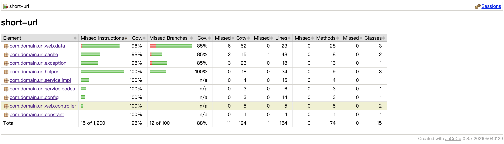

# 设计思路

## 短域名存储接口
1. **短链接生成**：通过发号策略，给每一个过来的长链接，发一个号即可。小型系统直接用程序实现数字自增或者使用MySql的自增索引就搞定了。如果是大型应用，可以考虑各种分布式key-value系统做发号器，不停的自增就行了。最后将得到的数字做10=>62进制转码即可。第一个使用这个服务的人得到的短地址是http://xx.xx/0，第二个是 http://xx.xx/1，第11个是 http://xx.xx/a 依次往后，相当于实现了一个62进制的自增字段即可。
2. **存储**：为了保证存储时线程的安全性，使用ConcurrentHashMap存储*短 -> 长链接映射关系*。
3. **限制条件**：短链接输出的最大长度为8个字符，即*62^8 - 1 = 218340105584894*个短链接地址，超过此数字将重新计数。

## 短域名读取接口
通过固定前缀加上接受的短链接作为key，从映射关系中取出长链接，并返回。

# 架构设计
### `系统架构`
采用典型三层架构设计，如下图所示：

### `工作流程`

# JUnit单元测试及Jacoco测试报告

# 系统假设
- 如何保证同一个长地址，每次转出来都是一样的短地址？
   - 最简单的是建立一个长对短的LinkedHashMap，这样相当于用空间来换空间，同时换取一个设计上的优雅（真正的一对一）。
   - 用key-value存储，保存“最近”生成的长对短的一个对应关系。注意是“最近”，也就是说并不保存全量的长对短的关系，而只保存最近的。然后可以采用一小时过期的机制来实现LRU淘汰。当一个地址被频繁使用，那么它会一直在这个key-value表中，总能返回当初生成那个短地址，不会出现重复的问题。如果它使用并不频繁，那么长对短的key会过期，LRU机制自动就会淘汰掉它。
- 如何保证发号器的高并发高可用？
   - 如果改成分布式部署，那么多节点要保持同步加1，多点同时写入，可以使用Redis的自增，但还要同时考虑自增数字的持久化问题，以防Redis宕机。
   - 退一步考虑，假设需要实现1000个逻辑发号器，那么可以设计为每个发号器分别发尾号为0到999的号。每发一个号，每个发号器加1000，而不是加1。这些发号器独立工作，互不干扰即可。
- 具体存储如何选择？
   - 需要对系统的可用性、并发能力及数据的一致性综合进行考虑，DB、Cache均可以考虑。
- 短链的安全性如何考虑？
   - 自增序列算法很容易让攻击者找到规律，这里推荐 Google 出品的 MurmurHash 算法，与其它流行的哈希函数相比，对于规律性较强的 key，MurmurHash 的随机分布特征表现更良好，系统性能也不会损失太多。
- 如何避免内存溢出？
   - 限制数据存储的数量，使用LRU机制进行淘汰。但是链接存储数量的多少不好预估，并且如过还需要额外维护链接的有效期的话，有些得不偿失。
   - 使用Redis缓存。当前硬盘的价格越来越便宜，完全可以使用空间换时间，而且Redis有一套成熟的缓存淘汰策略，无需重复造轮子。
