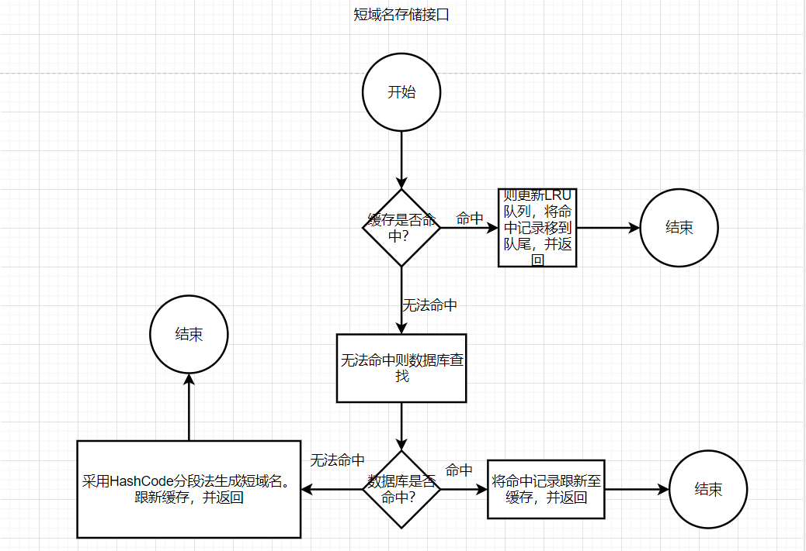
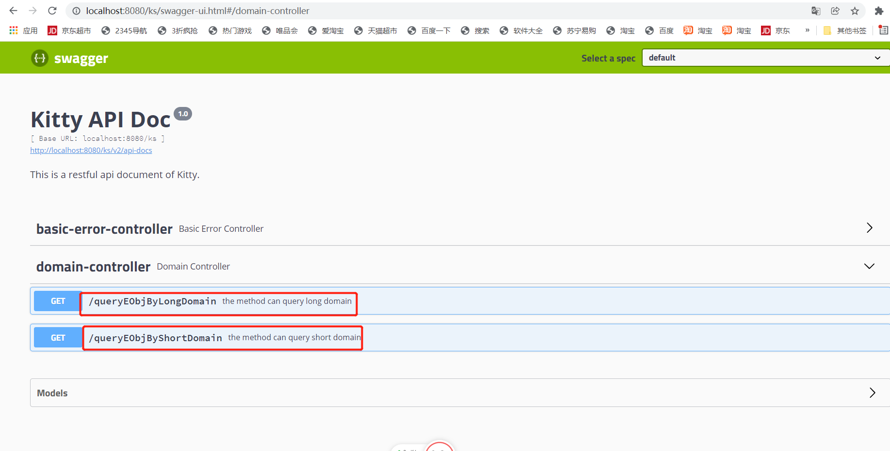
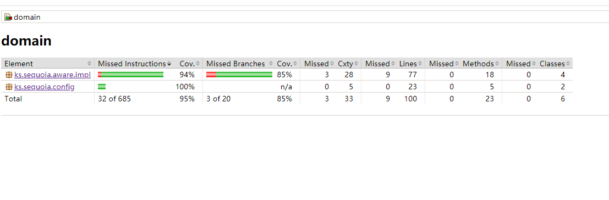

#需求分析 
 1）短域名存储接口：接受长域名信息，返回短域名信息
 2）短域名读取接口：接受短域名信息，返回长域名信息

# 域名表结构
```
CREATE TABLE `ks_domain` (
`domain_id` decimal(18,0) NOT NULL COMMENT '主键',
`long_domain` varchar(100) NOT NULL COMMENT '长域名',
`short_domain` varchar(8) NOT NULL COMMENT '短域名',
`create_Time` varchar(100) CHARACTER SET utf8 COLLATE utf8_general_ci DEFAULT NULL COMMENT '创建时间',
`create_Id` decimal(18,0) DEFAULT NULL COMMENT '创建人Id',
`update_time` timestamp NULL DEFAULT NULL COMMENT '创建时间',
PRIMARY KEY (`domain_id`)
) ENGINE=InnoDB DEFAULT CHARSET=utf8
```

#设计思路
##1)设计流程图
###短域名存储接口

 
###短域名读取接口


#细微亮点 根据HashCode源码命中Hash桶的原理，实现HashCode分段法，生成短域名。

HashCode分段法:由于短域名长度最大为 8 个字符.才生成短域名的时候应该避免生成相同的短域名。可借鉴HashMap确定Hash桶位置坐标算法
由于A-Z，a-z,0-9 '-', '_' 刚好64字符（即源码中ks.sequoia.impl.AbstractCacheServiceImpl.digits数组），
即2^6 计算因子是6，当长域名长度小于8，整个字符串的HashCode高16位与低16计算并与计算因子，则得到数组下标，此时
是短域名 的第一个元素，其它几位分为按照char字符按照上述方法计算，得到其余位的数组下标。组成短域名。当长域名长度
大于8， 整个字符串的HashCode高16位与低16计算并与计算因子，则得到数组下标，此时是短域名的第一个元素。由于
HashCode值是int类型，即是4*8 = 32 bit，则分为8段，前7段分别与最后一段做异或运算，减少Hash碰撞，并与计算因子
与运算， 确定数组下标。 所以满足短域名的最大 长度是8个字符。

缓存预热:
    在ks.sequoia.aware.impl.AbstractCacheServiceImpl初始化方法中进行初始化操作，可根据具体情况将热点数据预加载进入jvm内存。


缓存穿透：
    从缓存取不到的数据，在数据库中也没有取到， 将key-value对写为key-null,由于HashMap不具备重复性，大量的请求 请求相同的key也不会造成问题。
    
缓存雪崩：由于此次采用LRU队列，暂不涉及过期时间，不存在雪崩问题。

#细节再优化的方案
 在LRU列表中可设置缓存的过期时间 并加上命中次数保留热点数据，提高命中率。
 
#框架图
 ```

├──src
    ├──main
        ├──java
            ├──city.yyds.job.hsdemo
                ├──config       定位系统配置的bean
                ├──controller   控制层
                ├──eobj         实体
                ├──bobj         dao层
                ├──service      服务层(内存数据库)
                ├──utils        工具类
        ├──resources            存放配置文件

```

##2)具体实现
构建longMappingMap(长域名存储缓存),shortMappingMap（短域名存储缓存）,lruList（LRU队列）

```  
    /**
      * 计算因子，011111b,计算去除digits的数组下标
      */
     private static final int DEFAULT_FACTOR = (1 << 6) - 1;
     /**
      * 长域名大于8时，最大的迭代次数
      */
     private static final int TOTAL = 1 << 3;
     /**
      * 每次迭代的跨度
      */
     private static final int SPAN = 1 << 2;
     /**
      * 前7段和最后一段的计算因子
      */
     private static final int LAST_CAL_FACTOR = (TOTAL - 1) * SPAN;
     /**
      * int类型的最大bit
      */
     private static final int MAX_BIT = 1 << 5;
 
     /**
      * 初始化缓存容量
      */
     protected static final int INITIAL_CAPACITY = 102400;
 
     //2^6
     final static char[] digits = {'0', '1', '2', '3', '4', '5', '6', '7', '8',
             'z', 'A', 'B', 'C', 'D', 'E', 'F', 'G', 'H', 'I', 'J', 'K', 'L',
             '9', 'a', 'b', 'c', 'd', 'e', 'f', 'g', 'h', 'i', 'j', 'k', 'l',
             'm', 'n', 'o', 'p', 'q', 'r', 's', 't', 'u', 'v', 'w', 'x', 'y',
             'M', 'N', 'O', 'P', 'Q', 'R', 'S', 'T', 'U', 'V', 'W', 'X', 'Y',
             'Z', '-', '_'};

  #初始化缓存容量大小 
  protected static final int INITIAL_CAPACITY = 10240; 
  /**
  * 长域名的内存存储对象,初始化容量是10240,避免内存移除,保存热点数据
  * 由于HashMap存储数据在理想情况下时间复杂度接近常数下，因此考虑HashMap存储数据
  */
 protected Map<String, DomainEObj> longMappingMap = new ConcurrentHashMap<>(INITIAL_CAPACITY);
 /**
  * 短域名的内存存储对象,初始化容量是10240,避免内存移除,保存热点数据
  */
 protected Map<String, DomainEObj> shortMappingMap = new ConcurrentHashMap<>(INITIAL_CAPACITY);
 /**
  * LRU队列 ,当内存不足以写入新数据时候，移除最近少使用的key
  *使用装饰设计模式，加入LinkedHashMap的功能，实现LRU的细节。
  */
 protected LRU<Long,DomainEObj> lruList = new LRU<>(INITIAL_CAPACITY);

  /**
  *缓存预热，避免系统启动之初JVM内存没有数据，造成大量的请求落在数据库，会优先加载按照时间1W数据
  *进入JVM内存，注（也可增加字段accessTimes 记录域名的访问次数，从而加载预热）
  */
  private void init(){
      List<DomainEObj> domainEObjList =  domainBObj.queryLatest10000Times();
      if(domainEObjList == null || domainEObjList.size() == 0){
          return;
      }
      for(DomainEObj domainEObj : domainEObjList){
          lruList.put(domainEObj.getDomainId(),domainEObj);
          addCache(domainEObj.getLongDomain(),domainEObj,longMappingMap);
          addCache(domainEObj.getShortDomain(),domainEObj,shortMappingMap);
      }
    }
  
/**
*lRU队列实现
*/
public class LRU<K,V> {

    private final float loadFactory = 0.75f;
    private LinkedHashMap<K, V> map;

    public LRU(int maxCacheSize) {
        //HashMap达到容量就进行扩容，if ((size >= threshold)，因此需要+1
        int capacity = (int)Math.ceil(maxCacheSize / this.loadFactory) + 1;
        //public LinkedHashMap(int initialCapacity, float loadFactor, boolean accessOrder),accessOrder为true表示LRU
        map = new LinkedHashMap<K, V>(capacity, loadFactory, true) {
            //重写removeEldestEntry，当容量超过maxCacheSize会移除first
            @Override
            protected boolean removeEldestEntry(Map.Entry eldest) {
                return size() > maxCacheSize;
            }
        };
    }

    public void put(K key, V value) {
        map.put(key, value);
    }

    public V get(K key) {
        return map.get(key);
    }

    public void remove(K key) {
        map.remove(key);
    }

    public boolean contain(K key) {
        return map.containsKey(key);
    }
    @Override
    public String toString() {
       return map.toString();
    }

    public int size(){
        return map.size();
    }

    public Map.Entry<K, V> getHead(){
        return map.entrySet().iterator().next();
    }

/**
* 接受短域名信息，返回长域名信息。
*先从shortMappingMap(长域名存储缓存)读取，如果缓存中有数据，则将该数据移除LRU队列，并放到LRU队尾
*保持LRU队列的更新。如果没有则读取数据库，数据库没有，则返回null,如果有则判断加入LRU队列是否溢出，
*如果不存在溢出现象，直接加入LRU队列.如果存在溢出现象，则溢出队首元素，并将从数据库读取的数据加入队尾
*/

    @Override
    public DomainEObj queryEObjByShortDomain(String shortDomain) {
        if (StringUtils.isEmpty(shortDomain)) {
            throw new RuntimeException("long domain name is not exist");
        }
        DomainEObj domainEObj = longMappingMap.get(shortDomain);
        if (domainEObj == null) {
            DomainEObj domain = this.getDomainBObj().queryEObjByshortDomain(shortDomain);
            //说明数据库也没有数据
            if (domain == null) {
                return null;
            }
            //使用异步线程放到缓存中去,遵循最近最少使用原则.
            submitTail(domain);
            return domain;
        } else {
            //高并发情况下 ,防止高并发,并将最近访问的更新到尾部
            submitHead(domainEObj);
            return domainEObj;
        }
    }
    
    
    private void submitTail(final DomainEObj domainEObj) {
        threadPoolExecutor.execute(new Runnable() {
            @Override
            public void run() {
                updateCache(domainEObj);
            }
        });
    }
    private void submitHead(final DomainEObj domainEObj) {
        threadPoolExecutor.execute(new Runnable() {
            @Override
            public void run() {
                synchronized (this) {
                    lruList.remove(domainEObj.getDomainId());
                    lruList.put(domainEObj.getDomainId(), domainEObj);
                }
            }
        });
    }
    
    /**
    *读取数据库后，如果有数据则判断加入LRU队列是否溢出，
    *如果不存在溢出现象，直接加入LRU队列.如果存在溢出现象，则溢出队首元素，并将从数据库读取的数据加入队尾
    */
    private synchronized void updateCache(DomainEObj domainEObj) {
        if (lruList.size() > INITIAL_CAPACITY) {
            throw new RuntimeException("LRU List beyond range " + INITIAL_CAPACITY);
        }
        if(lruList.size()< INITIAL_CAPACITY){
            lruList.put(domainEObj.getDomainId(), domainEObj);
            return;
        }
        //由于HashMap Key具有唯一性，所以并发下重复添加不会重复。
        Map.Entry<Long,DomainEObj> domainEObjEntry = lruList.getHead();
        if(domainEObjEntry == null){
            lruList.put(domainEObj.getDomainId(), domainEObj);
        }else {
           DomainEObj domain =  domainEObjEntry.getValue();
           longMappingMap.remove(domain.getLongDomain());
           shortMappingMap.remove(domain.getShortDomain());
           longMappingMap.put(domainEObj.getLongDomain(),domainEObj);
           shortMappingMap.put(domainEObj.getShortDomain(),domainEObj);
        }
    }

/**
* 短域名存储接口：接受长域名信息，返回短域名信息
*先从longMappingMap(长域名存储缓存)读取，如果缓存中有数据，则将该数据移除LRU队列，并放到LRU队尾
*保持LRU队列的更新。如果没有则读取数据库，数据库没有，则生成短域名（采用HashCode分段法）,如果有则判断加入LRU队列是否溢出，
*如果不存在溢出现象，直接加入LRU队列.如果存在溢出现象，则溢出队首元素，并将从数据库读取的数据加入队尾
*/
 @Override
    public DomainEObj queryEObjByLongDomain(String longDomain) {
        if (StringUtils.isEmpty(longDomain)) {
            throw new RuntimeException("long domain name is not exist");
        }
        DomainEObj domainEObj = longMappingMap.get(longDomain);
        if (domainEObj == null) {
            DomainEObj domain = this.getDomainBObj().queryEObjByLongDomain(longDomain);
            //说明数据库也没有数据
            domain =  transformShortDomain(longDomain);
            //使用异步线程放到缓存中去,遵循最近最少使用原则.
            submitTail(domain);
            return domain;
        } else {
            //高并发情况下 ,防止高并发,并将最近访问的更新到尾部
            submitHead(domainEObj);
            return domainEObj;
        }
    }
}

    /**
    *由于短域名长度最大为 8 个字符.才生成短域名的时候应该避免生成相同的短域名。可借鉴HashMap确定Hash桶位置坐标算法
    *由于A-Z，a-z,0-9 '-', '_' 刚好64字符（即ks.sequoia.impl.AbstractCacheServiceImpl.digits数组），即2^6
    *计算因子是6，当长域名长度小于8，整个字符串的HashCode高16位与低16计算并与计算因子，则得到数组下标，此时是短域名
    *的第一个元素，其它几位分为按照char字符按照上述方法计算，得到其余位的数组下标。组成短路径。当长域名长度大于8，
    *整个字符串的HashCode高16位与低16计算并与计算因子，则得到数组下标，此时是短域名的第一个元素。由于HashCode值是32
    *bit，则分为8段，前7段分别与最后一段做异或运算，减少Hash碰撞，并与计算因子与运算，确定数组下标。所以满足短域名的最大
    *长度是8个字符。
    */
     //短域名长度最大为 8 个字符
        protected DomainEObj transformShortDomain(String longDomain) {
            DomainEObj domainEObj = longMappingMap.get(longDomain);
            //使用HashCode方法和equals生成短域名
            if (domainEObj == null) {
                //得到longDomain的Hash值，^和>>>减少Hash碰撞
                StringBuffer sb = new StringBuffer();
                int pos = hash(longDomain) & DEFAULT_FACTOR;//元素的第一个位置
                sb.append(digits[pos]);
                if (longDomain.length() < 8) {
                    char[] chars = longDomain.toCharArray();
                    for (char c : chars) {
                        int p = hash(c) & DEFAULT_FACTOR;
                        sb.append(digits[p]);
                    }
                } else {
                    int hashCode = longDomain.hashCode();
                    //将hashCode一分为8，最后一位参与^运算，减少hash碰撞
                    for (int ind = 1; ind < TOTAL; ind++) {
                        System.out.println(hashCode >> ((MAX_BIT - ind * SPAN)));
                        int cal = hashCode >> ((MAX_BIT - ind * SPAN)) ^ (hashCode >>> LAST_CAL_FACTOR);
                        int p = cal & DEFAULT_FACTOR;
                        sb.append(digits[p]);
                    }
                }
                DomainEObj domain = this.getDomainBObj().queryEObjByShortDomain(sb.toString());
                if (domain != null) {
                    DomainEObj one = new DomainEObj();
                    domainEObj.setLongDomain(longDomain);
                    domainEObj.setShortDomain(sb.toString());
                    domainEObj.setCreateTime(new Timestamp(System.currentTimeMillis()));
                    domainEObj.setUpdateTime(new Timestamp(System.currentTimeMillis()));
                    return one;
                }
                return addDomainEObj(longDomain, sb.toString());
            }
            return domainEObj;
        }


``` 
#集成Swagger API文档



#Jacoco生成测试报告 



从上述测试结果来看指令行覆盖率为95%，分支覆盖率为85%。
