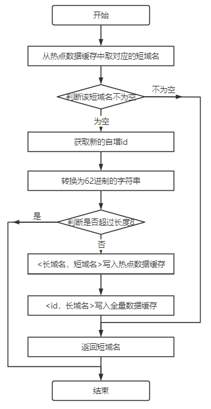
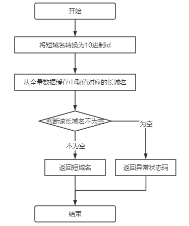
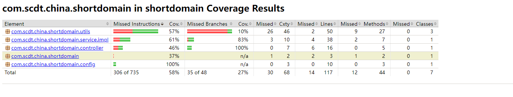
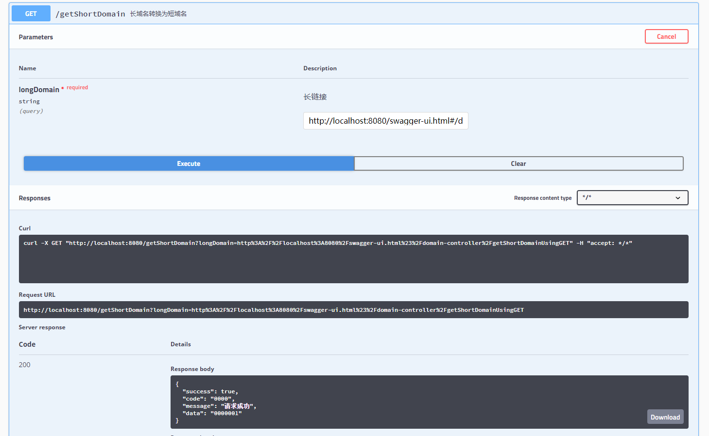
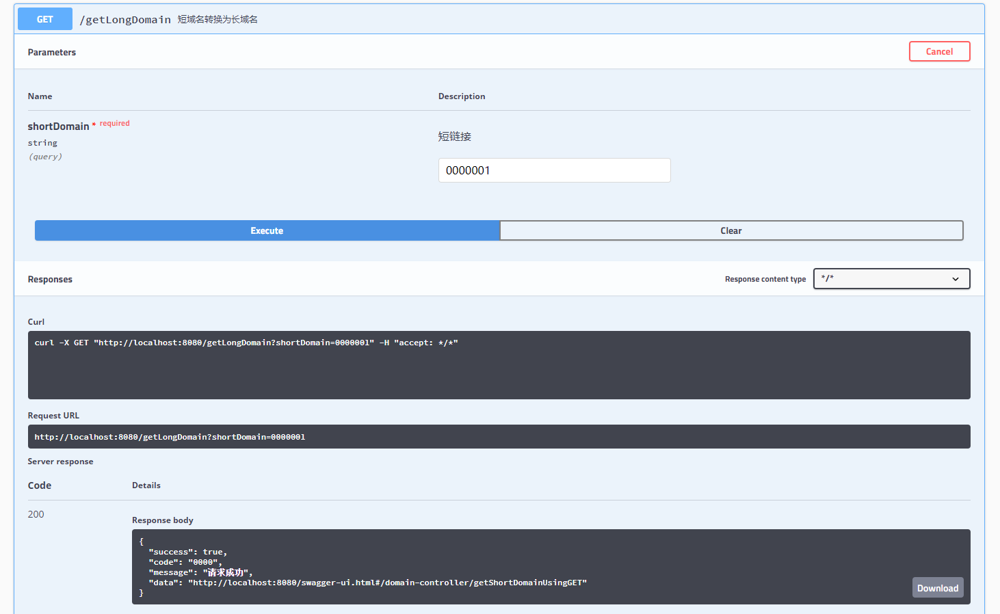
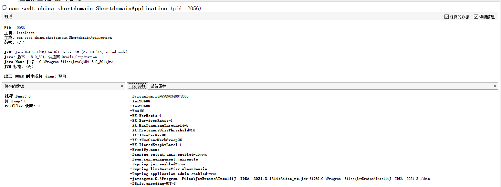
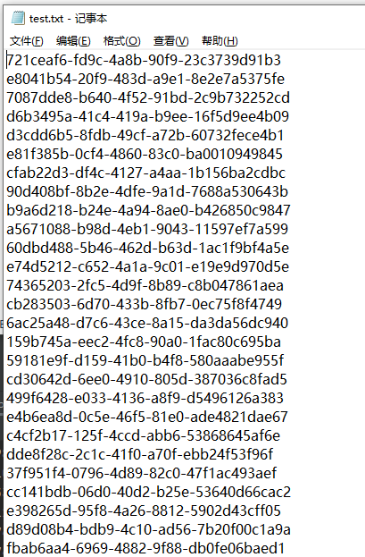
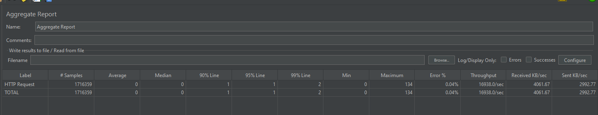
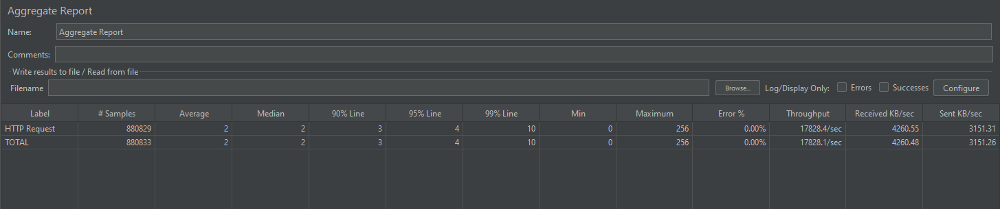

# 一、设计思路
采用自增ID方式，对生成的id进行62位转码，存储对应关系；
解决如下问题：
- 如何生成短链接：采用AtomicLong，自增生成id，然后转码为62位，生成短链接；
- 如何存储短链接：程序中存储于内存缓存中，LRU淘汰数据；
- 如何将短链接和长链接对应：同一个长链接可能有多个对应的短链接，不是一一对应关系，设置有热点数据缓存；


# 二、架构设计图
### 2.1 接受长域名信息，返回短域名信息接口流程如下:

### 2.2 接受短域名信息，返回长域名信息接口流程如下:



# 三、测试
### 3.1单元测试
整体类覆盖率100%，方法覆盖率87%，行覆盖率87%，分支覆盖率92%

### 3.2 功能测试
##### 3.2.1 生成Swagger API文档


##### 3.2.2 获取短域名接口功能测试


##### 3.2.3 获取长域名接口功能测试


### 3.3 性能测试
测试单机性能，运用jmeter，分别启动10个、50个，分别测试
```
IDEA配置启动参数
-Xmx2048M -Xms2048M -Xss1M -XX:NewRatio=4 -XX:SurvivorRatio=4 -XX:MaxTenuringThreshold=5 -XX:PretenureSizeThreshold=1M -XX:+UseParNewGC -XX:+UseConcMarkSweepGC
```
程序实际运行参数

测试样例数据来自随机的UUID数据，数据不重复，测试极端情况下不命中热点缓存场景。


##### 3.3.1 10个线程
结论：平均响应时间1毫秒，99%请求在2毫秒，QPS约为17000次/s



##### 3.3.2 50个线程
结论：平均响应时间2毫秒，99%请求在10毫秒，QPS约为18000次/s



##### 3.3.3 性能测试结论
单机可承载QPS为17000次/秒，性能较好

# 四、参考链接
[如何设计一个短网址服务](https://juejin.cn/post/7024055300449632269)
[设计一个短网址系统](https://guigu.io/notes/89-designing-a-url-shortener)
[如何设计与实现短URL服务](如何设计与实现短URL服务)

# 五、简历
**基本信息**

- 姓名：陈振
- 电话：13671890862    
- Email：czbryant24@163.com


**工作经历**

- 2020.5至今 顺丰科技有限公司 大数据平台研发工程师
- 2016.1-2020.1 武汉斗鱼网络科技有限公司 大数据Java开发工程师
- 2015.1-2015.12 小米科技 Java开发工程师实习生
- 2014.7-2014.12 华为上海研究所 Java开发工程师实习生

**教育背景**

- 2013.9—2016.3：中国科学技术大学，软件学院，软件工程（硕士研究生）
- 2009.9—2013.7：武汉科技大学，计算机科学与技术学院，计算机科学与技术（学士本科）