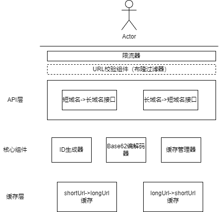
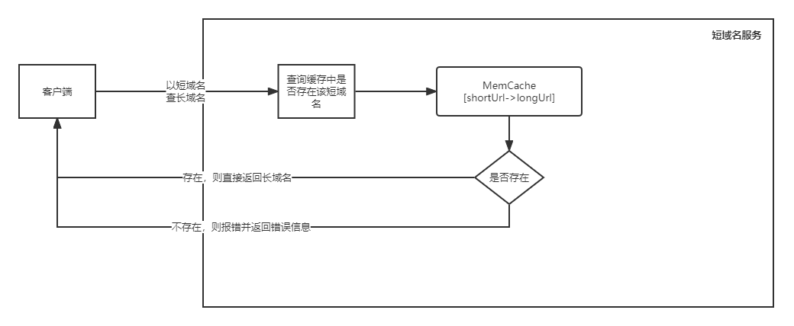
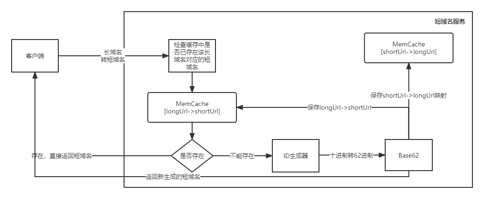
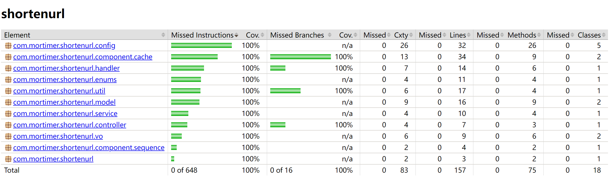
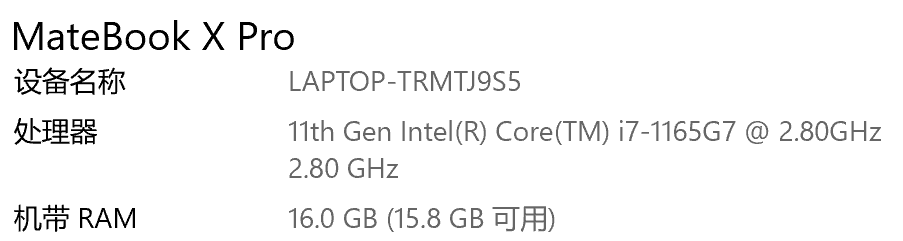
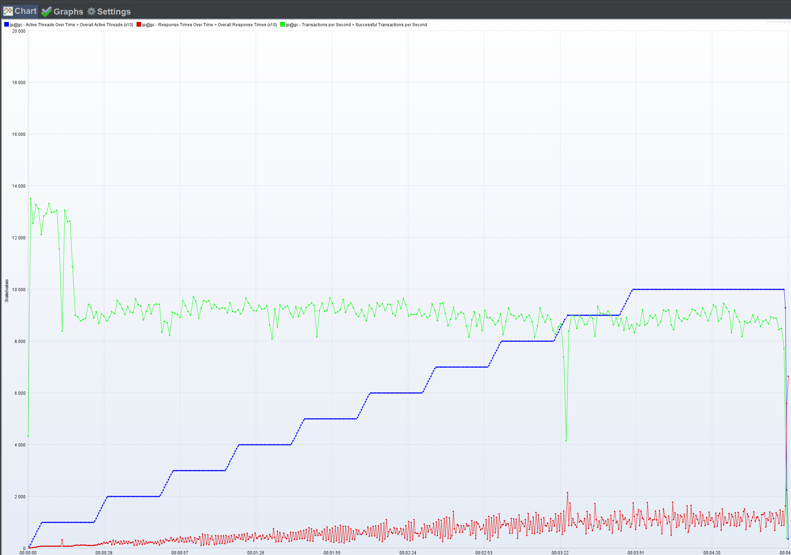
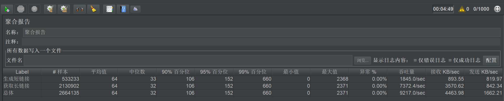

## 1 需求分析

​	    根据从网上了解到的信息，短域名服务的初衷是为了降低URL过长导致的字符过多，复制不方便，甚至成本浪费（短信通知如果采用长域名可能会导致发送成本增加）等问题。其主要功能包括将长域名转换成短域名，以及将短域名恢复成原始的长域名。目前比较流行的短域名服务有[百度短网址](https://dwz.cn) 、[TinyURL](https://tinyurl.com)。

​		根据以上了解到的信息，可以大致确定短域名服务的需求范围。

### 1.1 功能性需求

- 短域名存储接口（写请求）：接受长域名信息，返回短域名信息
- 短域名读取接口（读请求）：接受短域名信息，返回长域名信息

### 1.2 非功能性需求

- 服务需要具备高可扩展
- 服务在提供低延迟接口调用的同时保持高吞吐

### 1.3 约束条件

- 短域名长度最大为8个字符
- 映射数据存储在JVM内存即可，防止内存溢出


## 2 详细设计

​		通常情况下，设计系统前都应该向需求方详细了解诉求。针对短域名服务，可能需要澄清的诉求包括：使用本服务的用户是内部用户还是外部用户？用户规模大概多大？本服务针对的URL是互联网上的URL还是组织内部的URL？每月大概有多少长域名需要转成短域名？短域名是否需要支持定制？短域名是否需要过期？过期时间多长？是否需要支持报表功能，如记录最常访问的域名……

​		本系统设计将基于如下假设进行：

- 本服务的用户主体为外部用户，针对所有互联网上的URL
- 每秒请求大概在1000次，为了保证服务不被DDoS攻击，可以通过令牌桶做限流
- 短域名不需要支持定制
- 短域名允许失效
- 不需要支持报表功能


### 2.1 关键技术

​		短域名服务的最重要功能是将一个长的域名转成一个短的域名，短链一般都是采用62进制（0-9a-zA-Z）来表示。根据约束，短域名最长为8位，因此采用62进制最多可以表示的URL个数为

```
62^8 = 218 340 105 584 896 个
```

即使按照每秒生成1000个不重复的短域名，也需要

```
218 340 105 584 896 / (1000 * 3600 * 24 * 365) = 6923.52年
```

即大概需要6923年才能消耗完，足以支撑业务诉求。

​		从业界看目前有如下4种算法：

| 算法                                                         | 优点                               | 缺点                                                         |
| ------------------------------------------------------------ | ---------------------------------- | ------------------------------------------------------------ |
| 自增ID，利用自增ID算法，生成10进制数字，再将其转换成62进制数作为短域名 | 算法简单，不存在重复ID问题         | 转换成的短域名长度不定；由于ID连续，存在单一递增易被预测和爆破等问题 |
| 摘要（哈希），通过哈希算法将长域名转成短域名                 | 效率高，生成的短域名长度可以自定义 | 存在哈希冲突问题；从生成的长哈希字符截取短字符时也可能出现重复 |
| 随机数，通过随机算法按位生成随机数，再将其转成62进制数作为短域名 | 算法简单                           | 随着短网址越来越多可能导致较多重复，重复数据的校验对性能可能产生较大影响 |
| 分布式ID，通过分布式ID生成算法（如[雪花算法](https://www.cnblogs.com/wuzhenzhao/p/13295382.html)）生成唯一数，再将其转成62进制数作为短域名 | 方案成熟，可以支持分布式场景       | 分布式ID算法可能存在时间回拨等导致ID重复的问题               |

​		基于上述分析，以及本需求中数据存储在内存中的约束，可以考虑第1种和第4种算法来实现长域名到短域名的转换。第4种算法（分布式ID）引入了第三方中间件，虽性能更高，但增加了系统复杂度，更适合在分布式的生产环境使用。而本系统作为单机系统，采用第1种算法相对而言代价更小，为了降低ID单一递增带来的可预测性，我们对62进制的原始字符做打散处理。

> 本系统采用内存式发号策略，来实现自增ID的诉求，同时为了支持高并发，使用AtomicLong来进行发号。

### 2.2 接口设计

#### 2.2.1 短域名存储接口

<table>
    <tr>
        <th>uri</td>
        <th colspan=2>/api/v1/shorten</td>
    </tr>
    <tr>
        <td>请求方式</td>
        <td colspan=2>POST</td>
    </tr>
    <tr>
        <td>接口描述</td>
        <td colspan=2>接受长域名信息，返回短域名信息</td>
    </tr>
    <tr>
        <td>请求体</td>
        <td colspan=2>{<br />
            &nbsp;&nbsp;&nbsp;&nbsp;"url": "待转换的长url"<br />}</td>
    </tr>
	<tr>
        <td colspan=1>响应说明</td>
        <td colspan=2>{<br />
            &nbsp;&nbsp;&nbsp;&nbsp;"code": 状态码,<br />
            &nbsp;&nbsp;&nbsp;&nbsp;"message": "信息，失败则为原因",<br />
            &nbsp;&nbsp;&nbsp;&nbsp;"data": {<br />
            &nbsp;&nbsp;&nbsp;&nbsp;&nbsp;&nbsp;"longUrl": "原始URL",<br />
            &nbsp;&nbsp;&nbsp;&nbsp;&nbsp;&nbsp;"shortUrl": "短URL"<br />
            &nbsp;&nbsp;&nbsp;&nbsp;}<br />
            }</td>
	</tr>
	<tr>
        <td colspan=3>示例</td>
	</tr>
	<tr>
        <td>响应码</td>
        <td>说明</td>
        <td>示例</td>
	</tr>
	<tr>
        <td>201</td>
        <td>成功响应。短域名转换成功，返回长短域名</td>
        <td>{<br />
            &nbsp;&nbsp;&nbsp;&nbsp;"code": 201,<br />
            &nbsp;&nbsp;&nbsp;&nbsp;"message": "success",<br />
            &nbsp;&nbsp;&nbsp;&nbsp;"data": {<br />
            &nbsp;&nbsp;&nbsp;&nbsp;&nbsp;&nbsp;"longUrl": "http://www.xxx.com",<br />
            &nbsp;&nbsp;&nbsp;&nbsp;&nbsp;&nbsp;"shortUrl": "http://localhost:8888/abcdefgi"<br />
            &nbsp;&nbsp;&nbsp;&nbsp;}<br />
            }</td>
	</tr>
	<tr>
        <td>200</td>
        <td>成功响应。长域名在系统中已存在，返回长短域名</td>
        <td>{<br />
            &nbsp;&nbsp;&nbsp;&nbsp;"code": 200,<br />
            &nbsp;&nbsp;&nbsp;&nbsp;"message": "success",<br />
            &nbsp;&nbsp;&nbsp;&nbsp;"data": {<br />
            &nbsp;&nbsp;&nbsp;&nbsp;&nbsp;&nbsp;"longUrl": "http://www.xxx.com",<br />
            &nbsp;&nbsp;&nbsp;&nbsp;&nbsp;&nbsp;"shortUrl": "http://localhost:8888/abcdefgi"<br />
            &nbsp;&nbsp;&nbsp;&nbsp;}<br />
            }</td>
	</tr>
	<tr>
        <td>400</td>
        <td>失败响应。长域名转换失败，返回null，同时返回失败原因</td>
        <td>{<br />
            &nbsp;&nbsp;&nbsp;&nbsp;"code": 400,<br />
            &nbsp;&nbsp;&nbsp;&nbsp;"message": "url is too long",<br />
            &nbsp;&nbsp;&nbsp;&nbsp;"data": null<br />
            }</td>
	</tr>
</table>


#### 2.2.2 短域名读取接口

<table>
    <tr>
        <th>uri</td>
        <th colspan=4>/{shortUrl}</td>
    </tr>
    <tr>
        <td>请求方式</td>
        <td colspan=4>GET</td>
    </tr>
    <tr>
        <td>接口描述</td>
        <td colspan=4>接受短域名信息，返回长域名信息</td>
    </tr>
    <tr>
        <td>参数名</td>
        <td>参数类型</td>
        <td>数据类型</td>
        <td>是否必填</td>
        <td>参数说明</td>
    </tr>
    <tr>
        <td>shortUrl</td>
        <td>path</td>
        <td>字符串</td>
        <td>是</td>
        <td>短域名</td>
    </tr>
	<tr>
        <td colspan=1>响应说明</td>
        <td colspan=4>{<br />
            &nbsp;&nbsp;&nbsp;&nbsp;"code": 状态码,<br />
            &nbsp;&nbsp;&nbsp;&nbsp;"message": "信息，失败则为原因",<br />
            &nbsp;&nbsp;&nbsp;&nbsp;"data": {<br />
            &nbsp;&nbsp;&nbsp;&nbsp;&nbsp;&nbsp;"longUrl": "原始URL",<br />
            &nbsp;&nbsp;&nbsp;&nbsp;&nbsp;&nbsp;"shortUrl": "短URL"<br />
            &nbsp;&nbsp;&nbsp;&nbsp;}<br />
            }</td>
	</tr>
	<tr>
        <td colspan=5>示例</td>
	</tr>
	<tr>
        <td>响应码</td>
        <td colspan=2>说明</td>
        <td colspan=2>示例</td>
	</tr>
	<tr>
        <td>200</td>
        <td colspan=2>成功响应。返回长短域名</td>
        <td colspan=2>{<br />
            &nbsp;&nbsp;&nbsp;&nbsp;"code": 200,<br />
            &nbsp;&nbsp;&nbsp;&nbsp;"message": "success",<br />
            &nbsp;&nbsp;&nbsp;&nbsp;"data": {<br />
            &nbsp;&nbsp;&nbsp;&nbsp;&nbsp;&nbsp;"longUrl": "http://www.xxx.com",<br />
            &nbsp;&nbsp;&nbsp;&nbsp;&nbsp;&nbsp;"shortUrl": "http://localhost:8888/abcdefgi"<br />
            &nbsp;&nbsp;&nbsp;&nbsp;}<br />
            }</td>
	</tr>
	<tr>
        <td>400</td>
        <td colspan=2>失败响应。客户端请求错误，返回null，同时返回失败原因</td>
        <td colspan=2>{<br />
            &nbsp;&nbsp;&nbsp;&nbsp;"code": 400,<br />
            &nbsp;&nbsp;&nbsp;&nbsp;"message": "shortUrl is not valid",<br />
            &nbsp;&nbsp;&nbsp;&nbsp;"data": null<br />
            }</td>
	</tr>
	<tr>
        <td>503</td>
        <td colspan=2>失败响应。服务端异常</td>
        <td colspan=2>{<br />
            &nbsp;&nbsp;&nbsp;&nbsp;"code": 503,<br />
            &nbsp;&nbsp;&nbsp;&nbsp;"message": "service unavailable",<br />
            &nbsp;&nbsp;&nbsp;&nbsp;"data": null<br />
            }</td>
	</tr>
</table>


### 2.3 数据库设计

​		由于需求中要求数据存储在JVM中，所以无需使用数据库。从需求场景出发，我们需要支持较大并发且要**避免内存溢出**，因此需要考虑一种支持并发，性能优异，支持缓存淘汰算法的本地缓存，结合网上对各种缓存库的[比较](https://www.cnblogs.com/cnndevelop/p/13429962.html)，Caffeine更符合我们的诉求。

​		常用的缓存淘汰算法有：LRU和LFU。

- LRU

  LRU（Least Recently Used，最近最少使用）算法根据数据的历史访问记录来淘汰数据，其核心思想是“如果数据最近被访问过，那么将来被访问的几率也更高”。每次访问某个数据时，就把该数据放到队列的头部，对满了之后就淘汰队列尾部的数据，即淘汰最长时间没有被访问的数据。该算法的优点是实现简单，当存在热点数据时，效率很好。缺点是偶发性的、周期性的批量操作会导致LRU命中率急剧下降，缓存污染情况比较严重。

- LFU

  LFU（Least Frequently Used，最近最不常用算法）算法根据数据的历史访问频率来淘汰数据，其核心思想是“最近使用频率高的数据很大概率将会再次被使用，而最近使用频率低的数据，很大概率不会再使用”。该算法避免了LRU的缺点，因为根据频率淘汰，不会出现大量进来的挤掉老的。如果在数据的访问的模式不随时间变化时候，LFU能够提供绝佳的命中率。其存在的问题是，需要维护每个数据项的访问频率信息，每次访问都需要更新，开销较大；另外，如果某些数据短时间内被重复引用，并且在很长一段时间不再被访问，由于它的访问频率计数很大，即使长期不再被使用，它也不会在短时间内被淘汰，这使得其它可能更频繁使用的数据更容易被清除。此外，刚进入缓存的新数据可能很快就会被再次删除，因为它们的计数器较低，即使之后可能被频繁使用。

  Caffeine采用了一种结合LRU、LFR优点的算法：W-TinyLFU，其特点是：高命中率、低内存占用。它可以解决频率统计不准确以及访问频率衰减的问题。这个方法让我们从空间、效率、以及适配举证的长宽引起的哈希碰撞的错误率上做均衡。

  > 本系统采用W-TinyLFU缓存淘汰算法

​		

​		需要注意的是，短域名服务既要支持从短域名到长域名的查询，也需要支持从长域名到短域名的查询，因此，我们需要同时保存 **shortUrl->longUrl** 和 **longUrl->shortUrl** 的缓存。

### 2.3.1 短域名->长域名

​		短域名到长域名的映射用来根据短域名来查询长域名，其中key为短域名（字符串类型），长度最大为8个字符，value为长域名（字符串类型）。根据查询到的[数据](https://www.geeksforgeeks.org/maximum-length-of-a-url-in-different-browsers/)，各个主流浏览器支持的最大URL长度从2083到无限大不一。查阅网上[资料](https://backlinko.com/search-engine-ranking)得知，更短的域名通常可以获得更高的搜索排名，因此，为了获得在搜索引擎中更高的排名（SEO），各个网站都会尽量控制URL的长度。我们以[资料](https://backlinko.com/search-engine-ranking)中的数据为参考，假设长域名呈现正态分布，且80%长度在25-250之间。

​		这里，我们假设长域名的长度250个字符，一个字符串占用的内存大小为40 + 2 * n（字符数），所以短域名->长域名大概占用40 + 2*8 + 40 + 2 * 250 = 596B，我们按 600B 算。假设我们可供使用的堆内存为 1GB，则可以承载 170万+ 的短域名->长域名数据。

​		为了避免恶意程序通过构造大量超长URL来消耗我们的内存，我们规定接受的最长URL长度为2000，且对于长度超过500的URL，我们单独建一个缓存管理，跟正常的URL缓存数据做隔离。暂定超长URL缓存允许的最大数为10000，则其占用的空间最大约为 10000 * 2KB ≈ 20MB。

### 2.3.2 长域名->短域名

​		长域名到短域名的映射用来根据长域名查询短域名，我们是否需要保存一份长域名到短域名的映射数据呢？这里存在一个问题待分析：我们是否要保证一个长域名到一个短域名的一对一映射？短域名服务的应用场景是为了方便用户查看和复制，然后通过点击短域名跳转到原来的域名，即该服务是一个读多写少的业务，短域名到长域名的映射关系是一定要保存下来的。而长域名到短域名的映射，可能大部分时间都不会被使用。另外，根据短域名服务的应用场景，用户应该对一个长域名是否唯一对应一个短域名不是很在乎，用户更在意的场景是，点击短域名能跳转回原来的域名。

​		所以，我们得出一个结论，我们只需保证一定时间内（假设为1小时），一个长域名唯一对应一个短域名即可，在时间跨度较长的场景下允许一个长域名对应多各短域名。

​		根据以上分析，我们定义长域名->短域名的缓存数据大概占用的内存大小为（保存1个小时，假设每秒的请求中20%为非重复的长域名到短域名转换请求）

```
600 * 3600 * 1000 * 0.2 / (1024 * 1024) = 412MB
```

​		为了防止突然大批量的长域名到短域名转换请求，我们还需要限制下长域名->短域名映射最大数，这里取 3600 * 1000 * 0.2 = 720 000。

## 3 架构设计

​		架构图


获取长域名流程


生成短域名流程


## 4 测试

### 4.1 测试覆盖率


### 4.2 性能测试
首先，我们应该确认本系统性能测试的目的是什么，也就是我们做性能测试的需求。通常而言，我们做性能测试的目的是为了找到系统的性能瓶颈，确定系统的性能指标。
其次，我们还需要确定在何种测试场景下进行性能测试。针对本系统，我们的测试场景包括：
1. 单一场景
- 仅调用短域名存储接口（写接口）的性能指标
- 仅调用短域名读取接口（读接口）的性能指标
- 异常场景下的性能指标，如所有短域名存储接口传的长域名长度都超过2000个字符、同一时间大量用户发起请求
2. 组合场景
- 短域名存储接口 + 短域名读取接口同时调用场景下的性能指标

为了简单起见，我们仅考虑本系统在正常使用场景下的性能情况。根据前面的系统设计，本系统为多读少写的系统，按照二八法则，我们设计的测试场景为20%的写接口请求+80%的读接口请求。
常见的性能指标包括请求响应时间，并发数，吞吐量以及性能计数器。进一步细化后，确定本次性能测试的指标包括：
- 最大并发数：通过逐步增加并发数的手段，确定系统平均响应时间高于1秒，TPS出现明显下降的区间，再通过减小新增并发用户的步长数最终确定一个较准确的值
- 请求平均响应时间：读接口和写接口按照4:1比例调用情况下平均响应时间
- 吞吐量：可以通过观察性能计数器和平均响应时间的指标来确定系统的最佳并发数以及对应的吞吐量
- 性能计数器：按照经验CPU使用率低于80%，内存使用率低于80%

我们使用常用于性能测试的工具JMeter来执行测试方案，测试结果如下：
- 测试环境：
MateBook X Pro 2021
CPU i7-1165G7 2.80 GHz 8核
内存 16G

- 测试分析
从组合图中看到当并发用户数增大到100之后，TPS出现明显下降，所以本系统最大并发数在100左右。为了提高并发数，可以将ID预先准备好放到BlockingQueue中，然后通过单线程不断往其中添加ID。这样可以减少多线程实时生成ID导致的并发冲突。

请求平均响应时间在不同并发数下存在差异，平均64ms，中位数32ms，吞吐量在达到最大并发数前可以达到10800左右，平均在9200左右。

补充说明：由于本人是在个人电脑上使用JMeter对部署在本地的服务进行的性能测试，所以并不能十分准确地反应本系统的性能情况。推荐的做法是使用软硬件和生产环境一致的服务器部署服务再进行测试，且应当多次测试取平均值。


## 5 其它说明

​		本次设计主要针对的是单机场景，未考虑高可用、高性能等特性。在构建企业级的短域名服务时，我们需要对架构做如下优化：

  - 在客户端和服务端间增加负载均衡器，避免服务单点故障导致的服务不可用问题

  - 分布式ID生成机制做分段设计，利用Zookeeper来对分段的WorkId做动态管理

  - 本地缓存升级为分布式缓存

  - 数据需要做持久化，由于本服务无需支持事务、自增ID和复杂查询，因此NoSQL应是更好的选择

  - 对于长期未使用的数据，需要定期清理，特别是对于可能包含隐私信息的URL数据

    

    另外，在安全方面，我们也可以做如下增强：

- 增加鉴权机制，在客户端调用本服务前先做鉴权，防止外部恶意攻击

- 对于单个IP的每日调用设置阈值，超过阈值即拒绝服务，防止DDoS攻击
