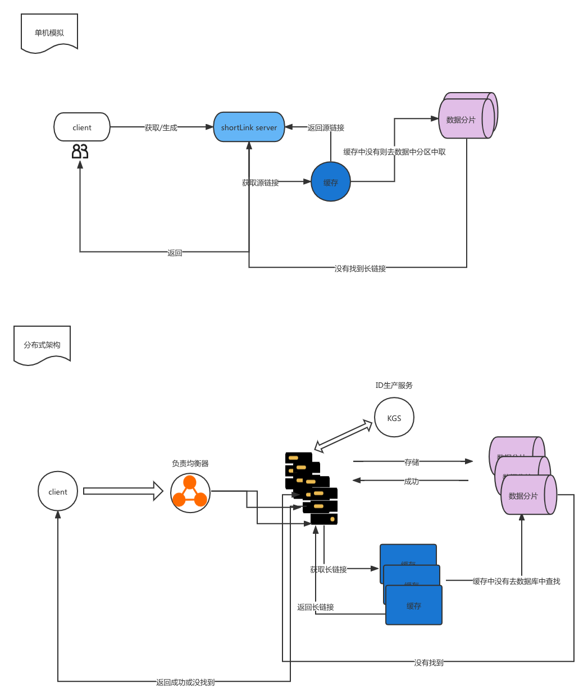
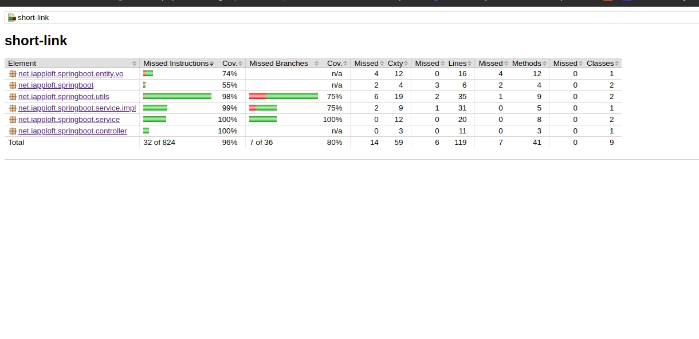

# shortlink 短域名服务

# 项目背景

    用途:
    1. 长域名转换为短域名服务 

# 项目架构

## 设计思路

1. 存储是使用了 8位的62进制存储， 62^8 已经达到218兆的存储量了。
2. 采用递增ID获取短连接数字；

## 简单的架构图

## 假设

1. 单机假设，如果分布式部署，数据分区规则映射注册到nacos或zookeeper，存储至mysql，缓存至redis中。
2. 如果分布式部署，替换递增id算法至KGS服务来解决资源竞争,提高id生产效率，可以预生成一批ID。
3. 为了防止内存溢出，RLU算法保证最大缓存数,如果分布式部署，缓存至redis中；

# 框架

    1. 使用spring boot
    2. 代码简化编写使用了lombok
    3. 接口文档&接口测试使用的swagger

# api命名规范
    restful风格

# swagger

> 启动App后访问：http://localhost:8080/api/swagger-ui.html

# 单元测试

项目根目录执行 mvn test 后， 会在 target/site/jacoco 目录下生成测试报告，浏览器打开 index.html 即可.
> 行覆盖率已经96+ 

