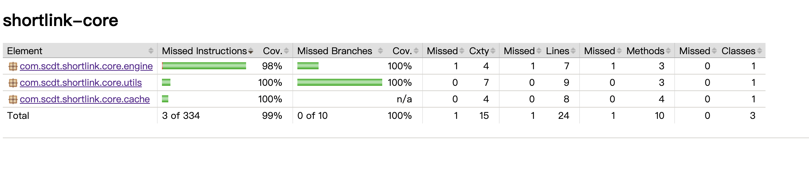
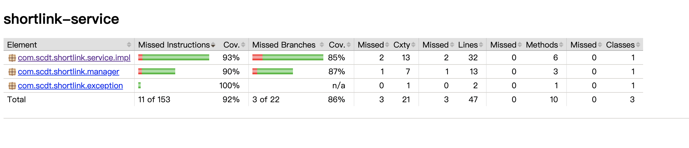
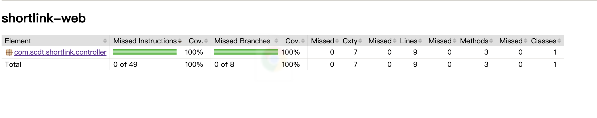
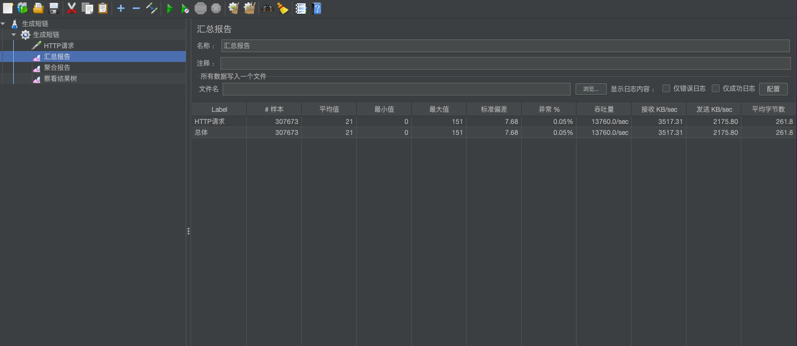
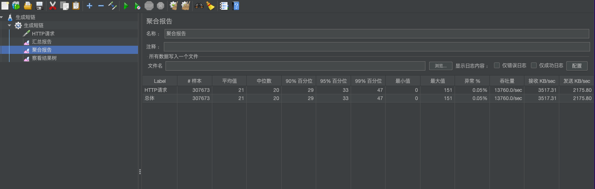

# 设计思路

## 项目背景

面试题

## 项目要求

* 长链转短链接口；
* 通过短链获取长链接口；
* 短域名长度最大为 8 个字符；
* 开源框架采用springboot；
* 集成Swagger API文档；
* 写单元测试，使用Jacoco生成测试报告；
* 数据存储放在内存即可，需防止内存溢出；

## 具体分析

* 短码长度为8，每个位上的字符由（0-9 + a-z +
  A-Z），总共62个字符，所以得出总共有62的8次方种组合，即218340105584896种组合。由于不确认长链的实际长度，假设每种组合在内存中存储容量为1k，则大约需要203345T内存，所以单机存储全量数据，一定会出现内存溢出的情况；
* 各浏览器限制url长度不一致，如：IE对url最大限制2083个字符；chorme限制8182个字符。所以长链的实际大小在生产环境时需预留足够空间；
* 防止热点击穿cache层，可在本地机器增加二级缓存；
* 内存作为二级缓存，去掉远程存储（例：redis），本例中只使用内存的二级缓存作为存储；
* 最终生成短链后，需要做一次查询，防止短链重复，当出现3次重复，则返回异常，防止死循环；

## 架构思路

* 首先应用分为4个模块，分别是web、client、service、core：web层作为独立站点运营；service作为内部服务，可在公司内部提供转码服务；core为转码引擎核心；client包deploy到服务器，供给其他部门使用该服务；
* 实际项目中可以采用散列算法(具体算法没想好，只是知道这个方向)，可让生成的短码重复率降更低；本次采用最简的Random实现；

## 性能测试

* 单机采用jmeter做压测
  * TPS设置300，时长为手动停止

## 附加
* 启动类：java/shortlink/shortlink-web/src/main/java/com/scdt/shortlink/Application.java
* 接口文档地址：
    * http://localhost:8080/doc.html

## 单测报告

## 压测报告

