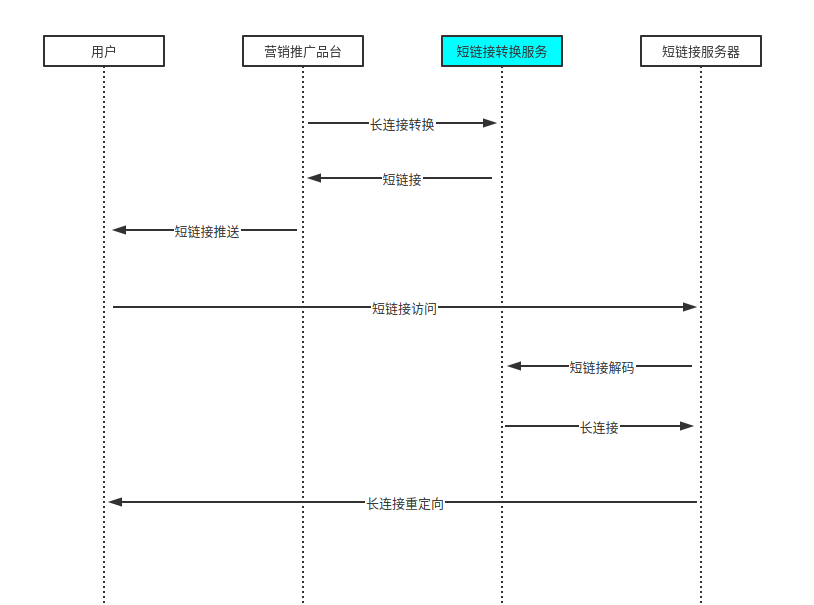
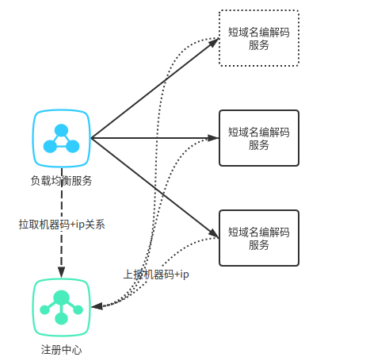
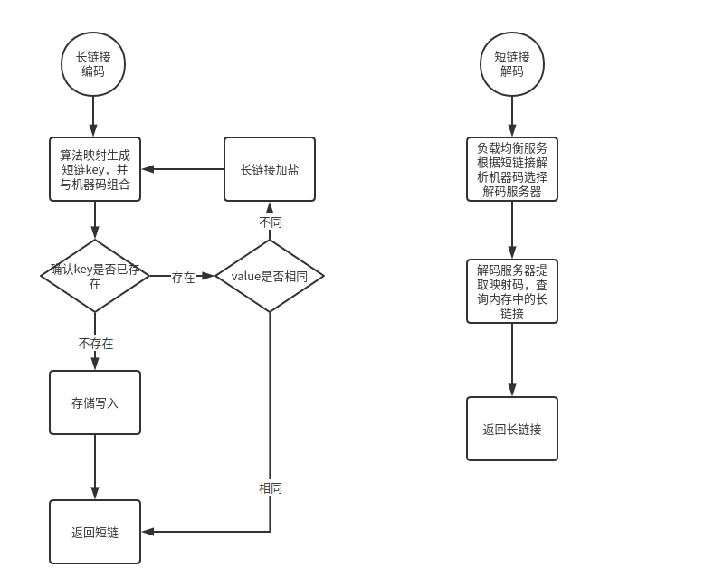

# 短链接服务设计文档
## 1.需求分析

#### (1)业务场景分析

+ 短链接的使用场景主要是营销推广场景
+ 使用方式为，通过短链接服务将营销推广页面地址转化为短链后通过短信等营销推广手段推送至用户
+ 具体短链转化及短链接解码的服务使用如下图所示

#### (2)业务需求假设

基于以上的使用场景分析，我们可以作出以下的需求假设

+ 长链接转化服务使用主要toB，短链接解码服务使用主要toC，解码场景下的并发与流量将远高于存储
+ 推广场景下一般是生成一批短链后，大范围投放，服务的特征是读多写少
+ 短链接使用场景本身是存在时效性的，因而短链接的有效性可以设置一定期限

#### (3)业务需求分析

+ 构建短链接和长链接的唯一映射关系，并存储，可设置一定的过期时间
+ 1个短链接只能唯一对应1个长链接，长链接编码算法需要规避重复生成风险
+ 短链接解码服务toC，需要有基于流量扩张，动态伸缩的能力
+ 短链接解码服务需要足够快，以避免由于等待导致的客户流失

#### (4)技术分析

对应以上的需求分析，对应以下的技术解决思路

+ 从本需求来看，数据存储使用key-value的数据结构,限制映射数据存储在JVM内存，采用JDK的Map
+ 短链接的唯一性处理，可以两种方式实现（1）全局发号器，（2）基于单机算法映射，碰撞后加盐重新生成考虑到全局发号器由于需要保证全局唯一可能成为瓶颈，并且在hash冲突概率较小，以及写场景并发流量不会大规模扩张的假设下，方案2更为合适，此处直接使用方案2
+ 映射数据存储在JVM内存，考虑到解码流量扩张的需求，可前置nginx负载均衡服务，根据短链路由请求，因而短链可区分为两段：机器码+映射编码
+ 映射算法选择，本需求不存在对链接的加密需求，因而选择业界成熟，并且敏感度及速度均十分优秀的Murmurhash3来实现
  + 使用Murmurhash3，32bit能表示的最大值近43亿
  + 将十进制的hash结果转化为62进制数[0-9A-Za-z]，长度在6位以内
  + 设置两位的机器码，总长度符合8位的限制需求
+ 映射数据存储在JVM内存,需要考虑内存溢出的风险，可通过配置文件确定单机存储key-value对上限，超过上限则拒绝编码请求，并上报注册中心，将该机器的编码服务设置为不可用状态，停止编码服务的负载

#### (5)系统架构及编解码流程

+ 系统架构图

+ 说明：
  + 长链接编码负载均衡策略为随机策略
  + 短链接解码负载均衡策略，通过解析短链接中机器码确定访问服务目标机器
  + 机器码与访问服务器的绑定关系通过注册中心上报，负载均衡服务通过注册中心拉取与更新绑定关系
+ 编码与解码流程图

#### (6)未尽事宜

+ 未处理存储的持久化问题，服务重启后，内存数据将清空，当前架构下，可考虑异步刷盘存至硬盘文档中，并在启动注册服务前，将文档数据加载
+ 后续发展可考虑采用redis进行缓存存储，如此则单个机器码可对应多台服务器，避免单点故障，保证服务的高可用

