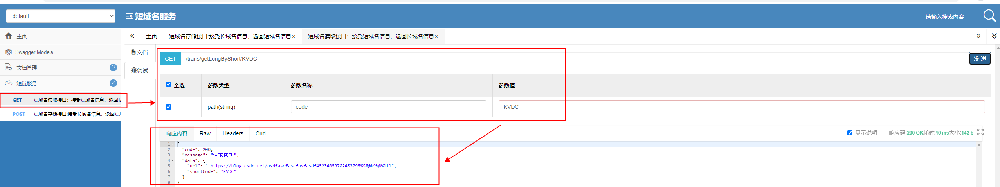
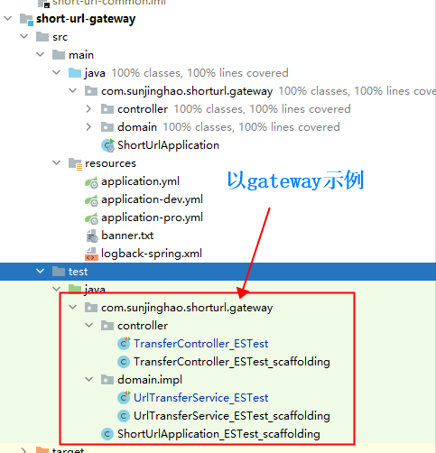

#               ::::::::::::  短域名服务   :::::::::::::::::

# 1.项目简介

短域名存储接口：接受长域名信息，返回短域名信息

短域名读取接口：接受短域名信息，返回长域名信息

 

#2.系统设计思路
 

###注：本项目采用发号器生成自增唯一id做长短链唯一映射方案
         正式生产用采用db生成自增唯一Id，本项目采用本地线程生成自增id代替DB生成
#3.程序启动地址 ：
 
     环境：jdk要求1.8+
     启动：执行com.sunjinghao.shorturl.gateway.ShortUrlApplication；
     访问：http://localhost:6300/{path}
      
#4.项目结构
 

#5.相关集成：
 
##(1) Swagger UI(增强版)：  http://locahost:6300/doc.html
     * 线上环境环境尽量不开启访问，或锁定办公网可访问
 

##(2) 自动生成单元测试，集成 evosuite
 

 
##(3) 单元测试覆盖率统计收集 直接使用 Coverage(idea自带）
        集成了jacoco,但个人感觉没有 Coverage方便、快捷，遂还是使用了Coverage报告如下
 

html图表

 
##(4) 性能测试，集成JProfiler
 

##(5).本地缓存Caffeine（实际分布式环境可用redis）
    内存控制依赖Caffeine淘汰策略
###缓存组件中 Caffeine 性能是其中最好的
# Getting Started
### Caffeine 配置说明
 
 

##（6）工具集
     采用开源的 Hutool 包，便捷、不用各自封装

 
