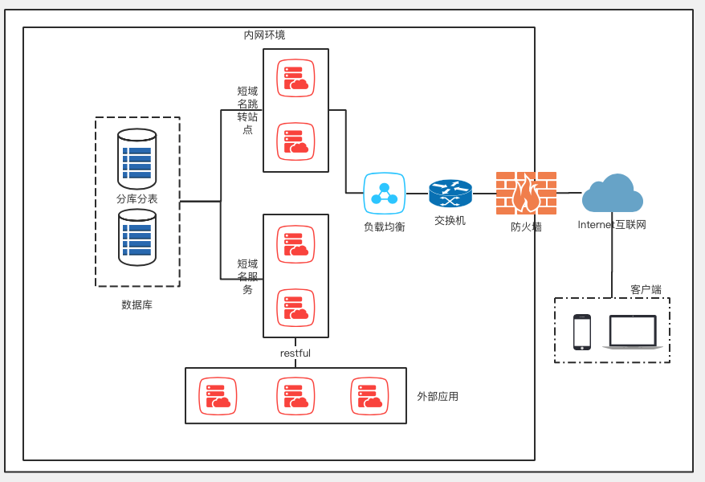
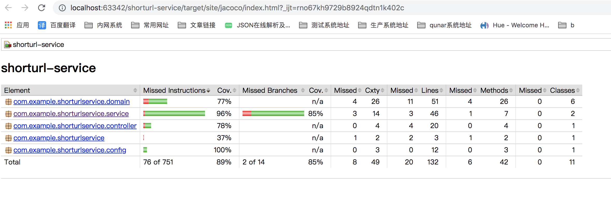
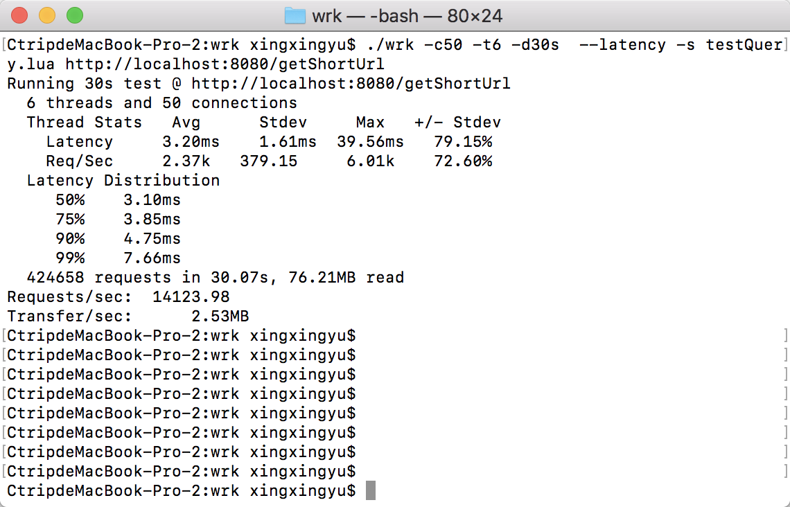
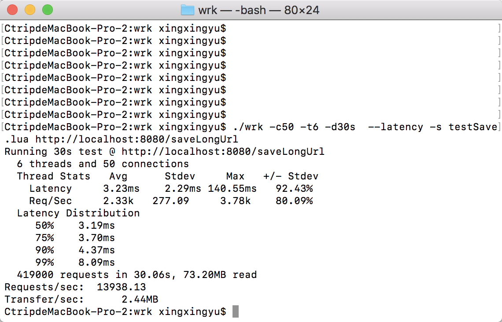

- [0.系统假设](#0)
- [1.系统技术方案](#1)
   - [1.1 整体设计思路](#1.1)
   - [1.2 架构图](#1.2)
   - [1.3 短码算法选型](#1.3)
   - [1.4 存储设计](#1.4)
- [2.Swagger API文档](#2)
- [3.Jacoco单元测试](#3)
- [4.性能测试](#4)
   - [4.1 测试需求分析](#4.1)
   - [4.2 测试脚本设计](#4.2)
   - [4.3 测试数据记录](#4.3)
   - [4.4 测试结论](#4.4)


## 0.系统假设
1) 单体架构的restfu服务。分布式部署会出现查询接口为空的情况，需要更改统一存储来解决。 
2) 存储未设计过期时间和淘汰策略，仅监控堆内存使用率防止内存溢出 
3) 暂不考虑题目以外的生产级功能。如安全、访问量数据统计、短链接数据治理（短链接生命周期）

## 1.系统技术方案

 **1.1 整体设计思路**  
采用SpringBoot，集成Swagger API文档提供restful API。支持json格式的访问和输出。支持幂等

提供两个接口：

1、将所有的不定长的url地址，统一转换为8位字母和数字的字符串

2、将传入的8位字符串转换为原url地址

采用google Guava双向的BiMap数据结构存储在jvm中，通过Runtime类监控内存使用率

**1.2 架构图**  
整体架构图如下：短域名服务内部架构和流程图暂略



 

**1.3 短码算法选型**  
目前比较流行的生成短码方法有：自增id、摘要算法、普通随机数。本项目选择摘要算法。

其相较另2个算法的优势有：
长度固定、相同的输入数据始终得到相同的输出、无序更安全、碰撞概率极小

算法过程：
1) 将长网址md5生成32位签名串,分为4段,每段8个字节；
1) 对这四段循环处理,取8个字节,将他看成16进制串与0xffffffff(32位1)与操作； 
1) 这32位分成8段,每4位的数字作为字母表的索引取得特定字符, 依次进行获得8位字符串；
1) 总的md5串可以获得4个8位串；取里面的任意一个就可作为这个长url的短url地址；

**1.4 存储设计**  
基于题目要求，数据存储在JVM内存即可

那么本项目采用google Guava双向的BiMap数据结构来存储

BiMap介绍

1) BiMap 也是基本的 map 集合结构, 由key value 构成.区别于 Map 是双向关联结构,
1) 可以通过 key 查询 value, 也可以 通过 value 查询 key;
1) 这种集合 不允许 value 重复, 否则会抛出异常
IllegalArgumentException: value already present: value


## 2.Swagger API文档

swagger api文档访问路径：
http://127.0.0.1:8080/swagger-ui/index.html

## 3.Jacoco单元测试

Jacoco单元测试覆盖率截图(行覆盖率和分支覆盖率85%+)



## 4.性能测试

**4.1 测试需求分析**  

1) 测试范围：测试短域名存储和读取接口的响应时间和支持的qps
1) 测试工具：使用wrk测试工具
1) 测试环境：wrk客户端和restful服务同在本地部署

- 硬件: CPU 2核 2.30GHz, 内存 16G 2133Mhz
- 软件：mac操作系统，springboot内置tomcat9.0.58，Jdk1.8.0_181,jvm -Xms4096m -Xmx4096m


**4.2 测试脚本设计** 

对保存和查询接口进行3轮压测，通过结果中输出的响应延迟分布得出压测结论，checkHealth接口可作为基线数据对比

1) checkHealth接口，分别压测30、60、180秒
```
# 6个线程，50个连接，压测30秒
./wrk -c50 -t6 -d30s  --latency  http://localhost:8080/checkHealth
```
2) saveLongUrl接口，分别压测30、60、180秒
```
# 6个线程，50个连接，压测30秒，指定testSave.lua脚本
./wrk -c50 -t6 -d30s  --latency -s testSave.lua http://localhost:8080/saveLongUrl
```

```
--testSave.lua
request = function()
    local headers = { }
    headers['Content-Type'] = "application/json"
    parms = math.random(1000,9999999)
    body = '{"longUrl": "www.ctrip'..parms..'.com"}'
    return wrk.format('POST', nil, headers, body)
end

function response(status,headers,body)
    if status ~= 200 then --将服务器返回状态码不是200的请求结果打印出来
            print(body)
    --      wrk.thread:stop()
    end
end
```
3) getShortUrl接口，分别压测30、60、180秒
```
# 6个线程，50个连接，压测30秒，指定testQuery.lua脚本
./wrk -c50 -t6 -d30s  --latency -s testQuery.lua http://localhost:8080/getShortUrl
```

```
--testQuery.lua
wrk.method = "POST"  
wrk.body = '{"shortUrl": "nQJEYzzj"}'
wrk.headers["Content-Type"] = "application/json"  

function response(status,headers,body)
    if status ~= 200 then --将服务器返回状态码不是200的请求结果打印出来
            print(body)
    --      wrk.thread:stop()
    end
end
```

**4.3 测试数据记录** 

查询接口压测数据



保存接口压测数据



**4.4 测试结论** 

结论：  
查询接口qps在14000 ~ 16000 之间,响应时间99线在8ms内

保存接口qps在13900 ~ 14500 之间,响应时间99线在9ms内