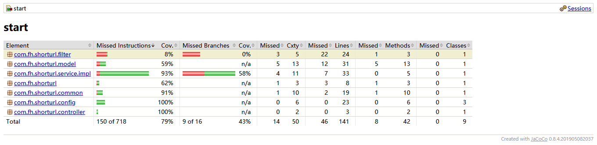

# 工程简介

## 开源框架：
springboot 阿里官网初始化脚手架
knife4j-api文档共享
h2文档数据库以便本地直接启动
EhCache本地缓存
Jacoco用例覆盖测试报告

## api文档地址
http://localhost:8080/doc.html
## 数据库访问地址
http://127.0.0.1:8080/h2-console 查看数据库
## 测试报告查看
1.根路径执行mvn test
2.子Module中打开target/site/jacoco/index.html
### 转发测试URL 
http://localhost:8080/t/63i6Zn

# 需求
短域名存储接口：接受长域名信息，返回短域名信息
短域名读取接口：接受短域名信息，返回长域名信息。
限制：
•	短域名长度最大为 8 个字符
•	采用SpringBoot，集成Swagger API文档；
•	JUnit编写单元测试, 使用Jacoco生成测试报告(测试报告提交截图即刻)；
•	映射数据存储在JVM内存即可，防止内存溢出；

# 设计思路
1.短域名存储接口用于配置短域名转换，其重点在于控制同一个长域名对应的短码唯一
目前采用对长url进行加盐加密的方式进行签名，判断签名是否重复来控制是否返回已有数据
存储转码方面，将长连接进行62进制转换压缩成6位，加上2位转换标识符前缀共计8个字符
2.短域名读取接口主要用于重定向转发，目前没有以api的形式暴露，以filter拦截形式进行暴露，
拦截到指定前缀后进行查询，如果查询到了则进行转发，否则拦截到前缀之后未查到对应长链接则返回提示信息

# 覆盖率测试结果

# 压力测试
工具 apacheAB/apacheJmeter 未完待续

