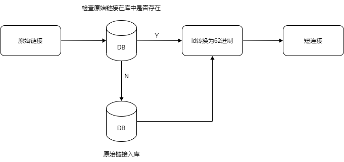
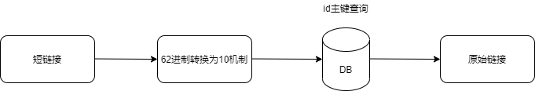
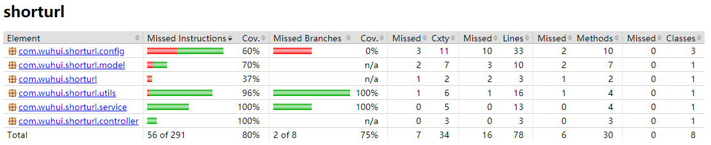

# 短链接服务

## 项目架构: spring boot + jpa + mysql

## 服务提供两个接口:
1. /api/toShortUrl  原始链接转换成短链接 
2. /api/getSourceUrl  短链接获取原始链接

Swagger在线文档地址: http://localhost:8080/swagger-ui.html

## 设计思路：
1. 原始链接转换短连接核心是一个自增ID转成62进制字符串作为短码
   
2. 短链接查询主要是把短码转换成10机制数字作为ID去表中查询
   

## 扩展:
1. 功能扩展
    - 短链接转换可以增加过期时间的机制
    - 短链接查询可以增加查询记录的功能，提供统计上的需求
2. 性能扩展
    - 短链接转换可以使用类似雪花算法生成唯一ID或redis的自增功能替换mysql的自增，让mysql的插入异步化；需要考虑mysql插入失败如何处理
    - 短链接查询也可以使用redis缓存起来，减少mysql的查询次数；需要考虑缓存穿透和缓存雪崩的情况
    - 或者全部使用redis持久化替换mysql存储；需要考虑redis崩溃或重启后的数据恢复

## 单元测试覆盖率：
