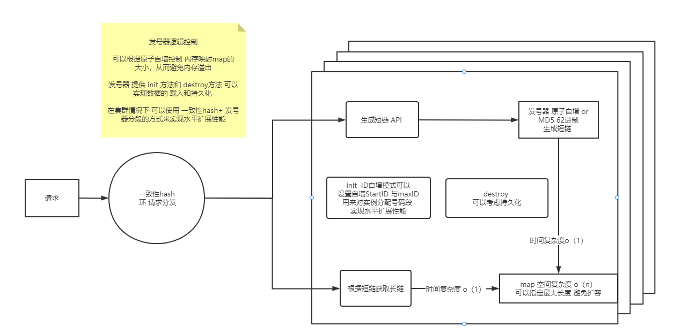
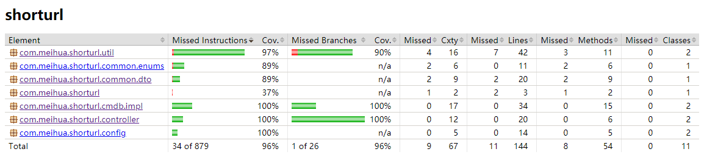

### 设计思路
目前有几种思路实现
1. hash  
优势 **无需id分配 计算简单**  
缺点 **无法避免hash冲突的情况 想要控制长度会带来更大的hash冲突**
2. 自增发号器转62进制  
优势 **可以控制数据量 实现容易**  
缺点 **可能暴露数据量 同一数据也会占用不同号码段  唯一自增会带来一些额外开销 cas（锁）**
3. MD5转62进制  
优势: **不显著随着并发增加而增加响应时间**  
缺点：**但是仍然可能出现重复的情况 数量不好控制 会产生额外开销**

**目前实现ID自增发号器转62进制模式 和 MD5转62进制模式**

### 关于性能
性能结果分析  可能随环境情况抖动 但是两者对比具备一定的参考价值  
1. 方案A 自增发号器 会存在 cas操作 多线程并发下会自旋 
2. 方案B md5发号器 采取cpu计算url的md5值的方式进行发号 

> 硬件配置：Intel(R) Core(TM) i5-9300H 8核   内存 24GB

- 单线程情况分析  100w数据量  循环8次   校验测试  

id发号器  | md5
---|---
[ main] 耗时 ： 648 ms  | [ main]  耗时 ： 2249 ms  
[ main] 耗时 ： 1194 ms | [ main]  耗时 ： 2184 ms  
[ main] 耗时 ： 453 ms  | [ main]  耗时 ： 1679 ms  
[ main] 耗时 ： 2103 ms | [ main]  耗时 ： 1702 ms  
[ main] 耗时 ： 550 ms  | [ main]  耗时 ： 1432 ms  
[ main] 耗时 ： 2184 ms | [ main]  耗时 ： 1406 ms 
[ main] 耗时 ： 285 ms  | [ main]  耗时 ： 1546 ms  
[ main] 耗时 ： 571 ms  | [ main]  耗时 ： 1810 ms  
[ main] 总耗时：7989 ms | [ main]  总耗时 ： 14008 ms  

**单线程情况下 id发号器因发号简单 优于 md5 近一倍**

- 多线程  8线程同时执行 每个线程 100w 条数据量 生成+读取 校验测试

id发号器 总 37722 ms  均 4715.25 ms  | md5  总 34802‬ ms 均 4350.25 ms
---|---
[    id-thread-7]   : 耗时 ： 3973 ms | [   md5-thread-3]  : 耗时 ： 4299 ms 
[    id-thread-3]   : 耗时 ： 4425 ms | [   md5-thread-4]  : 耗时 ： 4317 ms 
[    id-thread-5]   : 耗时 ： 4461 ms | [   md5-thread-0]  : 耗时 ： 4328 ms 
[    id-thread-2]   : 耗时 ： 4501 ms | [   md5-thread-7]  : 耗时 ： 4342 ms 
[    id-thread-6]   : 耗时 ： 4551 ms | [   md5-thread-5]  : 耗时 ： 4356 ms 
[    id-thread-1]   : 耗时 ： 4954 ms | [   md5-thread-6]  : 耗时 ： 4384 ms
[    id-thread-0]   : 耗时 ： 5428 ms | [   md5-thread-1]  : 耗时 ： 4387 ms 
[    id-thread-4]   : 耗时 ： 5429 ms | [   md5-thread-2]  : 耗时 ： 4389 ms 

**多线程情况下 自增发号器 可能带来更加严重的cas 消耗  
后续又进行了多次测试 多线程情况下 自增发号器均不如md5  
反观MD5 总体表现比较平均   不会随着并发的增加而降低性能**

### 关于持久化
持久化可以通过生命周期方法来进行加载和持久化 如果想要保证数据不丢失  
可以在put时 同步或异步 或者后台线程 来进行持久化 但是这也会带来性能的损耗 

### 关于集群模式
MD5在分布式环境下更友好 不需要对号码段进行控制 
ID自增可以通过对实例的号码段进行锁定 每台实例分配不同的号码段 从而实现水平扩展能力

 
### 总结与假设
假设在数据量增长不大的情况下 并发相对较低时 使用自增发号器是个不错的选择
假设数据量量级较大需要考虑水平扩展节点，且并发相对较高，则可以采取较为友好的MD5转62进制实现

### Jacoco 报告

 

