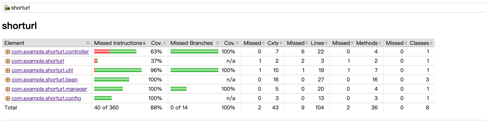

## 短域名生成服务技术设计说明
### 项目结构
````
├── shorturl    
│   └── img                                     // 图片目录，存放jacoco测试结果和项目流程图                                         
│   └── src                                     // 源码目录
│   │   └── main                
│   │   │   └── java
│   │   │       └── com.example.shorturl
│   │   │       │   └── bean                    // 实体类目录，存放请求和响应的实体类
│   │   │       │   └── config                  // 配置目录，存放一些项目的配置类
│   │   │       │   └── controller              // 控制器目录
│   │   │       │   └── manager                 // 存放处理业务逻辑的manager，复杂项目会增加service层
│   │   │       │   └── util                    // 项目用到的一些工具类
│   │   │       └── resources                   // 资源目录
│   │   │           └── application.properties  // 配置文件，目前只将端口改为8081，8080端口经常被占用
│   │   └── test                                // 测试目录
│   │       └── java
│   │           └── com.example.shorturl
│   │               └── controller              // 控制器测试目录
│   │               └── manager                 // manager测试目录
│   │               └── util                    // 工具类测试目录
│   └── .gitignore                              // 忽略版本控制文件清单
│   └── pom.xml                                 // mavan依赖管理文件
│   └── README.md                               // 说明
````

### 流程图


### 短连接生成算法
#### 基本思路
观察到网上常见的短域名地址通常由（0-9，a-z,A-z）组合而成一共62位可选数，因此思考能否用62进制数来表示短域名。然后问题变为如何把长域名转换为62进制数而不重复，考虑到数字的天然连续自增特性，直接维护一个long型的id进行自增，然后转换为62进制即可。long型的最大值为9,223,372,036,854,775,807 >> 62^8 = 218,340,105,584,896(题干要求最多8位的最大生成短链接数)，因此此套方案最多可以支持生成218,340,105,584,896个不同的短域名。目前将一个原子类型id缓存在内存中，保证其并发场景下的正确性，实际线上场景可以把此id作为数据库主键存在数据库中进行自增，然后通过算法转换为62进制，或放到redis中。
#### 优势
相比网上看到的其他通过hash算法或uuid生成短域名的方式，本项目采取的62进制转换法具有永不重复，容量大，易于管理等优点

### 缓存设计
#### 基本设计思路
本项目一共采用了两个缓存对象，一个是以短域名为key的，原始域名为value的缓存对象，用来通过短域名获取原始域名，一个是以原始域名为key的，短域名为value的缓存对象，获取短域名时起到缓存作用，避免每次请求都需要重新生成短域名。
- 如果是实际项目中可能直接用短连接的十进制id来维持映射关系，因为十进制的id与62进制的短域名可以随时转化，id在数据库中作为主键，在设计多级缓存（内存->redis->mysql）的场景下，id更加灵活和直观
- 为了保证内存不溢出，采用了guava cache作为缓存的实现，设置maxSize为1024 * 1024，在单条数据占用1K的情况下，最多占用1K * 1024 * 1024 * 2 = 2G 内存
- 过期时间暂时设置为7天，实际应用中可以灵活的将过期时间存储在数据库中
- 以原始域名为key的，短域名为value的缓存对象，在实际应用中，需要从数据库中加载全部数据，数据库中数据到达一定数量时，可以前置加一个布隆过滤器，判断域名有没有曾经生成过短域名，避免全量加载所有数据到内存中


### swagger地址
````
http://localhost:8081/swagger-ui/index.html
````

### jacoco覆盖率测试
#### 引入
````
<plugin>
	<groupId>org.jacoco</groupId>
	<artifactId>jacoco-maven-plugin</artifactId>
	<version>0.8.3</version>
	<executions>
		<execution>
			<id>default-prepare-agent</id>
			<goals>
				<goal>prepare-agent</goal>
            </goals>
        </execution>
        <execution>
		<id>default-report</id>
			<phase>test</phase>
			<goals>
				<goal>report</goal>
 			</goals>
		</execution>
	</executions>
</plugin>
````
#### 运行
````
mvn test
````
#### 结果
打开target/site/jacoco/index.html查看结果


