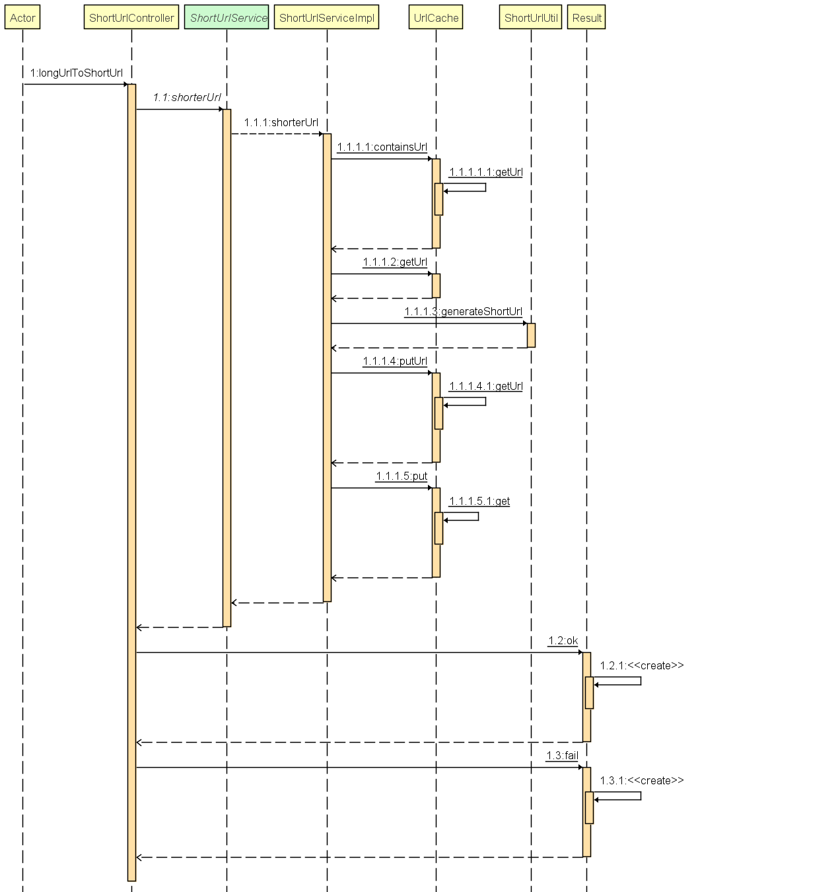

# 系统架构设计
web-->service-->Cache
# 技术选项
1.服务：使用springboot快速打架系统
2.本地缓存：使用google Cache 实现数据缓存，满足系统LRU原则
3.算法：使用摘要算法，
# 工程简介
common--基础公共包，存放返回结果及缓存工具类
config--配置包，swagger配置
controller--控制器
exception--异常包及全局异常处理器
service--服务包，短域名服务接口及实现

## 缓存方案
**域名对数量**
计算思路：假设单个域名对大小不超过200字节. 使用内存大小/域名对大小，同时预留一定内存buffer
计算线程数 = CPU可用核心数/(1 - 阻塞系数）阻塞系数 = 阻塞时间 /（阻塞时间 + 计算时间）
计算公式：8 * (1024 * 1024 * 1024) / 200 = 42949672.
缓存策略：缓存过期时间设置为写入后30天，超过缓存限制采用LRU策略进行清理
缓存思想：
存在2个内部缓存，1，存储长链接md5值与短链接，房子相同长链接请求，直接返回缓存值
2.存储短链接与长链接，方便后续短链接映射长拦截

# 延伸阅读
**算法过程**
1. 将长网址md5生成32位签名串,分为4段, 每段8个字节；
2. 对这四段循环处理, 取8个字节, 将他看成16进制串与0x3fffffff(30位1)与操作, 即超过30位的忽略处理；
   这30位分成6段, 每5位的数字作为字母表的索引取得特定字符, 依次进行获得6位字符串；
3. 总的md5串可以获得4个6位串，按顺序取结果中的短域名编码，如果出现重复，则继续取下一个短域名编码

#测试样例
**测试数据**
1. http://localhost:8080/longUrlToShortUrl?url=http://www.baidu.com
2.http://localhost:8080/shortUrlToLongUrl?shortUrl=http://t.cn/QRrIFn

#调用时序图
1.长链接转短链接时序图
