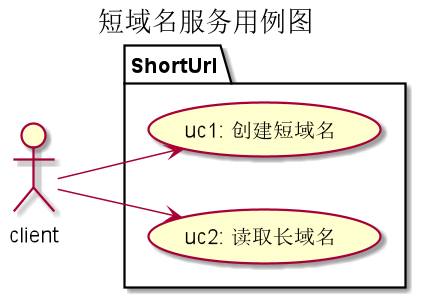
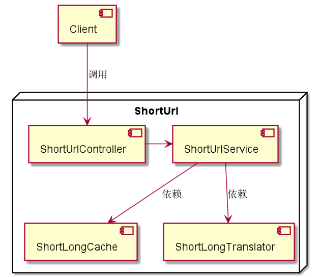
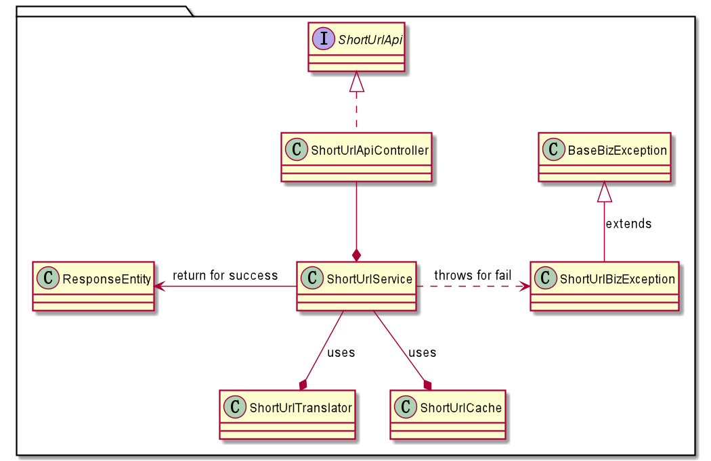
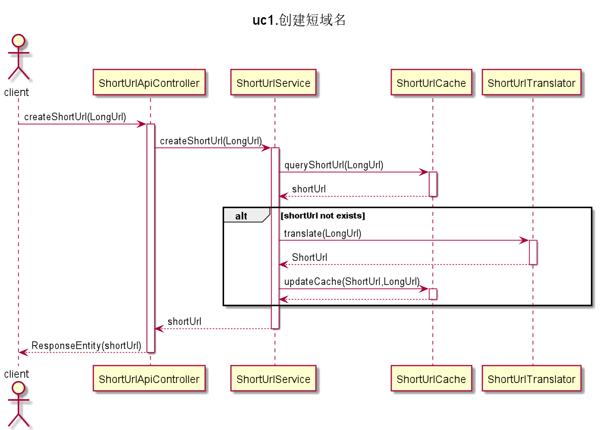
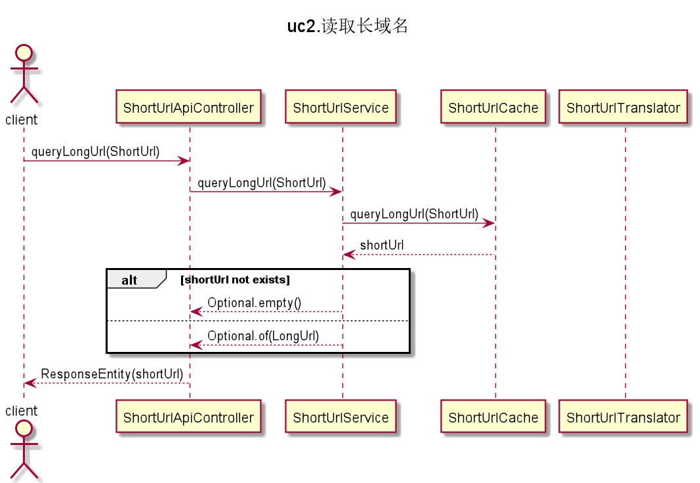

# 短域名服务方案设计

[toc]

## 需求分析

### 名词解释

域名（短域名、长域名）：在本次作业中，“域名”指的是URL，完整格式为`protocol :// hostname[:port] / path / [;parameters][?query]#fragment`

### 概述

实现短域名服务，提供

1. 短域名创建、存储接口：接受长域名信息，返回短域名信息
2. 短域名读取接口：接受短域名信息，返回长域名信息

### 用例图

### 用例约束

1. uc1: 创建短域名
   1. 输入：输入一个合法的url字符串，lurl
   2. 输出：返回一个长度在8个字符以内的url，surl，字符集为[0-9a-zA-Z]，即数字字符以及英文大小写字符，共计62个字符
2. uc2: 读取长域名
   1. 输入：输入一个surl
   2. 输出：返回一个lurl

### 假设条件

针对本次作业做出的具体性假设

1. 功能约束：
   1. 只提供根据LongUrl生成ShortUrl，根据ShortUrl查询LongUrl功能。
   2. 不涉及重定向、转发等功能要求
   3. 不涉及统计等要求
2. 数据量：1000.
   根据IE浏览器Http GET方法，url最长2083字符，Tomcat Http Post方法url最大2M。综合估算设置为1000.
   相应的jvm堆内存也会限制到2.5G.
   超过最大数据量，将返回拒绝服务
3. 吞吐量：未做要求，不做分析设计
4. 响应时间：未作要求，不做分析设计
5. 安全性
   1. 认证鉴权：未作要求，不做分析设计
   2. 其它安全性要求：以SpringBoot+Tomcat默认配置为准，不做特殊配置
6. 数据持久化：
   1. 相应映射关系存储在jvm内存中
   2. 数据库：NA，不进行数据库持久化处理
   3. 缓存服务：NA
7. 数据映射关系
    由于本次作业，不考虑统计信息等要求，因此设计如下

## 总体设计

1. 接口风格：遵循Restful风格，请求与响应利用Http语义完成
2. 会话认证：NA
3. 会话状态保存：NA
4. 组件图

## 核心方案设计

### 长短链映射算法

#### 方案对比

1. 方案一：自增序列。设置ID自增，将ID以62进制呈现。以62进制，最长8个字符算，最大容量可超过200万亿。
   1. 优点：
      1. 永不重复
      2. 效率高
      3. 实现简单
   2. 缺点：
      1. 生成的短链surl长度不一致
      2. 短链有序，存在一定的安全隐患
2. 方案二：摘要算法。利用md5、sha等摘要算法，转换为固定长度字符串
   1. 优点：
      1. 短链没有规律，安全性较高
   2. 缺点：
      1. 存在哈希冲突的可能
      2. 效率较低
      3. 实现复杂，需要解决哈希冲突问题

#### 方案选择

综合以上两种方案优缺点，及本次作业要求，选择*自增序列*算法。

## 系统设计

### 类图

### 用例流程设计

