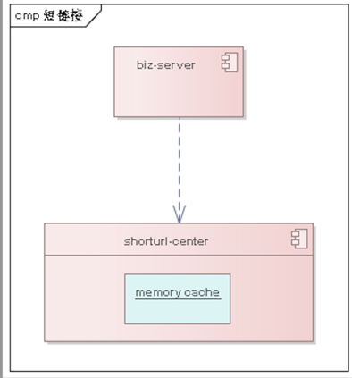
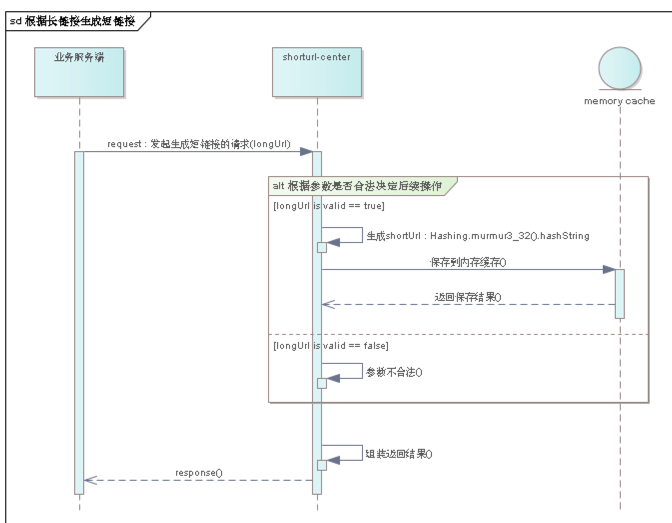
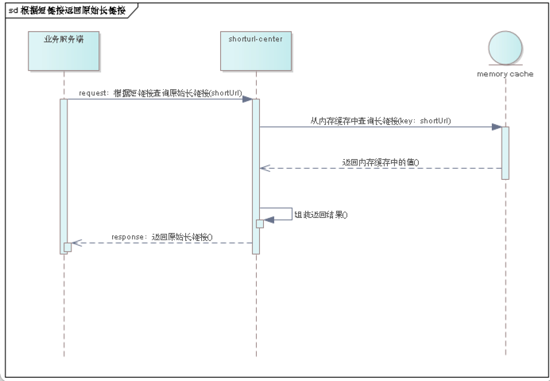

# 利用 Spring Boot & guava 实现短链接服务
## 整体设计
+ 架构概览
  
  
  
+ 根据长链接生成短链接时序
  
  
  
+ 根据短链接查询原始长链接
  
  


## 准备工作

+ Spring Boot 2.1.0+
+ Lombok
+ Guava 28.0
+ Commons Validator 1.6
+ Commons Pool 2.6.0

`application.yml`
## 核心代码


```diff
/** 基于guava的内存缓存 */
  @Autowired
  private LocalCacheManager localCacheManager;


  @ApiOperation(value = "根据输入的长链接生成短链接 ", notes = "根据输入的长链接生成短链接")
  @GetMapping(path = "/createShortUrl")
  public Result<String> createShortUrlByLongUrl(@RequestParam("longUrl") String longUrl) {
    if(!StringUtils.isEmpty(longUrl)){
      UrlValidator urlValidator = new UrlValidator(
              new String[]{"http", "https"}
      );
      if (urlValidator.isValid(longUrl)) {
        String shortUrl = Hashing.murmur3_32().hashString(longUrl, StandardCharsets.UTF_8).toString();
        log.debug("URL Id generated: {}", shortUrl);
        localCacheManager.setShortLongMap(shortUrl, longUrl);
        return Result.ok(shortUrl);
      }
    }
    return Result.fail("param invalid!");
  }

  @ApiOperation(value = "根据短链接获取原始长链接 ", notes = "根据短链接获取原始长链接")
  @GetMapping(path = "/getLongUrl")
  public Result<String> getLongUrl(@RequestParam("shortUrl") String shortUrl) {
    if(!StringUtils.isEmpty(shortUrl)){
       String longUrl = localCacheManager.getLongUrlByShortUrl(shortUrl);
       if(!StringUtils.isEmpty(longUrl)){
         return Result.ok(longUrl);
       }else {
         return Result.fail("url is not exists or lose efficacy！");
       }
    }
    return Result.fail("param is error");
  }
```

## 使用方式

**Step 0: 启动 `url-shortener` 服务**

```console
$ mvn install
...
[INFO] BUILD SUCCESS
...
$ mvn spring-boot:run
...
2019-08-21 21:03:50.215  INFO 10244 --- [ main] o.s.b.w.embedded.tomcat.TomcatWebServer  : Tomcat started on port(s): 8080 (http) with context path ''
2019-08-21 21:03:50.219  INFO 10244 --- [ main] i.g.y.s.u.UrlShortenerApplication        : Started UrlShortenerApplication in 6.01 seconds (JVM running for 12.165)
```

**Step 2: 访问swagger文档**
http://localhost:9527/doc.html

查看日志


**step3: 生成短链接**
http://localhost:9527/doc.html#/API%E5%88%97%E8%A1%A8C-%E5%85%AC%E5%85%B1/%E7%9F%AD%E9%93%BE%E6%8E%A5/createShortUrlByLongUrlUsingGET

**step4: 根据短链接获取原始长链接**
http://localhost:9527/doc.html#/API%E5%88%97%E8%A1%A8C-%E5%85%AC%E5%85%B1/%E7%9F%AD%E9%93%BE%E6%8E%A5/getLongUrlUsingGET

