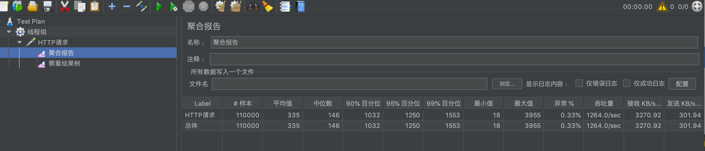

1、功能测试报告
    
    使用jacoco测试结果如下（排除了参数类）
   
    
    
2、性能测试

    机器配置：MacBook Pro 2.6GHz Inter Core i7 16G内存
    统一都是1000个线程组，在1s内循环100次
    
    2.1、长地址转换短地址接口性能
       
   
    2.2、短地址转换长地址接口性能
    
    
    2.3、转发性能
    
     
3、缺陷
    
    3.1、性能测试仅使用jmeter做了单接口的性能测试。
    3.2、参数未动态调整，与实际场景会有较大出入。
    3.3、未进行混合场景的压测。
    3.4、本机测试，无法保证机器稳定性以及是否受其他干扰。
    综上，以上的性能测试只能作为一个参考，并不能说明任何实际问题。
    
4、进阶
    
    更加完善的压测方案：
    4.1、可根据实际业务场景中，各个接口的请求比例设置压测场景中的请求比例
    4.2、通过网关录制全天（或流量高峰时的一段时间）的请求，压缩在几分钟之内全部请求
    