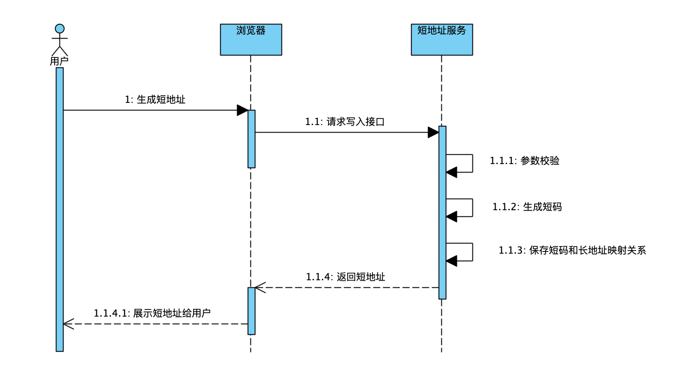
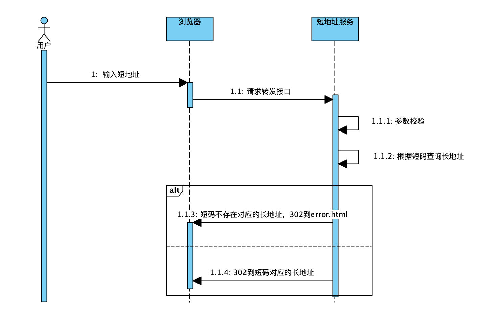

1、背景

    实现短域名服务（细节可以百度/谷歌）
    撰写两个 API 接口:
    短域名存储接口：接受长域名信息，返回短域名信息
    短域名读取接口：接受短域名信息，返回长域名信息。
    短域名长度最大为 8 个字符
    采用SpringBoot，集成Swagger API文档；
    JUnit编写单元测试, 使用Jacoco生成测试报告(测试报告提交截图)；
    映射数据存储在JVM内存即可，防止内存溢出；

2、设计思路
    
    2.1、核心问题
    
    2.1.1 短码生成算法
    短码一般使用0-9，a-z，A-Z的组合
    A、自增id
       使用62进制计数法，从0开始，每次递增。
       缺点：
            短码不随机，有规律，可以从0开始穷举出来
            每次请求都会自增，相同的长地址每次生成的短码都不一样
            
    B、hash算法
       将长地址使用md5加密，得到32位字符串，分割成8个子串，每个字段和62做位运算，查表得到对应短码。
       缺点：
            存在hash碰撞问题
            
    2.1.1 存储
        
    
    2.2、核心时序图
    生成短地址
   

    短地址转发
   
3、缺陷

    3.1、映射数据存储jvm内存，容易发生丢失，一旦宕机或者重启无法找回；同时，当流量过大时无法扩容
    3.2、在内存中选择了ConcurrentHashMap作为存储容器，存储的数量会受到限制。8位短码理论上可存储62^8个短地址
    3.3、未考虑内存溢出问题。可以通过数量来进行限制。最大数量=实际jvm分配内存/（短码+长地址的凭据大小）
    3.4、计算短码的方式存在缺陷，可能会重复。
    3.5、不支持过期清除。
    
4、扩展
    
    设计了db存储和redis存储的扩展类。

    
    
    