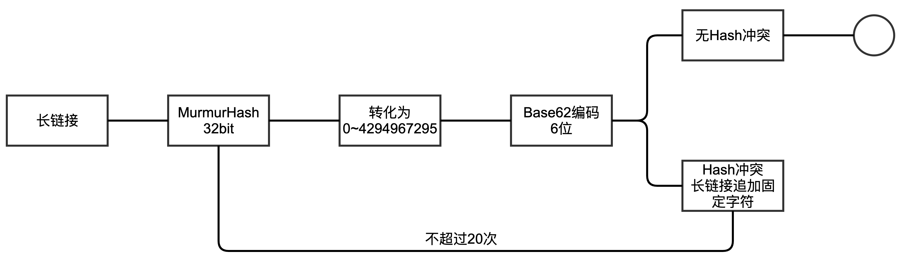
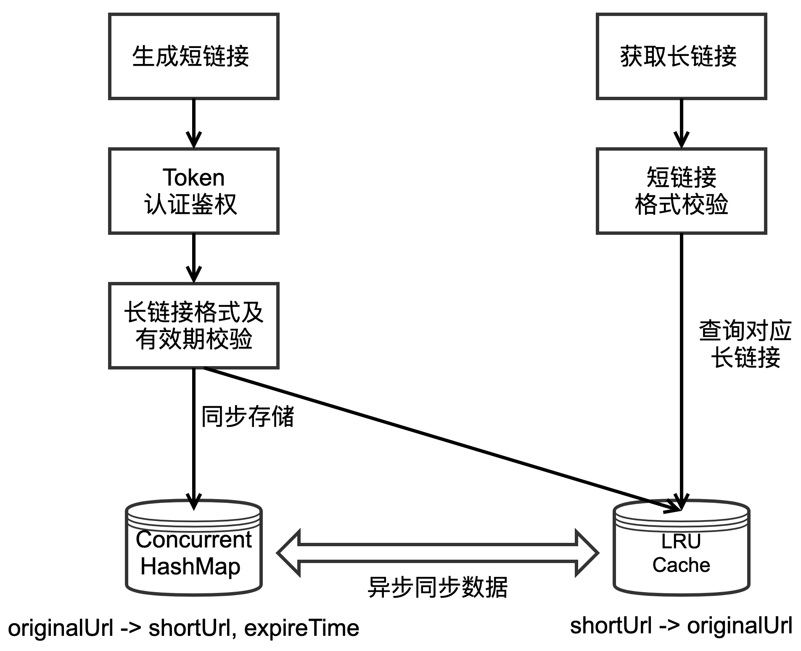

## 设计思路

​		本服务主要是维护一个长链接和短链接的映射关系，核心需要考虑的有两点：一是短链接的生成算法；二是长短链接的映射关系如何存储；

#### 1、短链生成算法

​		这里采用的是Google的MurmurHash，MurmurHash是一种非加密型哈希函数，适用于一般的哈希检索操作。与其他流行的哈希函数相比，对于长度较长的key，MurmurHash的随机分布特征表现更良好，发生Hash碰撞的几率更低。比起MD5，它的性能至少提升一个数量级。

​		MurmurHash提供的32bit长度的哈希值，可以表示的数值范围是0~4294967295，约43亿。然后将MurmurHash生成的数字转化为6位的Base62的字符，不足6位在前面补最低位字母。6位Base62能够对应的数字范围是0~56800235584，约568亿，可以覆盖MurmurHash生成的数字范围。

​		出现Hash冲突时，在原始长链接后面拼接特殊标记，重新计算Hash值，同时限制一下追加重算的次数。

#### 2、存储设计

​		映射数据存储在JVM内存中，一个存储是要将短链接转换为长链接，这个存储承担短链接转换为长链接的查询功能，读多写少，且为了防止内存溢出，设置了最大数量，在映射数据都没有失效的情况下，根据数据的访问频率进行自动淘汰，这里选择Dubbo基于LinkedHashMap实现的LRU-2的缓存实现，key为短链接，value为长链接，保证短链接没有重复数据；另一个存储管理短链接的有效期，这个存储读写频次接近，选择使用ConcurrentHashMap，key为长链接，value为短链接，保证长链接没有重复数据，同时通过异步方式与另一个存储进行同步。

#### 3、整体架构

## 前提假设
1、服务设计和实现是基于单机环境，分布式环境需要将锁和存储替换为分布式实现；

2、短链接的有效期不超过5年，容量评估5年生成的内短链接数量在20亿左右；

3、生成短链接服务使用多租户模式，各租户不能修改其他租户的短链接信息，同一个租户可以修改自己短链接的有效期；

4、查询原始链接的服务不区分租户，以开放的形式对外提供查询服务；

## 由于时间有限，还有一些待完善的地方

1、短链接生成接口/short-url/create，可以增加服务隔离机制，按照appId增加限流控制，防止一个请求方并发量过大，对整个服务造成大的影响；

2、查询原始链接接口/short-url/get，可以增加布隆过滤器，对不存在的短链接进行过滤，减少存储层的查询量；

3、短链接容量扩充，可以替换为64bit的MurmurHash，超过8位Base64范围时进行截取操作；
