# 短域名服务

## 原始需求
[PRD文档](https://github.com/scdt-china/interview-assignments/tree/master/java)

## 实现目标
### 业务目标
+ 提供两个API接口：   
    短域名存储接口：接受长域名信息，返回短域名   
    短域名读取接口：接受短域名信息，返回长域名
+ 限制：   
    短域名长度最大为 8 个字符

### 技术要求
+ 采用SpringBoot，集成 Swagger API 文档
+ JUnit 编写单元测试，使用 Jacoco 生成测试报告（提供截图）
+ 源代码（生产级编码，使用gitignore过滤） 
+ Jacoco单元测试覆盖率（行覆盖率和分支覆盖率85%+）
+ 文档：完整的设计思路、架构设计图及适当的假设 
+ 系统性能测试方案及测试结果 

### 增值
+ 稳定性
+ 高并发
+ 防攻击
+ 数据统计分析
    
## 概要设计
**工程搭建**
+ 采用Springboot搭建服务，继承swagger、JUnit、Jacoco
+ 采用单体部署，而不是分布式部署
+ 数据采用本地内存存储，配合适当的淘汰策略

**关键点**
+ 62进制的短域名：使用62个字符[A-Z,a-z,0-9]来保存长度为n的短域名。7位的62进制数可以保存3万5千亿个域名，可以满足需求。
+ 短域名格式，采用如 c3.cn/<alias_hash> 格式，其中，alias_hash 是一个固定长度的字符串。alias_hash 作为每一个映射的id，需要维护一个 <ID, url> 的关系。
+ id生成方式：   
   - 有序id
     - 关系数据库自增id，如mysql；
     - redis INCR自增生成id；
   - 无序id  
     - hash算法生成id，如google MurmurHash等，需要避免碰撞；
     - 分布式号码生成器生成id，如 Twitter SnowFlake，或自建发号器
     - 随机数，需要避免碰撞
   
| 算法 | 描述| 优点 |缺点 |
| --- | --- | --- |--- |
|Snowflake | 改造Snowflake算法，确保生成的ID不超过64进制下8位字符 | 高效、分布式 | 默认ID过长，改造后需牺牲并发性能 |
|  本机自增ID| 本机 AtomicLong 实现 | 简单、高效 | 单机、ID有规律 |
|  分部署自增ID| redis自增、数据自增ID都可以实现 | 简单、分布式 | 依赖中间件、ID有规律 |
|MurmurHash | 对原始链接取 Hash 值，可直接用Guava 中的 MurmurHash 实现 | 高效、分布式、ID无规律 | Hash冲突需单独处理 |
|随机数 | 基于Math.round()生成 | 生成简单 | 存量数据大时，碰撞概率增加，需重试 |
    
## 设计思路
短域名服务的核心是给长域名匹配一个合适的短域名，通过长短域名的映射关系实现双向查询。

### 如何生成短域名
1、从缓存中查询长域名是否已经生成过短域名，如果已经生成过，则直接返回缓存中的短域名；   
2、从缓存中查询长域名是否已经生成过短域名，如果没有生成过，则使用算法生成一个短域名，然后保存短域名与长域名的关系，并判断是否碰撞（取决于具体算法），如果有碰撞，则再次算法生成新的短域名，最多重复10次，直到得到合适的短域名。

### 如何生成不冲突的短链
建立一个发号器，每次有一个新的长URL进来，就生成新的值返回，相当于实现一个62进制的字段（保证不重复，可自增）即可。    
实现方式：murmurHash生成

### 如何管理长短链接映射
长短连接一一对应？   
- 在内存中做一层缓存，保存长链接与短码对应关系，短码对外暴露时需要加上相应域名前缀   
- 采用guava cache存储最近/最热门的对应关系，非全量数据存储（仅模拟用）   

用guava cache存储“最近”生成的长对短关系，按照数据多少(weight权重)实现 LRU 淘汰。   
a、根据长链接生成短码，判断短码是否存在长短链接对应关系，有就直接返回   
b、没有的话，就尝试基于长链接这个字符串进行加锁处理，加锁成功后保存长短链对应关系   
c、如果保存长短链关系失败（如并发写入等），会尝试重试一定次数a到b的过程    
d、如果最终写入失败，返回失败信息   

### 如何防并发
内存中设置一层guava loadingCache（缓存30s），保存请求对应的 promise（对应CompletableFuture），相同入参并发请求下，只有第一个请求会生成promise并会源处理，其他并发请求拿到缓存中的promise等待处理结果即可。

### TODO LIST
1、若是采用分布式发号器，发号器的效率问题？  号段处理，批量发号   
2、长短链接如何重定向？ 301永久重定向，302临时重定向，一般以使用302，可结合业务场景适当使用301   
3、预防攻击
   - 请求签名
   - 限制ip的单日请求总数，超过阈值则限流，或者直接拒绝服务
   - 加缓存，LRU机制进行淘汰


## 架构设计图
架构图：   
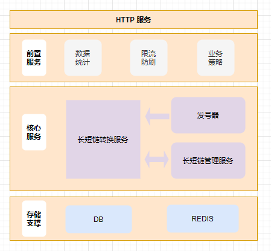

核心流程图:   
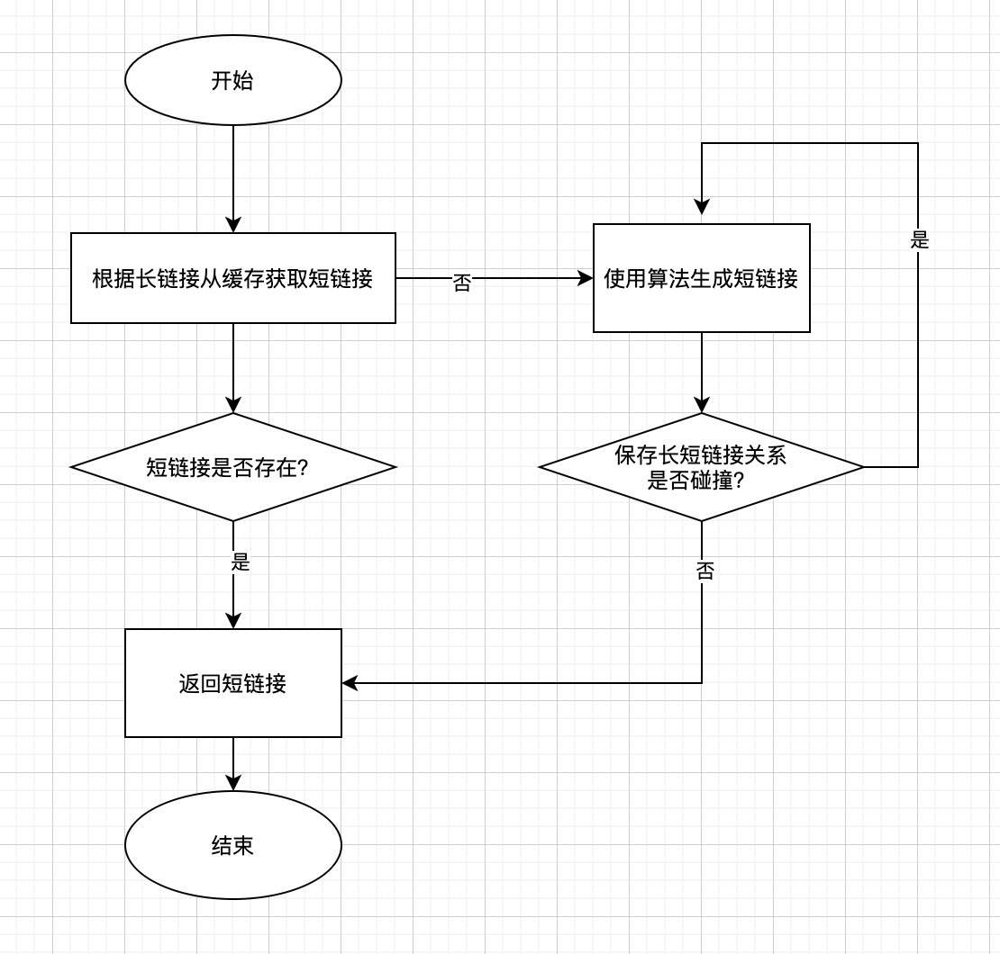


## 输出物
### 接口
1、根据长链接获取短链接 http://domain:port/tinyUrl   
2、根据短链接获取长链接 http://domain:port/originUrl   

### swagger 
http://localhost:8080/swagger-ui.html
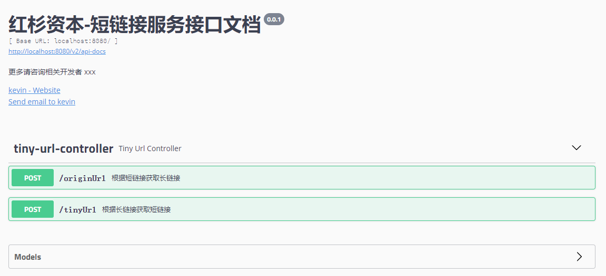

### 单元测试覆盖率
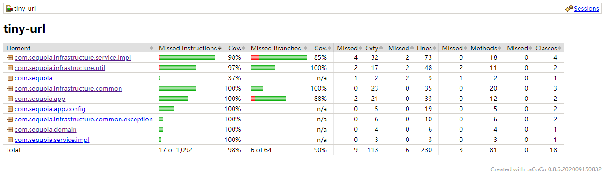

### 压力测试
- 压测方案  
采用Jmeter进行发压测试，使用 JProfiler 观察 CPU、内存、及GC表现

- 机器配置：2C8G
- 启动命令：
```
-Xms2048m -Xmx2048m -server -XX:+UseG1GC
```

- 压测结果：
    - jmeter启动100个线程，每个线程执行10000次，分别压测如下场景：   
    a、空方法下：验证机器性能  
    b、写方法(uuid作为入参获取短链接)：验证写长短链接映射关系性能    
    c、读方法(uuid作为入参获取长链接)：验证读性能

附录(压测数据表)：

| 场景 | avg(ms)| tp99(ms) |tps | cpu(%) |
| --- | --- | --- |--- |--- |
|空方法 |16 | 147 | 5655 |71
|取短链接(写)| 29 | 391 | 3824 |71
|取长链接(读) |34 | 391 | 3966 |70

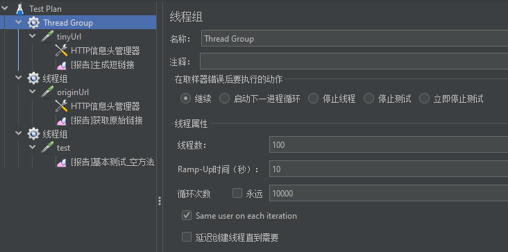   

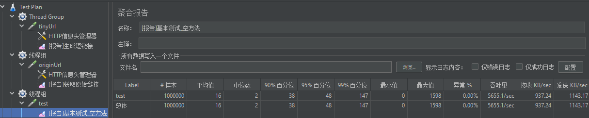   
   
jmeter写压测   
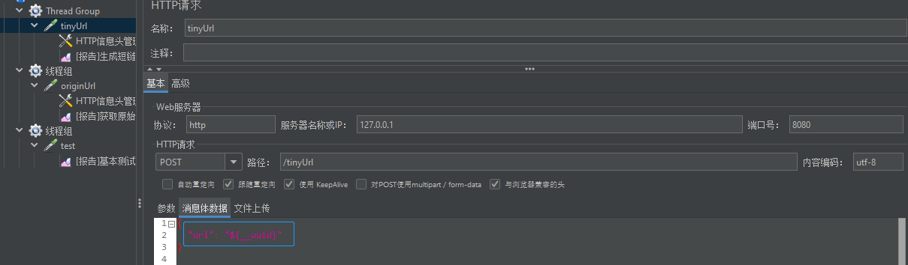   

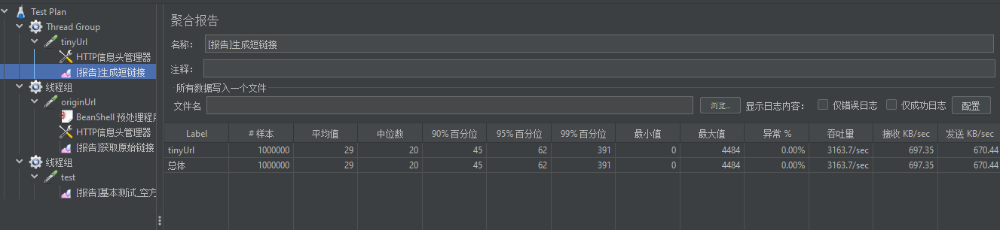    

jmeter读压测
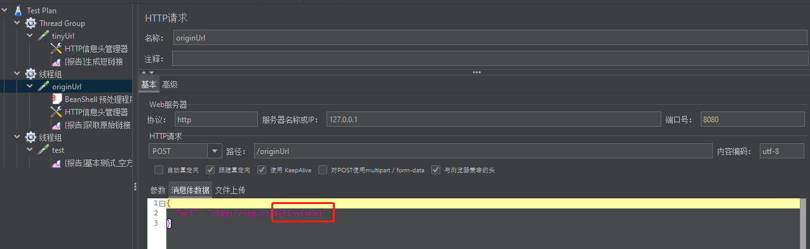 

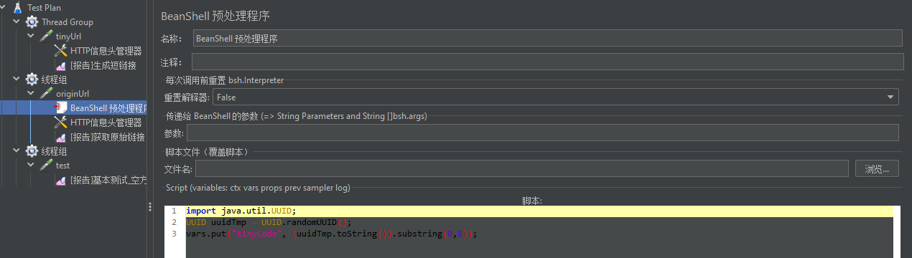 

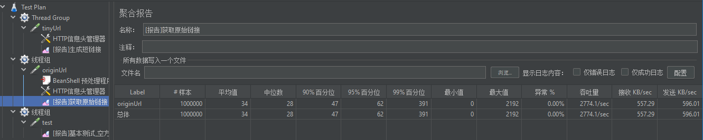   
