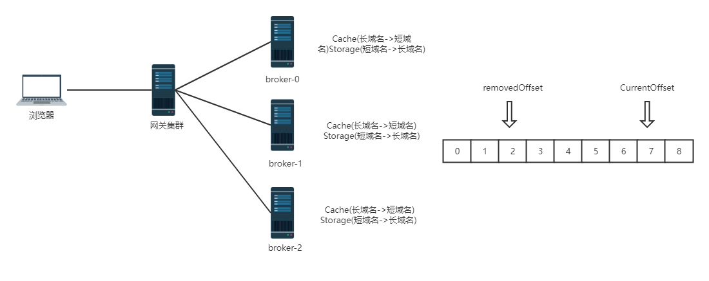
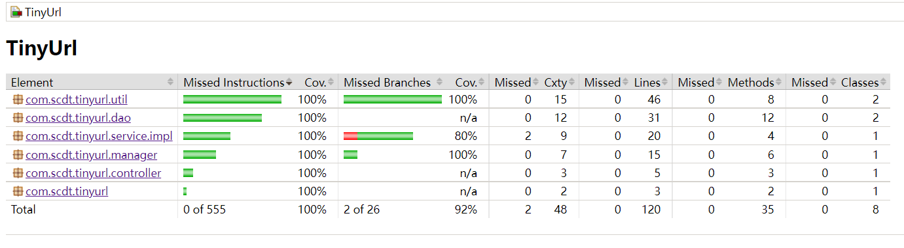
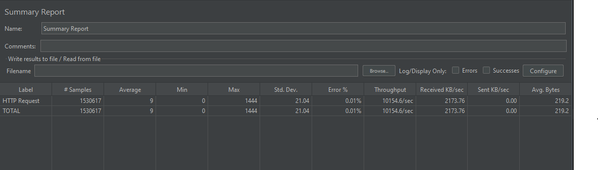

# tiny-url
短域名服务

## 需求内容
撰写两个 API 接口:
- 短域名存储接口：接受长域名信息，返回短域名信息
- 短域名读取接口：接受短域名信息，返回长域名信息。

限制：
- 短域名长度最大为 8 个字符
- 采用SpringBoot，集成Swagger API文档；
- JUnit编写单元测试, 使用Jacoco生成测试报告(测试报告提交截图)；
- 映射数据存储在JVM内存即可，防止内存溢出；

## 部署架构

)

方案整体使用分布式架构部署应用，提升服务横向扩展能力，防止单点故障导致整体服务不可用
每台机器分配一个broker-id作为唯一标识，将broker-id作为全局唯一ID的一部分进行编码，同时作为网关层的路由策略，
当网关解码短域名后取前N位判断将请求具体转发到哪台机器上。应用收到请求后判断如果不是当前机器则抛出ID_MOVED_ERROR，网关收到后重新从服务中心拉取新的服务实例列表进行重试。

## 分析设计
通常生成短域名的算法有多种，比如使用Hash算法，但是碰撞的问题不可避免，会导致多个长域名转成了同一个短域名，
因此方案中选择使用发号器为每个长域名生成全局唯一id，将ID按8位62进制编码后输出作为短域名。

使用发号器方案的问题在于每天新增的Url可能最终会导致ID耗尽，因此可以重复利用已经过期的id防止ID到达上限时无法分配。

方案设计上使用了类似MySQL Redo log的环形缓冲区的思路，使用两个AtomicLong变量currentOffset和removedOffset，
currentOffset表示已经分配的ID下一个所在的偏移量， removedOffset代表当前已过期的偏移量，

如果currentOffset到达上限时会从0开始计数，但如果追上了removedOffset，则需要等待removedOffset向前移动释放新的ID
为了简化方案的实现，这里使用currentCount记录已使用的id数量，当currentCount到达上限时抛出异常，否则加1，并且通过CAS更新currentOffset。

方案中使用监听器模式处理过期事件对currentCount的更新，当存储的Url过期时会通过EventPublisher发布一个过期事件，
id管理器在监听到过期事件发生时将currentCount减1，从而使removedOffset向前移动。

## 存储方案
存储方案选择了Caffeine，相比Guava的LoadingCache，Caffeine提供了RingBuffer和Window-TinyLfu算法，读写性能与缓存命中率都要优于后者。

## 限流方案
为了保护服务实例，方案中使用自定义注解封装了Guava的RateLimiter进行服务限流。

## 安全问题
- 为了防止生成的短域名被预测到，在应用配置中可以将application.codec-dict里的编码表随机打乱(默认配置为0-9 a-z A-Z)
- 为了避免相同的url刷单导致id增长过快，方案中使用了另一个默认容量为底层存储(短域名->长域名)20%的Cache存储了(长域名->短域名),
这里没有采用布隆过滤器的原因在于，布隆过滤器对于未存储过的url有一定几率的误判，此外布隆过滤器添加的元素无法删除。
如果使用按时间窗口的布隆过滤器，虽然可以节省内存空间，但在下一个时间窗口生成新的布隆过滤器需要回收旧的，增加了额外的垃圾收集时间，
因此综合考虑方案中使用了较为简单的LRU/LFU Cache实现。

## 测试报告
Jacoco测试报告

交互式应用场景，JVM使用ParNew + CMS取代默认的Parallel Scavenge+Parallel Old

JVM参数: 

-Xms2048M -Xmx4096M -Xmn3276M -Xss1M -XX:SurvivorRatio=8  -XX:+UseParNewGC -XX:+UseConcMarkSweepGC

单机(4c 8g配置)的压测报告

## 优化方向
### 负载均衡
  使用8位Base62编码时，生成的ID范围为0-218340105584895，使用第一位作为broker-id时可以部署三台机器，当broker-id=0或1时，ID的范围为0-99999999999999，
  而broker为2的机器 ID范围为0-18340105584895，存在负载不均衡的情况，因此可以将2开头的这些ID通过hash再次均匀分配到前面的机器上实现负载均衡。
  如果需要实现分区与节点映射关系的动态改变，可以考虑使用zookeeper保存元数据，节点向zookeeper注册自己，zookeeper则维护了分区与节点之间的映射关系，
  网关层向zookeeper订阅映射信息，如果节点或分区范围发生了改变，watcher会通知网关进行元数据更新，使网关的路由信息保持最新状态。

### 数据持久化
  当某台机器宕机时，由于数据保存在JVM内存中，生成的所有ID在重启之后均会丢失，
  当查询长域名的请求经过网关，通过解析短域名路由到该台机器时会找不到对应的短域名，
  可选以下几种方案进行数据持久化：
- 持久化内存中最近的数据到磁盘
  类似Kafka处理索引文件的方式，通过MappedByteBuffer内存映射与磁盘文件建立映射，使用后台线程写入PageCache，
  由操作系统决定刷盘时机，以免影响写入性能 ，每到一定时间间隔生成新的文件，并且滚动删除最老的文件，防止磁盘爆满。 
  当应用重启时尝试读取最新的文件加载到Caffeine中。
- 使用HBase等k-v型的NO-SQL数据库或者关系型数据库进行分库分表存储数据，同时将时间戳一并存储，
  用来判断读取的数据是否过期，如果使用HBase存储，可以将过期时间作为TTL，数据到期时会自动删除。
  使用数据库存储可以采用Redis类似的过期清理机制-惰性删除+定期删除，查询时访问到过期数据时对过期数据进行删除操作，
  同时后台定时任务线程会随机取出一定量数据进行检查，删除掉过期的数据。

### 框架选型
  目前方案采用的Spring MVC基于传统的同步阻塞式I/O模型，如果存储不使用jdbc的情况可考虑替换为webflux框架，基于NIO的非阻塞I/O模型可以支持
  更多的并发连接，相比之下性能可以得到进一步提升。

### 数据迁移
  假如当前应用需要从2个节点扩容到20个节点，网关解析请求的短域名broker-id规则从取一位变成取前两位，原来路由到broker1的请求会被路由到broker1X，因为broker1X为扩容节点所以无法查询到数据。
  因此broker1X可以将该请求转发至broker1(注意不要复用获取长域名的接口，否则会抛出ID_MOVED_ERROR，可单独提供一个接口进行查询)，并且将响应的数据存储到自身的节点中，
  同时返回给客户端，这样通过渐进式的数据迁移方案最终数据会均匀分布到所有扩容后的节点上。