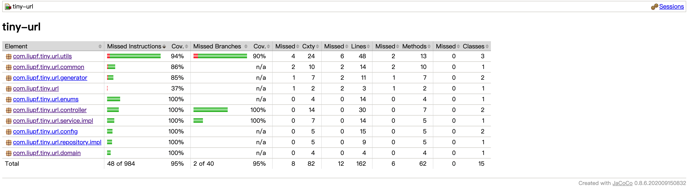

# 短域名服务

## 需求

**撰写两个 API 接口:**

* 短域名存储接口：接受长域名信息，返回短域名信息
* 短域名读取接口：接受短域名信息，返回长域名信息。

**限制：**

* 短域名长度最大为 8 个字符
* 采用SpringBoot，集成Swagger API文档；
* JUnit编写单元测试, 使用Jacoco生成测试报告(测试报告提交截图)；
* 映射数据存储在JVM内存即可，防止内存溢出；

## 设计
[设计方案](docs/设计方案.md)

## 部署

**本地运行：**

* 方法一：执行TinyURLApplication.java，可替换启动参数：spring.profiles.active=prod，默认spring.profiles.active=dev
* 方法二：在工程跟目录执行命令：mvn clean spring-boot:run -Pdev

**接口文档：**

* Swagger地址：http://localhost:8081/tiny/swagger-ui.html

## 单元测试

* 在工程跟目录执行命令：mvn clean test -Pdev，结束后访问target/site/jacoco/index.html查看
* 结果：./docs/image/jacoco_report.png 

## 性能测试
选用JMeter进行压测，方案待补充...

