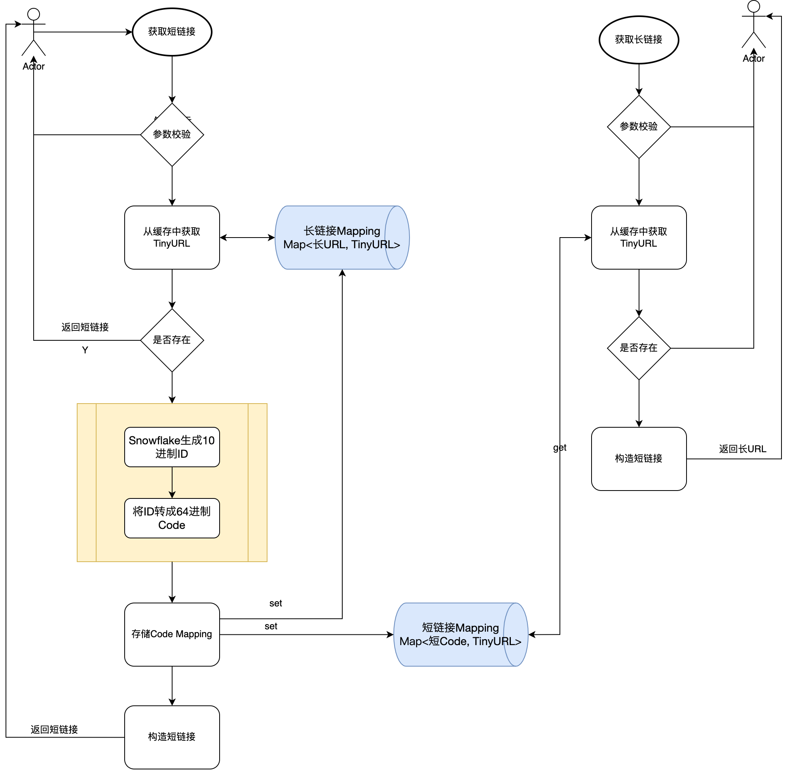

# 短域名服务设计方案

## 需求

[PRD文档](https://github.com/scdt-china/interview-assignments/tree/master/java)

撰写两个 API 接口:

* 短域名存储接口：接受长域名信息，返回短域名信息
* 短域名读取接口：接受短域名信息，返回长域名信息。

限制：

* 短域名长度最大为 8 个字符
* 采用SpringBoot，集成Swagger API文档；
* JUnit编写单元测试, 使用Jacoco生成测试报告(测试报告提交截图)；
* 映射数据存储在JVM内存即可，防止内存溢出；

## 需求整理

* 采用springboot搭建短域名服务，集成Swagger、JUnit、Jacoco
* 实现短域名存储接口、短域名读取接口
* 短域名Code长度最大为 8 个字符（可固定为8字符）,Code尽可能无规律
* 数据存储在本地JVM中，系统可设计成单体应用，扩展：集群部署少改动
* 本地内存有限，可选择性淘汰部分数据，优先确保不会出现OOM

## 概要设计

**工程搭建**

* 搭建简单SpringBoot服务，采用标准的三层结构设计
* 集成Swagger API、JUnit
* 通过profile控制运行环境

**Code生成算法**

> 比较流行的算法大致可分两种: 自增序列算法、摘要算法。

| 算法 | 描述| 优点 |缺点 |
| --- | --- | --- |--- |
|Snowflake (推荐)| 改造Snowflake算法，确保生成的ID不超过64进制下8位字符 | 高效、分布式 | 默认ID过长，改造后需牺牲并发性能 |
|  本机自增ID| 本机 AtomicLong 实现 | 简单、高效 | 单机、ID有规律 |
|  分部署自增ID| redis自增、数据自增ID都可以实现 | 简单、分布式 | 依赖中间件、ID有规律 |
|MurmurHash | 对原始链接取 Hash 值，可直接用Guava 中的 MurmurHash 实现 | 高效、分布式、ID无规律 | Hash冲突需单独处理 |

**内存映射**

```
class TinyURL {
	String code;// 8位Code
	String longUrl;// 长链接地址
}
1. 短链接Mapping：定长Map<短Code, TinyURL>
2. 最近的长链接Mapping：弱引用Map<长URL, TinyURL>
```

**内存溢出保护**

* 限制本地Cache的最大容量
* 采用WeakCache，定期清理
* 缓存对象统一构造(使用单例模式)

## 关键点设计

**ID生成器-Snowflake算法**

* 由于Code长度限制在8位，生成的10进制ID不能超过Math.pow(64, 8)=218340105584896；
* 64位二进制雪花算法 = 时间戳 + 业务属性 + 机器码 + 自增序列，时间戳相对固定，可以压缩后续三个组成部分
* 改造后ID生成规则如下：

| 描述 | 时间戳 | 业务码 | 机器码 |自增序列 |
|  ---  | --- | --- | --- | --- |
| 二进制占位| 第64~9位 |  第8位 | 第7位  | 第6~0位 |
| 可用数值 | 2022年后毫秒 | 2个 | 2个  | 64个 |

**流程图**


## 接口文档

```
# 获取短链接
curl -X POST "http://localhost:8081/tiny/url/getShort"
Param：{
	"longUrl": "http://www.baidu.com"
}
Response：{
	"code": 200,
	"msg": "成功",
	"result": "http://localhost:8081/tiny/v/AyogSndq"
}
```

```
# 获取长链接
curl -X POST "http://localhost:8081/tiny/url/getLong"
Param：{
	"shortUr": http://localhost:8081/tiny/v/AyogSndq"
}
Response：{
	"code": 200,
	"msg": "成功",
	"result": "http://www.baidu.com"
}
```

## 扩展

**安全性**

* 防止请求重复提交
* 验签：URL签名
* 限流：限制每分钟总的发号总数，限制每个IP单位时间内的次数

**集群部署**

* 将Mapping数据转移到Mysql即可集群部署
* 通过Redis提高系统效率

**统计/监控**

* 日志打点/Redis计数统计短链接的访问次数
