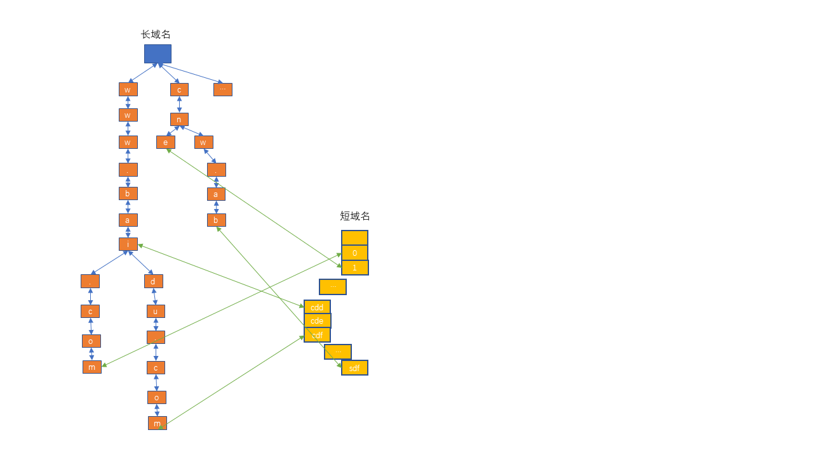

# 长短域名映射实现说明

## 核心思想
由于短域名比长域名短，不存在某种算法可以使长短域名一一映射，需要把长短域名的关系保存下来。

1.短域名:由[0-9|a-z|A-Z]中的字符组成的不超过8位的字符串,总共有63^8-1中可能,可由long型整数表示,输出时按照10进制到62进制转换。

2.短域名使用long型递增计数器，递增分配，可用空间大，实现简单。

3.长短域名映射关系存储:长域名用双向字符树存储,短域名用多个数组分段存储,长短域名通过指针关联.如下图:

上图表示：www.bai-->cdd; www.bai.com-->0; www.baidu.com-->cdf...

双向字符树：树里的每个节点都是一个字符，双向表示即可从父节点找到子节点，也可有子节点找到父节点。由于长域名前缀重复率高，用字符数来存储可节省空间，且查找效率高。

如上图中www.bai, www.bai.com, www.baidu.com 这三个长域名的共同前缀www.bai在树中只需要存储一次，省空间。

短域名需要分成多个数组来存储是因为在java里数组的最大长度不能超过int型的最大值。

## 根据短域名查找长域名

url: POST /url_mapping/long2short 

流程：根据短域名算出对应的long型整数，据此计算出短域名存储的数组下标，根据数组下标查找对应的长域名。

## 根据长域名获取短域名

url: GET /url_mapping/short2long/{shortUrl}

流程：

1.从字符树中查找，若已存在，则直接返回对应的短域名；

2.若不存在，则将该长域名插入到字符树中，并生成下一个短域名id（long型整数）

3.将短域名数组的第id个元素指向长域名在字符树中的最后一个节点。

4.将long型的短域名id转换成63进制的字符串当短域名返回。

