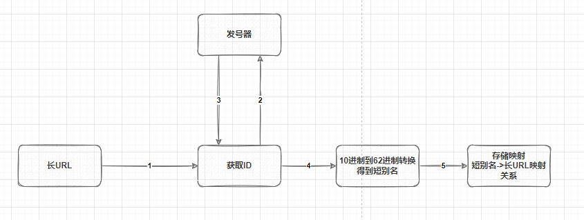
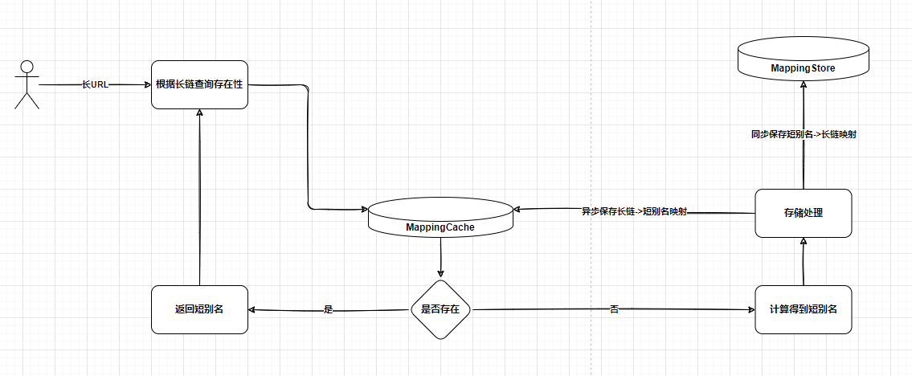
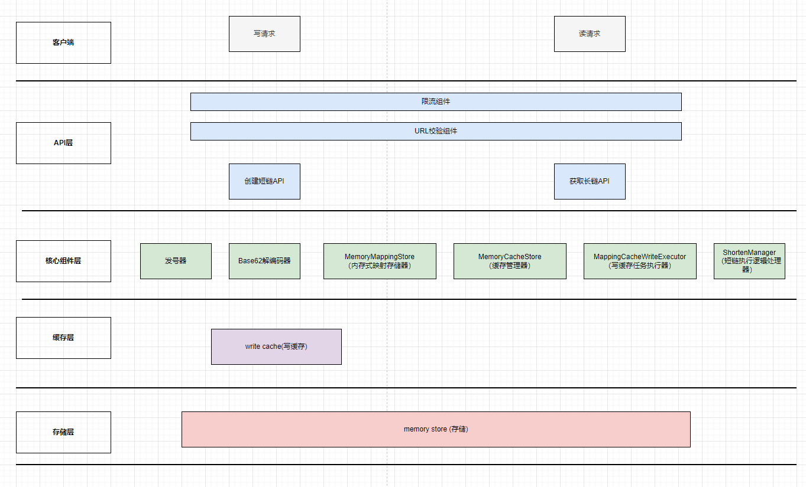
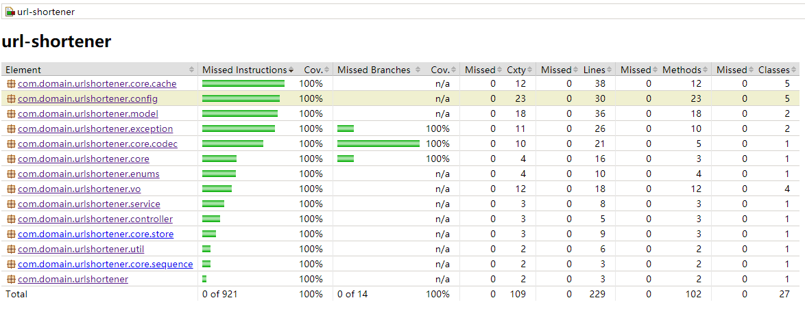

# 一、需求

## 1.1. 功能性需求

- 对于一个长URL，生成一个短别名来标记这个长URL；
- 短别名长度最大为 8 个字符；
- 输入短别名可以提取出原始长URL；

## 1.2. 非功能性需求

- 使用内存来存储短别名和长URL的映射关系
- 内存有限制，防止出现OOM

# 二、假设

- 短链允许失效
- 部署机器为64位操作系统
- 使用jdk8
- JVM堆内存为32G

# 三、算法

如何将长链接转换为一个短别名表示，这里涉及到短别名生成算法的问题。也就是说对于一个长链接A，有唯一的短别名与之对应，即长链->短别名有映射关系。算法解决的是如何定义这个映射关系。

## 3.1. 短别名表示

短别名追加到短域后组成短链，短链也是URL。那么短别名则只适合用可打印、非特殊字符组成的字符串表示。即字符串中的字符是[0-9a-zA-Z]中的某一个。

第一个可以想到的简单表示方式是用纯数字表示，每一个数字代表一个别名。但是短别名最大的长度是8个字符，那么使用纯数字表示，最大值为99999999。这个数量级还是比较小的。不适合现今的互联网业务。

为了让8个字符可表示的数目更大，则其中的字符的可选集选定为[0-9a-zA-Z]。8位的字符串，每位字符可选择数为62。

~~~
0-9：10个
a-z: 26个
A-Z：26个
------------
     62个
~~~

那么最大可表示的数目为：

~~~
62 x 62 x 62 x 62 x 62 x 62 x 62 x 62 = 62^8 = 218 340 105 584 896
~~~

假定系统每秒钟短链生成的请求数为2000，即2000/per(s)，那么，

~~~
218 340 105 584 896 / (2000x60x60x24x365) = 3461.75年 
~~~

通过计算可以知晓需要大概3461年才能消耗完。这个量级足够支撑业务需求。

## 3.2. 映射

现已确定短别名的表示方式，现需要确定的是如何做如下的映射：

~~~
http://www.da.com/wewew/xssde   ------映射------> 0xzdedwe
~~~

对于每一个长URL，有唯一的最多8个字符的字符串与之对应。

### 哈希方式

首先想到的就是哈希的方式，根据哈希函数的定义：

~~~
Hash，一般翻译做散列、杂凑，或音译为哈希，是把任意长度的输入（又叫做预映射pre-image）通过散列算法变换成固定长度的输出，该输出就是散列值。这种转换是一种压缩映射，也就是，散列值的空间通常远小于输入的空间，不同的输入可能会散列成相同的输出，所以不可能从散列值来确定唯一的输入值。简单的说就是一种将任意长度的消息压缩到某一固定长度的消息摘要的函数。
~~~

使用哈希函数可以将任意长度的输入，转换成固定的长度的输出。具备长变短的语义。

常见的哈希算法有MD、SHA和MAC共3大系列。

MD系列中典型的是MD5算法，它获得一个随机长度的信息并产生一个128位的信息摘要，转换为16进制，可以得到一个32位的字符串。

SHA系列中典型的是SHA-1算法，它可对最大长度为264的字节信息做摘要处理，得到一个160位的摘要信息，转换为16进制，可以得到一个40位的字符串。

MAC算法结合了MD5和SHA算法的优势，并加入了密钥的支持，是一种更为安全的消息摘要算法。

> MAC算法跟加密有关，这里我们的短别名并不需要复杂的安全加密功能。

在我们的需求中，对于哈希我们比较关注的是哈希的运算速度和冲突概率。对于其他非加密型的哈希函数，MurmurHash在这两方面表现更优些。下面是wiki的介绍：

~~~
MurmurHash 是一种非 加密型 哈希函数，适用于一般的哈希检索操作。 由Austin Appleby在2008年发明， 并出现了多个变种，都已经发布到了 公有领域(public domain)。与其它流行的哈希函数相比，对于规律性较强的key，MurmurHash的随机分布特征表现更良好。
~~~

不论是选择哪种哈希算法，既然是哈希，那么hash冲突理论上是必然存在的。也就是说长链经过hash算法处理后生成的hash值会冲突，再者因为短别名的长度最大为8个字符，那么做法是截取hash串的前8个字符，这个也可能会出现重复。

> 判断重复的标准是通过该别名去存储查询是否存在，还需判断别名映射的长链是否相同。

出现重复怎么办？其中的一种解决思路是出现重复之后，将长链进行修改（比如手动增加几个字符）然后再次进行哈希。

### 自增序列方式

> 本系统采用该方案。

自增序列方式即发号器方式，它在映射关系中引入了一个自增ID，可以算是一种间接映射方式。

~~~
长链 -> 全局唯一自增ID -> 短别名
~~~

对于一个长链，有唯一的ID与之对应；对于唯一的ID有唯一的短别名与之对应，那么就可以保证对于任何一个长链都有唯一的短别名与之对应。那么现在的问题就转变为ID与短别名如何进行映射。

ID是10进制数，而短别名中的每个字符可选数量为62，也就是说变成了10进制和62进制的转换。

>  进制的转换可参考：https://tool.lu/hexconvert/

该方式执行流程如下：

#### 发号器

发号器用于生成全局的唯一ID（十进制）。介于本需求中存储采用的是内存式存储，本身就不支持高可用的需求，不具备分布式部署的能力，这里不采用分布式ID发号器策略，而是采用内存式发号策略，同时为了支持单机高并发，使用AtomicLong来进行发号。

> 支持分布式，高可用可以使用分布式ID发号策略来进行发号处理，比如Snowflake、redis、数据库等。

> 问题1：单机版有没有必要用Snowflake。Snowflake算法中需要本机单调递增序号，这个就回到了单机内存发号上，单机版没必要使用Snowflake。
>
> 问题2:  AtomicLong是否可以用LongAdder替代。Java8引入了LongAdder来解决高并发下，AtomicLong的CAS自旋性能问题。但是LongAdder的sum返回的是一个近似值，不同线程的读写是可以并发执行的，会出现不同线程获取到的值是相同的，对于发号器需求来说，这个是不适合的。LongAdder适合纯计数的场景，比如说统计点击数这种，不需要结果非常准确。

# 四、存储

在确定存储之前，要先来讨论一下，短链失效的问题。在我们的系统中，短链需不需要定义为可失效。因为采用的是内存式存储，那么对最大存储容量是有限制的，当有请求过来，但是容量已经饱和后，如何处理？

- 第一种：不失效 + 单机容量限制

  在64位操作系统中，默认开启了压缩指针，包括压缩类指针和普通对象指针：

  ~~~
  -XX:+UseCompressedClassPointers //压缩类指针
  -XX:+UseCompressedOops  //压缩普通对象指针
  ~~~

  当JVM堆内存大小超过32GB后，压缩指针失效，导致对象的空间占用会变大，所以官方建议，JVM的堆内存大小不要超过32G。

  按照这个原则，配合上下面"Entry内存占用量"计算得到的保存映射需要占用的内存量，得到的单机能保存的映射条目数，是一个相对来说比较小的数量：

  ~~~
  32 x 1024 x 1024 x 1024 / 176 ≈ 195 255 786
  ~~~

  当容量达到上限，服务就不可用了。

- 第二种：失效 + 定时器剔除

​		映射关系定义为失效，存储结构定义为非缓存式。在保存短链映射时，维护一个失效时间，然后通过定时器定期清除失效的映射。这种方式的缺点是: 1.有内		存溢出问题；2. 需要遍历整个映射集；3. 如果短链定义的失效时间比较长，比如说1年，那么定时器定期清除其实效果是作用不大的。

- 第三种：失效 + 剔除策略

  这种方案，还是会对单机容量进行限制，但是采用缓存式处理方式，比如说采用LRU算法，当请求到达，容量达到饱和，则根据LRU算法，剔除最近不常使用的短链。当然，这种方案同样是存在问题的，当容量饱和之后，继续处理高并发的写入请求，那么会出现大量的短链在短时间内就失效了。

  这种方案不完美，主要还是内存式存储的限制，使用内存式存储，对于容量肯定是有限制的。只是说相对于其他的处理方案，这种方案是相对来说比较好。

> 本系统采用第三种方案。

## 4.1. 短别名->长链

长链->短别名是一个映射关系，这种映射关系需要保存到内存中，采用Map的数据结构来存储。短域名服务是读多写少的场景，需要根据短别名定位到长链，所以在Map中，设值如下：

~~~
key -> 短别名
value -> 长链
~~~

key和value组成了一个Entry，现在需要根据key和value的字符长度来评估单个Entry的容量。

### key(短别名)占用量

key存储短别名，短别名最大为8个字符。

key在Java中用String对象来表示，"假设"小节说明了使用64位操作系统，jdk的版本位1.8，那么对于key占用的内存计算过程如下：

| string引用         |          | 字符数组对象 |                                                   |
| ------------------ | -------- | ------------ | ------------------------------------------------- |
| header             | 12 bytes | header       | 16bytes（mark work + class pointer + array size） |
| hash               | 4 bytes  | 8个字符      | 8 * 2 bytes = 16 bytes                            |
| char[] (reference) | 4 bytes  |              |                                                   |
| alignment padding  | 4 bytes  |              |                                                   |
| 总字节数           | 24bytes  | 总字节数     | 32bytes                                           |

根据上面的计算，对于短域名最大消耗内存为56bytes。

### value(长链)占用量

value用于存储长链，长链是个URL。对于URL，不同的浏览器支持的最大字符长度不同：

~~~
https://web.archive.org/web/20180308145804/http://www.boutell.com/newfaq/misc/urllength.html
~~~

查询资料，IE支持的字符长度最小，为2,083个字符。以此作为长链最大字符数标准。

2083被定义为URL的最大字符数标准，但是实际情况下，绝大多数有效的URL肯定达不到这个长度，如果单单以2083作为依据来计算存储容量，继而计算映射条目数的话，那么可存储的条目数的数量预估值就偏差很大，这里我们还需要根据统计得出一个最小字符数标准，以此来得到一个容量区间。

参考如下的统计数据：

~~~
http://www.supermind.org/blog/740/average-length-of-a-url-part-2

To summarize:
Mean: 76.97
Standard Deviation: 37.41
95th% confidence interval: 157
99.5th% confidence interval: 218
~~~

将37个字符，定义为最小字符数标准。

value在Java中同样用String对象来表示，2083个字符和37个字符占用内存计算过程如下：

- 2083个字符

| string引用         |          | 字符数组对象      |                                                   |
| ------------------ | -------- | ----------------- | ------------------------------------------------- |
| header             | 12 bytes | header            | 16bytes（mark work + class pointer + array size） |
| hash               | 4 bytes  | 2048个字符        | 2083 * 2 bytes = 4166 bytes                       |
| char[] (reference) | 4 bytes  |                   |                                                   |
| alignment padding  | 4 bytes  | alignment padding | 2bytes                                            |
| 总字节数           | 24bytes  | 总字节数          | 4184bytes                                         |

总字节数 = 4208bytes。

- 37个字符

| string引用         |          | 字符数组对象      |                                                   |
| ------------------ | -------- | ----------------- | ------------------------------------------------- |
| header             | 12 bytes | header            | 16bytes（mark work + class pointer + array size） |
| hash               | 4 bytes  | 2048个字符        | 37 * 2 bytes = 74 bytes                           |
| char[] (reference) | 4 bytes  |                   |                                                   |
| alignment padding  | 4 bytes  | alignment padding | 6bytes                                            |
| 总字节数           | 24bytes  | 总字节数          | 96bytes                                           |

总字节数 = 120bytes。

**value的占用内存大小区间为：[120 - 4208]bytes **。

### key-value占用量

key，value组成一个Entry，忽略Entry引用本身，以及其内部其他的属性，根据上面的计算，单Entry最大消耗的内存量区间为：**[176-4264]bytes**。

### key-value总数

根据上小节的key-value内存占用量的计算，加上32G的JVM堆内存大小的限制，key-value总数最小为：

~~~
32 x 1024 x 1024 x 1024 / 4264 ≈ 8058 599
~~~

最大为：

~~~
32 x 1024 x 1024 x 1024 / 176 ≈ 195 255 786
~~~

基于上面的区间，在尽量存储比较多的key-value，以及防止极限场景下内存溢出的前提下，取区间的中间值，得出可存储key-value总数的预估值为：

~~~
(8058 599 + 195 255 786) / 2 = 105 686 492
~~~

## 4.2. 长链->短别名

根据上面的描述，已经在内存中保存了短别名->长链的映射，可以根据短别名查询出对应的长链。不过，在创建映射关系的时候存在一个问题。那就是如果长链已经有过映射该怎么处理？确保长链只有一个短别名，其中的一种方式就是在创建映射关系的时候，先通过长链去存储中查询，看有没有映射关系，如果有则获取其对应的短别名，直接返回。

先来看看如果使用mysql这种外部存储方式的时候怎么处理：

保持映射关系的表中有两个字段，alias - 短别名，url - 长链，同时在这两列建立索引。

- 第一种处理方式：创建映射关系之前，先通过url去表中查询，有结果，直接返回查询出的短别名；没有结果，则执行创建映射逻辑。

  这种处理方式的问题是显而易见的，每次write操作，都要去表中read一次，可能大部分的情况read都是没结果的，这个对数据库有影响，对于接口的响应时间也会有影响。

- 第二种方式：url列增加唯一约束，write之前不进行read检查操作，url已存在，数据库会抛出唯一约束异常，代码层捕获异常然后再根据url去查询出短别名。

  想对于第一种方式，这种方式对数据库的压力更小一点，可以说是按需检查。不过，这种方式同样有缺点，如果短时间内提交了大量相同的长链，那么就会退化为每次都去查。

像mysql这种外部式存储，保存一份数据，既可以根据短别名查长链，又可以根据长链查短别名。回到内存式存储，情况变得稍微有点复杂。短域名服务是读多写少的业务，短别名到长链的映射关系是一定要存储下来的。那么根据上面的描述，使用内存式存储怎么解决长链到短别名的查询问题？再保存一份长域名到短别名的映射关系？完全保存长域名到短别名的映射关系是不可取的，抛开容量不说，保存的这份映射关系的内容可能大部分时间都不会起作用。

这里引出另外一个问题？长链必须只能唯一对应一个短别名？也就是说长链->短别名是一一映射，还是允许一对多映射。短链的作用是为长链跳转服务的，并不强制性要求只能一一对应，只要能满足这个跳转的需求就行了。而同时如果短时间内一个长链生成了很多不同的映射关系，在发号器这种映射算法下，会无用得消耗序号，而且也没有必要短时间内生成过多的映射关系。

所以，这里就定义了一个结论：**一定时间内，相同的长链会使用相同的短别名，长链允许对应多个短别名**。

为符合这样的要求，在短别名->长链存储之外，引入了缓存级的长链->短别名的存储。短别名->长链存储名为MappingStore，长链->短别名存储名为MappingCache。

MappingCache是MappingStore的缓存层，有容量限制，其中的映射条目有过期时间。当短别名->长链的映射创建成功后，会在MappingCache中保存对应的长链->短别名的映射，过期时间设置为T，在T时间范围内，相同的长链转短链请求会直接从MappingCache中获取，T时间消耗后，相同长链会生成一个新的短别名。

> 使用外部存储，同样可以通过引入缓存层来解决写时存在的问题。

引入缓存层后处理流程示意图如下：

MappingCache采用异步写入方式，来提高短链创建接口的性能。

### 缓存容量

MappingCache不会是MappingStore的反向映射副本，容量远远比MappingStore小。同时也要明确一点，MappingCache是写缓存，是为了解决写时长链相同的问题，不符合读缓存那样的二八原则。

关于MappingCache中可支持存储的key-value数量，这个不容易估计，因为是要看写的时候到底会出现多少次重复。这个在程序级别做成可配置，初始值也只能给出个随意的值。这里按照10000个条目，然后计算一下占用的内存大小。

MappingCache中单个映射关系的内存占用大小还是上面计算出来的区间，即**[176-4264]bytes**。

占用的内存大小区间为：

~~~
最小：176 x 10000 bytes = 1718.75 KB ≈ 1.68M 
最大：4264 x 10000 bytes = 41640.625 KB ≈ 40M
~~~

对于32G的内存来说，这个数量级的缓存条目占用的内存几乎是可以忽略不计的。

### 过期时间

过期时间在没有实际的业务场景下，也是不容易做出评估。同样，在程序级别做成可配置，这里给出一个随意值，为30分钟。

## 4.3. 缓存框架

MappingStore和MappingCache都是采用缓存式存储策略，即本地缓存方式。最常见的本地缓存是 Guava 和 Caffeine。Caffeine 是基于 Google Guava Cache 设计经验改进的结果，相较于 Guava 在性能和命中率上更具有效率，可以认为其是 Guava Plus。故这里选择Caffeine。

还有一个需要考虑的是淘汰算法的问题。常用的淘汰算法有LRU、LFU。

- LRU

  如果数据最近被访问过，将来被访问的概率也更高。每次访问就把这个元素放到队列的头部，队列满了就淘汰队列尾部的数据，即淘汰最长时间没有被访问的。LFU算法有以下两个问题：

  - 需要维护每个数据项的访问频率信息，每次访问都需要更新，这个开销是非常大的。
  - 会把热点数据挤掉。

- LFU

  如果数据最近被访问过，那么将来被访问的概率也更高。也就是淘汰一定时间内被访问次数最少的数据（时间局部性原理）。

  其优点是，避免了 LRU 的缺点，因为根据频率淘汰，不会出现大量进来的挤压掉老的，如果在数据的访问的模式不随时间变化时候，LFU 能够提供绝佳的命中率。

  其缺点是，偶发性的、周期性的批量操作会导致LRU命中率急剧下降，缓存污染情况比较严重。

Caffeine 采用了一种结合 LRU、LFU 优点的算法：W-TinyLFU，其特点是：高命中率、低内存占用。

W-TinyLFU 是 Caffeine 提出的一种全新算法，它可以解决频率统计不准确以及访问频率衰减的问题。这个方法让我们从空间、效率、以及适配举证的长宽引起的哈希碰撞的错误率上做均衡。

> 采用基于容量回收策略。

# 五、安全

## 5.1. IP限流和封禁

为了防止异常流量导致耗光序号的风险，需要增加单IP访问频率和单IP访问总量的限制，超过阈值进行封禁。

------待完善------

# 六、架构设计图

# 七、API设计

系统对外提供两个API：

- 接受长域名信息，返回短域名信息
- 接受短域名信息，返回长域名信息

## 7.1. 短域名创建API

### 接口信息

接口地址：`/url/shortener/create`

请求方式：`POST`

请求体：

~~~json
{
    "url":""// 长链URL
}
~~~

响应体：

~~~json
{
    "code": "",// 业务状态码
    "message": "",// 业务信息
    "data": {
        "longUrl": "",// 长URL
        "shortUrl": ""// 短URL
    }
}
~~~

### 接口调用示例

#### 请求

~~~json
{
    "url":"http://xx.com"
}
~~~

#### 响应

~~~json
{
    "code": "0000",
    "message": "操作成功",
    "data": {
        "longUrl": "http://xx.com",
        "shortUrl": "https://m.dev.com/G8"
    }
}
~~~

## 7.2. 短域名读取API

### 接口信息

接口地址：`/url/shortener/retrieve`

请求方式：`GET`

请求体：

~~~json
{
    "url":""// 短链URL
}
~~~

响应体：

~~~json
{
    "code": "",// 业务状态码
    "message": "",// 业务信息
    "data": {
        "longUrl": "",// 长URL
        "shortUrl": ""// 短URL
    }
}
~~~

### 接口调用示例

#### 请求

~~~json
{
    "url":"https://m.dev.com/G8"
}
~~~

#### 响应

~~~json
{
    "code": "0000",
    "message": "操作成功",
    "data": {
        "longUrl": "http://xx.com",
        "shortUrl": "https://m.dev.com/G8"
    }
}
~~~

# 八、优化

------待完善------

# 九、测试

## 9.1. 单元测试

Jacoco单元测试覆盖率截图如下：

