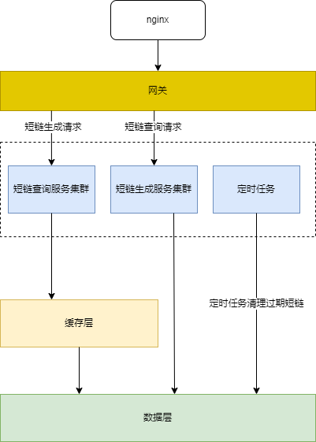
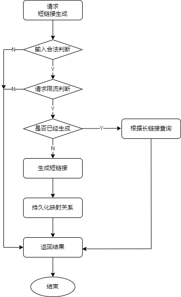
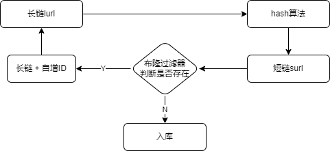
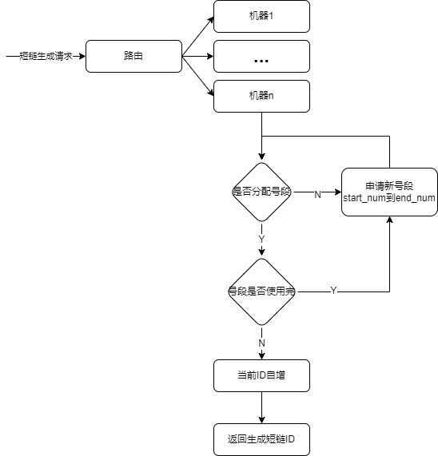
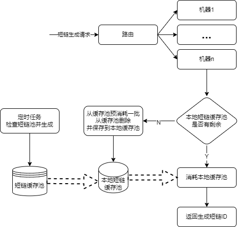
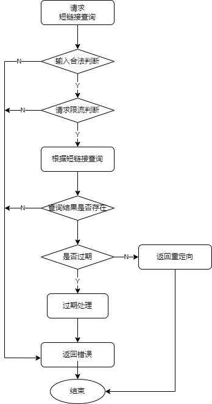

# 方案设计
短链接的实质是：维护长链接和短链接的对应关系，根据短链接查询映射的长链接并跳转

名词说明:

| 名称 | 含义 | 说明 |
| :-----| :---- | :---- |
| 长链 | 用户输入的长URL | 例如：https://www.baidu.com/s?ie=utf-8&f=8&rsv_bp=1 |
| 短域名 | 系统固定的短域名 | 例如本机：http://127.0.0.1:8080/a |
| 短链 | 对长链进行某种算法后生成的一小段字符串 | 例如：ryy5v |


## 一、需求分析
- 功能性需求
    1. 短域名生成，接受长域名，返回短域名
    2. 短域名读取，接受短域名，返回长域名
- 非功能性需求
    1. 短域名过期
    2. 系统高可用，低延迟
    3. 系统安全
- 限制
    1. 短域名长度最大8个字符
       
    
## 二、系统评估
按URL字符规范，URL可用字符有a~z、A~Z、0~9共62个字符，按长度限制为8，则最多可有62^8=218340,105584896(21W亿)，已经够用。

假设如下：
- 假设每日新增短链接1000W
- 系统活跃URL数量50KW
- 平均每个活跃短链接每日被访问10K次
- 短链接保存5年
- 每条URL映射数据存储大小500bytes
### 1.流量分析
按照八二原则分析，80%的读写在20%的时间
- 写: (1000W * 0.8) / (24 * 0.2 * 3600) =~ 463 URLs/S
- 读: (50KW * 10K * 0.8) /  (24 * 0.2 * 3600) =~ 231K/S

### 2.存储分析
- 总共需要存储链接数: 1000W * 365 * 5 = 18250million =~ 18billion 
- 所需空间大小: 18250million * 500bytes =~ 10TB

### 3.带宽分析
- 写: 463 * 500bytes =~ 230KB/S
- 读: 231K/S * 500bytes =~ 115M/S

### 4.内存分析
将活跃访问URL缓存在内存中
- 活跃URL: 50KW * 500bytes =~ 250G

### 5.单机实现分析
本实例按照单机实现，并保存数据在jvm中（先不考虑缓存）。
假设分配2G内存给该服务，则：
- 最多数据量为: (2G / 500bytes) = 400W

## 三、方案设计
### 3.1. 概要设计
  整个系统主要有三个功能，短链接生成、短链接持久化、短链接查询持久化。

  整体设计架构图如下：
  


### 3.2. 详细设计
#### 3.2.1. 短链接生成
##### 3.2.1.1. 短链接生成流程
短链接生成步骤如下（见图1-短链接生成流程图）：
1. 接收短链接生成请求
2. 输入合法性判断，若合法则继续步骤3，否则直接返回失败
3. 请求限流判断，未超过阈值则继续步骤4，否则直接返回失败
4. 判断该url是否已经生成，若未生成，跳到步骤5，否则直接查询结果并返回
5. 生成短链接
6. 持久化短链接和原始链接映射结果
7. 返回结果

_图1-短链接生成流程图:_


##### 3.2.1.2. 短链接生成算法
短链接是一个n（n=8）位字符串，可以由62种字符（大小写字母加数字）组成，可以看成是一个long类型数字（不大于62^n）的62进制表示。
java实现如下:
```java
/**
 * 十进制转62进制（仅限正整数）
 * @param num 十进制数字
 * @return
 */
public static String decimalToSixtyTwo(long num){
	if(num <= 0){
		return "0";
	}
	StringBuilder sb = new StringBuilder();
	//余数
	long remainder;
	while (num > 0){
		remainder = num % 62;
		//0-9
		if(remainder < 10){
			sb.append((char)('0' + remainder));
		}
		//A-Z
		else if(remainder < 36){
			sb.append((char)('A' + remainder - 10));
		}
		//a-z
		else{
			sb.append((char)('a' + remainder - 36));
		}
		num = num / 62;
	}
	//因为在上面的循环过程中，后一次循环本应是计算出来的高位字符，但是却被我们放在字符串的最后面，因此最终结果需要再反转一次
	return sb.reverse().toString();
}

/**
 * 62进制转十进制
 * @param numStr
 * @return
 */
public static long sixtyTwoToDecimal(String numStr){
	//最后转换完成之后的十进制数字
	long num = 0;
	//字符串中的具体某一个字符
	int idx;

	for (int i = 0; i < numStr.length(); i++) {
		idx = numStr.charAt(numStr.length() - 1 - i);
		if(idx >= 'a'){
			//idx = 'a' + remainder - 36，于是可以推导出：remainder = idx + 36 - 'a'
			//num = remainder * 62^i
			num += (idx + 36 - 'a') * Math.pow(62, i);
		}
		else if(idx >= 'A'){
			//idx = 'A' + remainder - 10，于是可以推导出：remainder = idx + 10 - 'A'
			num += (idx + 10 - 'A') * Math.pow(62, i);
		} else {
			//idx = '0' + remainder，于是可以推导出：remainder = idx - '0'
			num += (idx - '0') * Math.pow(62, i);
		}
	}
	return num;
  }
```

###### 3.2.1.2.1 long类型数字生成算法选择？
long类型数字有两种常见生成方式：hash算法和自增序列算法。hash算法用时间换空间实现，自增序列算法用空间换时间，各有优缺点（代码用自增序列算法实现）。

###### 3.2.1.2.2 hash算法：
1. 多次生成结果一样
2. 需要判断是否哈希冲突，并解决哈希冲突

由于是用hash算法，所以对同样的输入，多次生成的短链接结果是一样的，例如不同用户输入同样的url生成结果一样。
实际应用中需要考虑业务常见是否接受这种场景。可以将额外信息(用户ID，请求IP，时间等)和url一起作为输入解决。

用hash算法实现，不可避免的会出现hash冲突（即使可能概率小），如何解决呢？流程如下：
1. 将长链(lurl)经过hash算法后的到短链(surl)
2. 再根据得到结果surl去库查询是否已经使用，如果未使用，则直接插入数据库存储，否则解决冲突
3. 如果冲突，则将lurl + 自增ID作为输入，重复步骤1，直到成功。

hash冲突如何优化？

每次生成hash值后，需要先判断该值是否被使用。如何判断呢？两种方案，一是先查库，看是否被使用，二是直接插库，
看是否插入成功（用hash值做唯一索引）。在数据量大的情况下，很容易冲突，在高并发场景下，数据库压力太大，
可以使用布隆过滤器进行优化。

用所有生成的短链接构建布隆过滤器，当一个新的长链接生成短链后，先将此短链在布隆过滤器进行查找，如果不存在，
说明数据库不存在此网址，可以插入。

综上，用hash实现，总体设计思路如下：



###### 3.2.1.2.3 自增序列算法
1. 不会hash冲突，天然唯一
2. 生成结果是自增的
3. 需要考虑并发问题

可以维护一个ID自增生成器，将自增整数转为62进制字符串作为短链。由于是自增的，天然唯一，不会出现冲突。
实际业务场景中需要考虑是否接受结果递增。另外在高并发场景下ID自增生成器可能成为瓶颈。

在单机场景，使用AtomicLong或者AtomicLong实现即可，在分布式场景下需要使用redis或者mysql自增ID实现。
总结有如下三种方案，各有优缺点，实际应用中可根据应用场景选择（代码使用方案2实现）。

- 方案1，直接使用Redis或者mysql自增。实现简单，但在高并发场景下，有性能问题，另外不能实现过期短链重用；
- 方案2，分片+单机AtomicLong。单机先申请短链号段，单机上按AtomicLong实现，效率高。但不能实现短链重用；
- 方案3，预先生成并存入到短链池，用的时候拿出用。用数据库自增ID，预先生成可用短链到短链池，需要使用短链时，直接拿出来用。可以实现短链重用。短链池读写需要做优化。

##### 3.2.1.3. 如何确保生成短链接安全
在实际场景中，使用ID自增生成器方案时，一些恶意请求会导致光速耗光短链ID，如何防止？从两方面解决。
1. 限制IP或者用户的单日生成短链请求总数，超过则直接拒绝。
2. 对同样的长链输入，不生成新的短链，而是返回已经生成的。这里考虑到海量请求，需要做缓存。

在判断某个长链是否已经生成过短链时，一般是在数据库中对长链做索引，但是这样会导致索引空间比较大，可以对长链的hash值（例如md5）进行索引，这样可以减少索引空间。

##### 3.2.1.4. 分片+单机AtomicLong
对于方案分片+单机AtomicLong，具体如下：

设计一个专门的发号表，每插入一条记录，为短链预留一个号段（主键id*1000 - 999 到主键id* 1000）,如下(表url_sender_num)：

| id | start_num | end_num |
| :-----| ----: | :----: |
| 1 | 1 | 1000 |
| 2 | 1001 | 2000 |
| 3 | 2001 | 3000 |
其中id是主键，start_num代表短链号段的起始id，end_num代表短链的终止id。当某台机器接受到生成短链请求时，
先查看是否分配了短链号段，未分配或者分配号段已经使用完，则向发号表url_sender_num插入一条记录。然后将该条
记录作为该机器当前分配号段，从start_num开始分配，到达end_num，说明分配完了。流程图如下：



##### 3.2.1.5. 预生成短链
对于预生成短链方案，如下：

设计一个短链池表，定时或者按需出发生成一批短链（可以是之前使用过但已经过期的短链）存入数据库，需要时在消耗并从短链池删除。
在高并发场景下，会有数据库会有压力，可以做一层缓存，每个机器，先从短链池预消耗一批短链。当快用完时，再从锻炼吃预消耗一批。
流程如下：
1. 定时任务检查短链池可用数量。根据上文估算，系统每秒需要250个左右短链，每分钟15K个。可以设置定时任务，每分钟检查一次，少于15K个，则生成一批（15K）。
2. 服务接收到短链生成请求时，先查看本地缓存的预消耗短链池是否有，没有则从数据库消耗一批，否则直接从本地缓存消耗一个短链并返回。
3. 过期短链服务将过期短链插入短链池以便再次使用。

   
##### 3.2.1.6. 更短短链接如何实现（过期重用）
如果需要短链更短，例如4个字符，最多62^4 =~ 1400W，则需要考虑过期短链重用问题。使用hash算法和预生成短链都可以解决
这个问题。可以根据实际场景选择使用。

#### 3.2.2. 短链接存储
##### 3.2.2.1. 数据库选型
存储短链和长链的对应关系，可以用短链作为主键，长链作为value，用关系数据库（例如mysql）存储，或者用分布式KV数据库存储，例如redis。
但是用传统关系型数据库时，由于海量数据，需要做分片。

##### 3.2.2.2. 过期短链接清理
对于短链过期处理，一般用定时清理，但是失效性不高。可以用定时清理加惰性删除两种方案结合。
1. 定时清理。启动定时任务，在低峰期删除过期短链（可以移动到短链池，以便后续继续使用）。
2. 惰性删除。每次查询短链时，判断是否过期，如果过期，则走清理逻辑。

##### 3.2.2.3. 数据库设计
这里用mysql作为例子。
1. 短链发号表url_sender_num
   
   | 字段 | 类型 | 说明 | 是否可空 |
   | :-----| :---- | :---- | :----: |
   | id | bigint | 自增ID | N |
   | start_num | bigint | 起始ID，id*1000 - 9999 | N |
   | end_num | bigint | 结束ID，id*1000 | N |

2. 短链映射表short_url_map
   
   | 字段 | 类型 | 说明 | 是否可空 |
   | :-----| :---- | :---- | :----: |
   | id | bigint | 主键 | N |
   | surl | bigint | 短链编码 | N |
   | lurl | varchar(128) | 长链 | N |
   | lmd5 | char(32) | 长链接的MD5值，用于创建索引 | N |
   | create_time | datetime | 创建时间 | N |
   | expires_time | datetime | 过期时间 | N |

具体sql脚本见目录`./doc/sql`：
[sql文件](./sql/V1.0.0_20220506.sql)

##### 3.2.2.4. 分片与副本
由于需要支撑十亿级别的数据量，所以需要对数据进行分片存储。
1. 按字符串内容范围进行拆分，比如，按照短链首字母进行拆分，a开头的在一个分片，b开头的在一个分片。
   由于短链的规律性，这种方案容易出现数据倾斜。
2. 基于hash的拆分，通过对短链进行hash计算得到一个hash值，表示该url应该落入的分片。
3. 简单的基于hash拆分，在需要扩容分片的时候比较麻烦，当然可以开始就做好分片规划。也可以采用一致性hash算法解决该问题。

为了保证可用性，需要对每个分片进行副本冗余。从主分片同步数据到副本，主分片挂了，副本分片可以顶上。

#### 3.2.3. 短链接查询并重定向
##### 3.2.3.1. 短链接重定向流程
短链接重定向步骤如下（见图2-短链接重定向流程图）：
1. 接受短链接重定向请求
2. 校验输入合法性判断，合法调到步骤3，否则返回失败
3. 请求限流判断，未超过阈值则继续步骤4，否则直接返回失败
4. 根据短链接查询映射数据
5. 查询结果是否有效，若有效直接重定向，否则继续步骤6
6. 失效数据处理
7. 返回失败结果

_图2-短链接重定向流程图:_


##### 3.2.3.2. 重定向实现
重定向有301重定向和302重定向。301是永久重定向，302是临时重定向。从功能上看两种方案都可实现。区别如下，需要根据实际场景选择：
1. 301重定向，永久重定向，浏览器会缓存结果，可以减轻服务器压力。但是如果要统计短链点击次数等数据，则不行。
2. 302重定向，临时重定向，每次都会重新去获取映射地址。方便做短链统计。

##### 3.2.3.3. 惰性清除过期数据
对过期短链，会有定时任务进行清理，但时效性低，可以使用惰性删除结合定时删除进行处理。每次查询到结果后，判断是否是否过期，过期则删除。
```java
//伪代码如下
Optional<ShortUrlMap> query(long surl) {
    ShortUrlMap url = get(surl);
    if (url == null) {
        return Optional.empty();
    }
    if (url.isExpired()) {
        // 过期清理
        delete(surl);
        return Optional.empty();
    }
    return Optional.of(url);
}
```

##### 3.2.3.5. 缓存穿透和雪崩
为了提高查询性能，可以在服务和数据库之间添加一层缓存，但这样会带来新的问题，缓存穿透和缓存雪崩。如何优化这类问题？

1. 缓存穿透
   
   缓存穿透造成的原因是访问的数据既不存在缓存，也不存在数据库。解决方案：
    1. 对非法请求限制
    2. 缓存空值，或者通过状态标志。会造成空间浪费
    4. 不查询数据库，只查询缓存，异步从数据库同步数据到缓存。空间不够。
    3. 使用布隆过滤器，判断是否存在。由于会不断出现过期短链，需要定期重建布隆过滤器，比如按月重建布隆过滤器。
   
2. 缓存雪崩

    缓存雪崩是由于大量数据同时过期。解决方案如下：
    1. 分散设置过期时间，避免同一时间过期
    2. 对相同的短链进行互斥锁，保证同时只有一个线程在构建缓存。
       分布式场景下，为了避免使用分布式锁，可以通过修改路由，根据hash短链内容，将相同短链的请求路由到同一台机器上。
    3. 不查询数据库，只查询缓存，异步从数据库同步数据到缓存。空间不够。
    
在生产上，可以使用布隆过滤器、单机互斥锁以及分散过期时间结合使用。


