# url-shorter测试报告

## 一、测试内容
本次测试包括单元测试覆盖率和接口压力测试两部分。接口测试是对短链生成和短链重定向两个接口进行压力测试，
并对响应时间、吞吐量以及CPU和内存进行分析。

## 二、测试环境
本次测试在开发机上进行测试，并且网络走单机内网，服务端和客户端运行在同一台机器上。具体如下：

- 系统: Windows 10 企业版 64 位操作系统
- 处理器: 11th Gen Intel(R) Core(TM) i7-1165G7 @ 2.80GHz 4核
- 内存: 16G
- JDK版本: jdk1.8
- 服务启动命令: `java -jar -Xms2048m -Xmx2048`

## 三、测试方法
### 3.1 单元测试
单元测试覆盖率采用jacoco插件自动生成。项目跟目录执行命令`mvn test`，打开./target/site/jacoco/index.html查看覆盖率报告
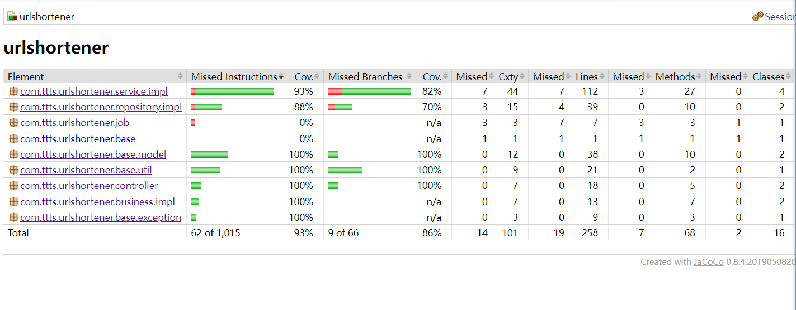

### 3.2 压力测试
#### 3.2.1 测试工具
- jmeter: 压力测试客户端
- jvisualvm: JVM监控：

#### 3.2.2 测试方案

##### 3.2.2.1 前置说明
为了方便测试，先调整tomcat配置:
```yaml
server:
  # tomcat 配置
  tomcat:
    # 接收队列长度
    accept-count: 5000
    # 最小空闲线程数
    min-spare-threads: 100
    # 最大链接数
    max-connections: 10000
    # 最大线程数
    max-threads: 1000
```

另外为了让重定向后的长链可访问，用本地服务提供一个可访问接口，例如`http://localhost:8080/swagger-ui.html`

##### 3.2.2.2 数据准备
1、对短链生成接口，输入如下:
```json
{
  "lurl": "http://localhost:8080/swagger-ui.html?nomobile=${lurl_params}"
}
```
其中lurl_params为jmeter生成的随机数，直接用jmeter随机生成即可

2、对短链重定向接口，输入是一个短链字符串。直接从系统导出有效短链字符串作为输入，如下图：
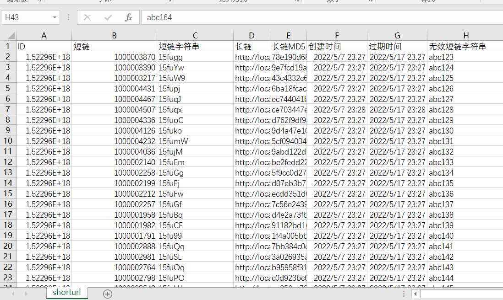

按流量二八原则，80%的请求携带有效参数（表中的短链字符串），20%的请求携带无效参数（表中的无效短链字符串）

##### 3.2.2.3 并发模拟
为了模拟不同并发量，通过设置jmeter线程数量，具体如下：

| 场景编码 | 循环次数 | 短链生成接口线程数量 | 有效短链重定向线程数量 |  有效短链重定向线程数量 |
| :-----| :----: |:----: | :----: | :----: |
| A01 | 150 | 100 | 320| 80 |
| A02 | 30 | 500 | 1600 | 400 |
| A03 | 15 | 1000 | 3200 | 800 |

## 四、测试结果与分析
对三种场景，采集jmeter测试结果和jvm监控结果如下：

1、场景A01
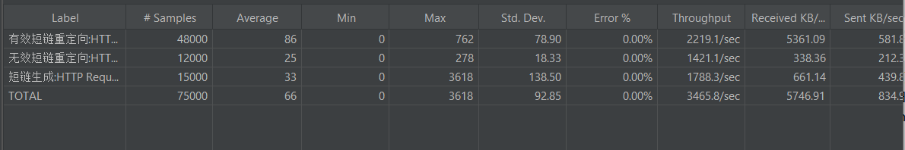
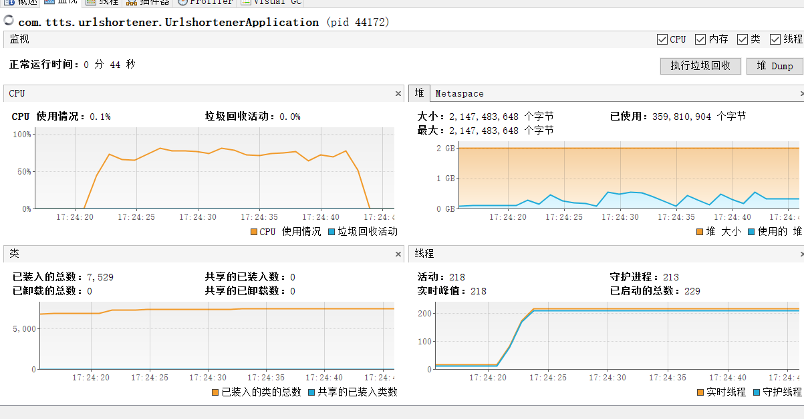
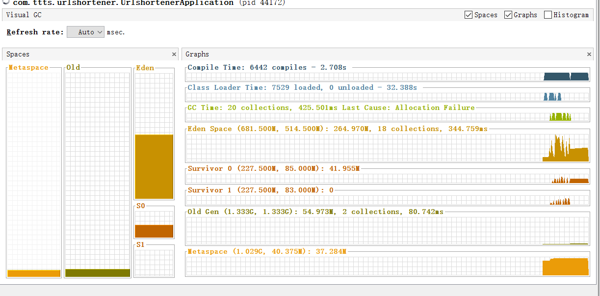


2、场景A02
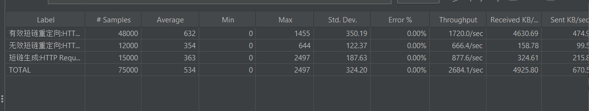
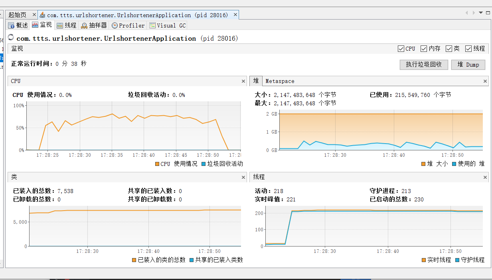
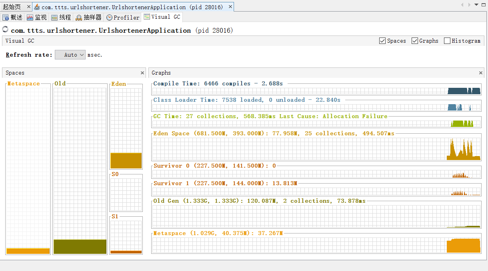


3、场景A03
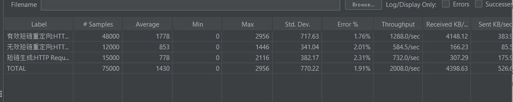
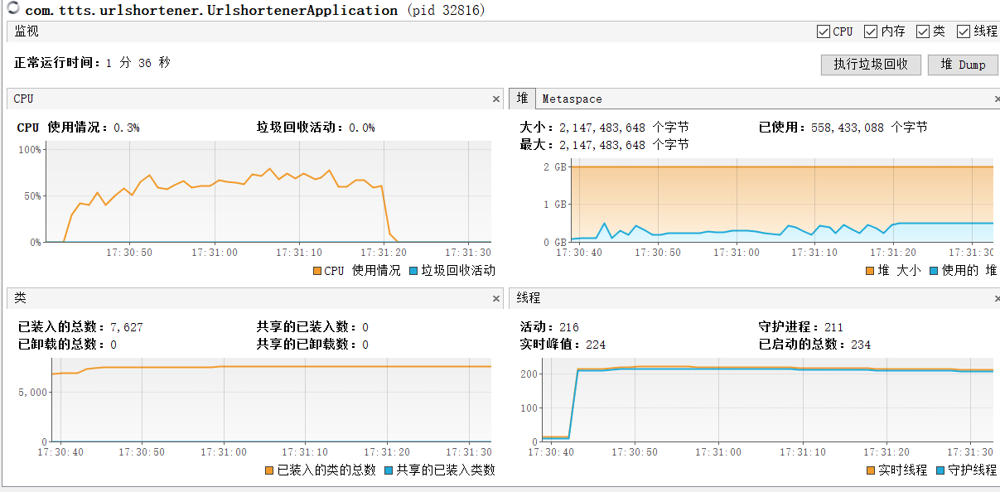
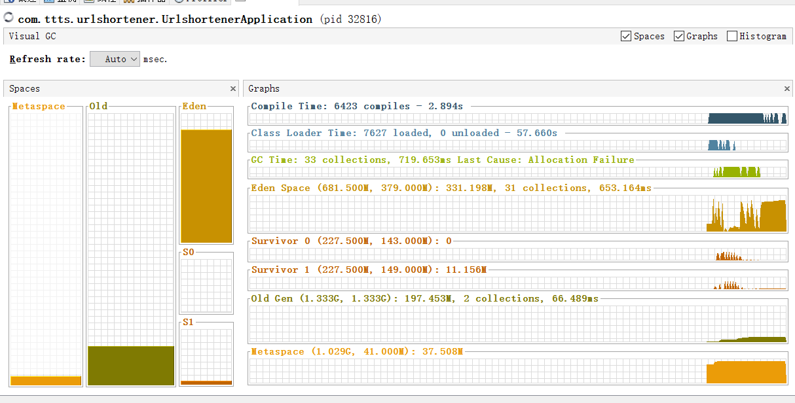


综合数据：

| 场景 | 短链生成接口吞吐 | 短链生成接口平均响应时间 | 短链查询接口吞吐 | 短链查询接口平均响应时间 | 错误率 |
| :-----| :----: |:----: | :----: | :----: | :----: |
| A01 | 1788 | 33 | 2219| 86 | 0.00% |
| A02 | 877 | 363 | 1720 | 632 | 0.00%  |
| A03 | 732 | 778 | 1288 | 1778 | 1.91% |

- 另外从GC结果看，没有出现Full GC，整个过程比较平稳；从CPU监控结果看，平均70%。
- 随着并发数增加，接口响应时间增大，另外吞吐降低，可能是由于tomcat线程配置影响，待验证
- 另外由于并发数的增加，会出现链接错误。受限于单机tomcat连接数影响。
- 从结果看单机可以支持短链生成接口（设计预估463个/秒）。 
- 单机满足不了查询接口需求（231K/S），除了调优tomcat配置，另外需要用集群负载均衡方案解决。


## 五、分析结果汇总
根据测试得到如下结果：
- 单机可以支持短链接生成需求（463 URLs/S）。
- 单机不能满足短链接查询接口需求(231K/S)，目前只能达到几千级别，需要调优tomcat和做集群。