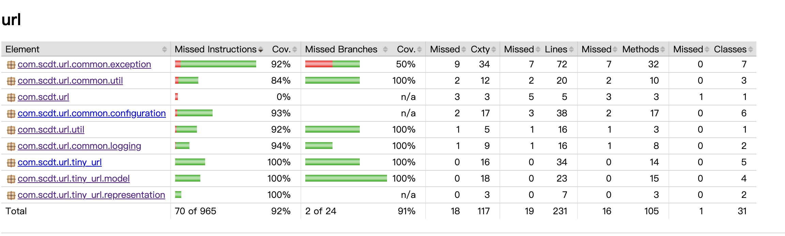

# url 服务
## 1. 产品需求
### 1.1 功能需求
撰写两个 API 接口:
* 短域名存储接口：接受长域名信息，返回短域名信息
* 短域名读取接口：接受短域名信息，返回长域名信息。
### 1.2 非功能需求
* 短域名长度最大为 8 个字符
* 采用SpringBoot，集成Swagger API文档；
* JUnit编写单元测试, 使用Jacoco生成测试报告(测试报告提交截图)；
* 映射数据存储在JVM内存即可，防止内存溢出； 
### 1.3 个人需求 
* 尽可能全 尽可能少
## 2. 产品设计
1. 创建短域名:
    * 源:其他服务 
    * 参数:传递长域名 
    * 结果:短域名
    * 性能：
      * 已创建的不生成
      * 过短的也不生成 直接存储或直接返回
2. 获取短域名:
   * 源:其他服务 
   * 参数:传递短域名 
   * 结果:短域名信息
   * 性能：

### 简单领域：
#### 短域名
1. 交互:
   1. 短域名控制器
2. 应用服务：
   1. 短域名存储接口
   2. 短域名读取接口
3. 聚合根：
   1. 短域名生成
   2. 短域名存储
   3. 短域名读取
4. 命令
   1. 创建命令
5. 通用：
   1. 存储工具
       * 使用内存，双向Map
       * 防止内存溢出
   2. 短域名生成器
      1. 不能超过8位
   3. 异常
   4. 日志
#### 通用
##### 服务结果
##### 全局异常
##### 日志

## 3. 资源需求
短域名存储器
    内存
## 4. 其他
### JUnit单元测试及Jacoco测试报告

### Jmeter
抱歉，更换电脑后JMETER未能在新环境启动,JDK17，因时间原因不再纠结
大致思路如下 
查询合法
1. 创建TinyUrlTestPlan
2. 创建CreateTinyUrl的HttpRequest
3. 使用RandomString 生成original url测试创建接口
4. 对CreateTinyUrl新建tinyUrlId的正则表达式提取器
5. 新建RetrieveTinyUrl 使用 tinyUrlId变量
查询非法，可以任意设置参数

### 系统假设
此需求应该是来自短信，微博等消息长度限制的地方
一般为内部服务使用，不直接对外
传入参数一般为 http://sina.com/asdad/adsasd12.html
加密后若为8位token，一般为最终看到的结果为 prefix + token
prefix 一般为公司注册的短域名 yxz.cn/token
prefix 在灵活性上一般是调用方决定，如果作为参数传入也会参与长度限制的运算
所以在此服务就不配置 只返回token也就是tinyurl的id即可

#### 空间量级
用 62 个字符 [A-Z, a-z, 0-9][A−Z,a−z,0−9] 来保存长度为8的短域名，
我们总共可以存储 62^8~= 217万亿个长链接。
#### 横向扩展
发号器使用一致性哈希，可以8位分为将长链接哈希为2位数字作为前缀，再生成6位的短域名

#### 性能Q&A
1. 创建运算
   * 避免运算
      1. 已经存储的过的不再查询
         1. 根据长域名为键的哈希表
      2. 短于限制的的直接存储
2. 查询运算
   * 根据短域名为键的哈希表
#### 空间Q&A
1. 防止OOM
  * 使用大小可控的容器
    1. 超过长度则使用LRU淘汰策略
    2. 保证多哈希表的淘汰一致
    3. 使用线程安全容器,保证长度限制准确
#### 优化
1. 在选择合适的算法和策略的前提下，时间与空间的选择
   1. 使用哈希发号器，使用Google MurmurHash，它的随机分布特征表现更良好，
      1. 缺点 哈希冲突
      2. 优点 服务重启后，之前的长链接依然对应相同的短链接，短链接再访问可以获取到相同的长链接
   2. 可以改为使用LongAdder 来获取id 限制长度为62^8，
      1. 优点保证唯一
      2. 缺点 服务重启 每次长链接生成不同短链接，更早以前的访问会导致完全错误的结果
   3. 使用类似BiMap策略，防止original重复生成
   
#### 可优化
1. 因为使用内存存储的可用性，必须使用大小限制的存储容器，必须要保证线程安全，如果改用Redis等则可以忽略重复设置带来较小的影响来提升性能
2. 正常我们这种数据是一定要落库的，如果Mysql等关系型数据库落库的话，可以使用自增主键id作为唯一键
3. 也会使用KV的nosql，使用短连接的id为key，使用long的bimap
4. 使用布隆过滤器来检测重复创建，在低存储成本要求或者一致性要求不那么高的时候可以使用

   