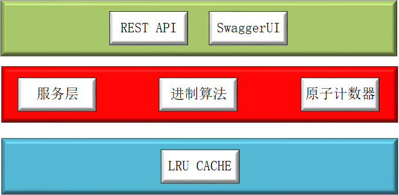
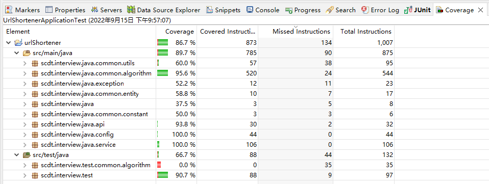

# 一、分析
### 从产品角度看，这是短域名产品的核心API，因此根据功能简单划分为三个模块：
1.通用模块：提供通用的算法、组件、常量、异常等处理；

2.日志模块：用于记录、跟踪服务情况，日志用于后期收集、处理；

3.api服务模块：集成模块，提供api服务。

    前期以package命名区分，后期有机会做微服务模块拆解。

### 参考百度、微信短域名服务，需要考虑以下问题：
    系统对高并发、低延时、同步相应等有较高的要求。
    高并发可以使用内存读写，并发数量需要考虑带宽、并发数量。这个开发后进行测试。
    低延时要考虑控制好读取的顺序，避免资源竞争。

### 同步响应问题需要做个简单计算和测试：

    短域名最大为8个字节长度，每位包括大写、小写和数字共62个字符，8位62进制约为10进制 2.18e14个
    以此为key存储长域名，每条记录的内存消耗可近似为1K，完全使用内存需要约200PB的内存。
    
    解决方案有两个，使用hash一致算法建立缓存集群 或 使用LRU算法对缓存数据进行淘汰，后期引入持久化。

### 测试一：
    concurrentHashMap和linkedHashMap
    连续存储2000万条数据，耗时约28ms；
    随机取10条数据，平均耗时<1ms;

### 测试二：
    linkedHashMap设置为最大长度1000万，存储2000万条数据，耗时约34ms；
    随机取10条数据，平均耗时<1ms;

# 二、设计

### 计数器
    采用62进制计数，用递归算法完成进制转换，并混淆进制字典。

### jvm缓存
    采用基于linkedHashMap，设置最大宽度，LRU回收触发参数等实现千万级数据存储。
    使用ReentrantLock保证数据一致性。

# 三、代码规范
    遵循通用惯例（google、eclipse、阿里巴巴）

# 四、测试

# 五、部署
    IDE调试、Docker，devOps
