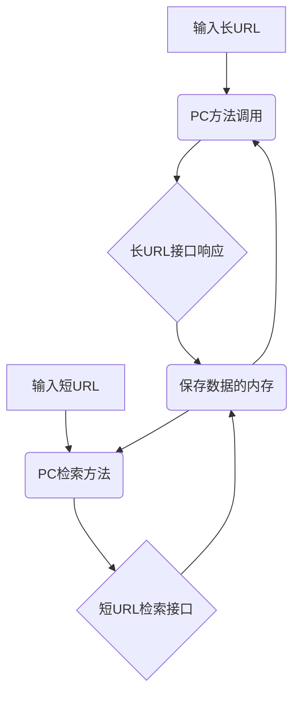

# **长短URL转换的设计思路**：

## 前台输入长URL后，通过后台提供的接口实现短URL的转换并返回给前台。

长URL接口实现：通过系统提供的MD5加密长URL后进行7段数据分离，然后对每段数据进行随机计算后，从基础字符库提取单个字符，最后合并成7位的短网址，保存到内存后，将短网址返回给前台。

## 前台输入短URL后，通过后台的内存数据检索接口返回对应的长URL给前台。

得到前台的短URL后，根据内存的数据检索后返回长URL数据给前台。

## PC访问方法，为了保护接口不暴露给PC前端，PC前端使用调用方法进行后台数据的访问。

# **简单的架构图**

# **假设**

1：内存提供了999次的存储空间，如果超过999次将无法保存。

2：由于本次采用内存保存的方式，当页面重新装载数据将无法检索之前的数据。

3：脱离系统的转换检测将失效。
