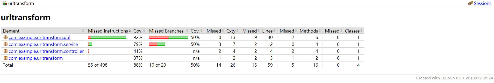
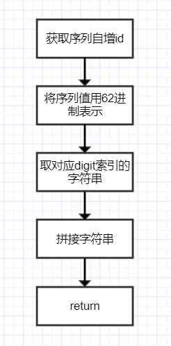
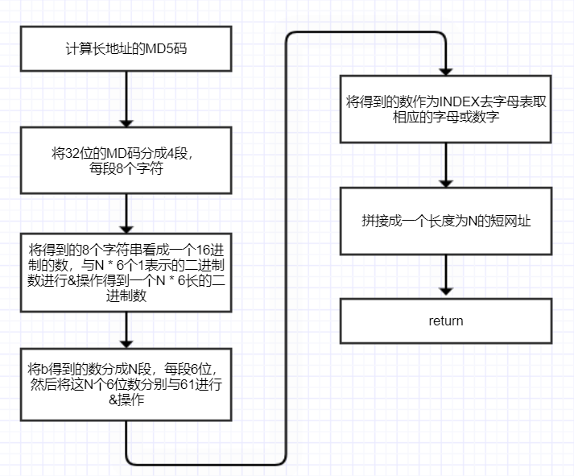

# Getting Started

### Reference Documentation

# 实现算法
比较流行的算法有两种  
1、基于id的自增序列算法  2、基于MD5的算法

# 自增序列算法 也叫永不重复算法
`假设` id 自增，一个10进制id对应一个 62进制的数值，1对1，也就不会出现重复的情况。

### 设计思路
a.获取序列的自增值  

b.将序列值用62进制表示，并取对应digit索引的字符串

# 基于MD5的摘要算法

`假设` url的长度为N

### 设计思路

a.计算长地址的MD5码，将32位的MD码分成4段，每段8个字符

b.将a得到的8个字符串看成一个16进制的数，与N * 6个1表示的二进制数进行&操作得到一个N * 6长的二进制数

c.将b得到的数分成N段，每段6位，然后将这N个6位数分别与61进行&操作，将得到的数作为INDEX去字母表取相应的字母或数字，拼接就是一个长度为N的短网址。

## Jacoco单元测试覆盖率截图

# 设计图

## 自增序列流程图

## 基于MD5的摘要算法流程图

# 假设扩展

以上是基于单个设备进行处理。如果需要进行数据的扩容，即多设备存储，需要采用`分布式方案`。  
需求是采用缓存进行映射，则采用分布式缓存方案（redis） 如果是基于db，则采取db分布式方案。  
`db思路`从原域名获得一个哈希值并找到对应的机器，然后当做单设备的情况处理。为了在集群里面找到正确的节点，我们需要使用一致性哈希。

## 基于分布式缓存的自增序列算法

a.获取分布式ID(`分布式id生成方案`)

b.将分布式ID用62进制表示，并取对应digit索引的字符串

## 分布式id生成方案

雪花算法，数据库自增id, redis自增id 等

# 基于分布式数据库的自增序列算法

## 获取短域名

a.取原域名哈希值 hash_val  
b.通过一致性哈希算法，在集群中定位到机器。  
c.将原域名插入数据库，并用函数 to62RadixString 获取短域名 short_url。  
d.将 hash_val 和 short_url 结合起来作为我们的最终短域名 final_short_url，并返回给用户。

## 由短域名获取原域名

a.截取final_short_url 的hash_val  
b.用hash_val定位到机器  
c.截取final_short_url中的short_url，获取表中对应的行  
d.将原域名 original_url 返回给用户

