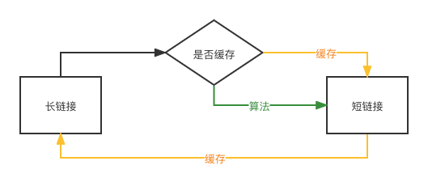
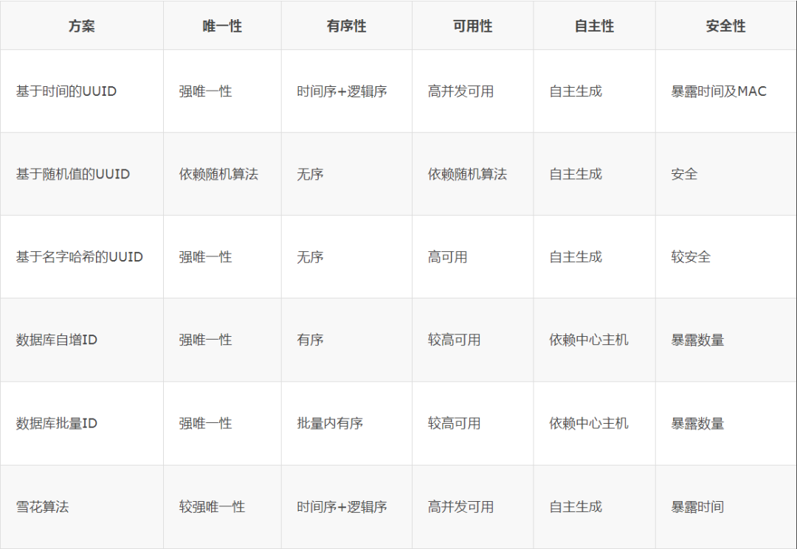
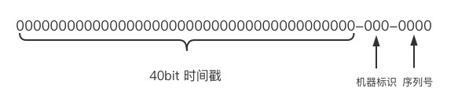
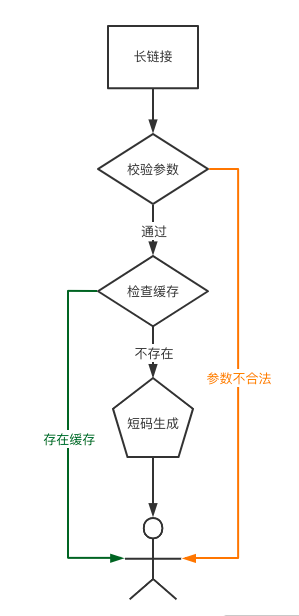

# 设计文档

## 背景

&emsp;&emsp;首先，题目中的"短域名服务"，应该指的是"短链接服务"，即提供长链接的缩短版本链接， 对于短链接域名固定的情况下，也就是提供长链接的路径简码，以达到简洁的目的;
至于短链接的好处和使用场景，显而易见的有占用空间小、减小阅读负担等。

&emsp;&emsp;结合"作业"题目内容："映射数据存储在JVM内存"，那单机服务就失去了宕机重入的能力， 进程异常退出会导致映射缓存丢失，如果要保障服务的连续性，必须保证映射算法具有一致性。
而8个字符限制难以从算法上保证幂等，所以放弃支持该特性，这点也不是作业考察目标。

## 设计思路

&emsp;&emsp;该服务主体为：

&emsp;&emsp;长链接、短链接互为输入输出

&emsp;&emsp;以下以内存存储为基础，忽略宕机等极端情形。

&emsp;&emsp;短链接路径部分常用字符为：A-Z、a-z、0-9，共62个字符，那么短链接可以使用**62进制**表示 一个映射平均占用空间大致为：各浏览器支持的url最大长度以IE最短2083字节，取中间值1000字节，
短路径最多8字节，按一条映射数据1024字节算，8G机器内存，5G可用存储，可靠支持数据量大约500万

&emsp;&emsp;base62短链接，**6位**即可表示62^6约**568亿**不同长链接。

&emsp;&emsp;按照题目已明确和未明确的需求来看，服务大致分为三种复杂级别：

### 1、单机单进程

&emsp;&emsp;单机版单进程服务最简单，数组存储长链接，以数组索引转6位base62作为短链接， hashmap存储长链接到短链接的映射。

&emsp;&emsp;写入时先检索hashmap长链接是否存在，若存在，直接返回结果；若不存在，则在数组追加并得到序号， 将序号转化为base62字符表示后写入hashmap并返回。

&emsp;&emsp;读取时，短链接直接转化成数组索引，返回索引对应记录。

### 2、单机多进程

&emsp;&emsp;单机多进程主要需要注意的是***并发写***的情况，
*另外可能出现重复写请求导致多个短链接对应一个长链接，不过这种情况不影响服务质量，无需关心。*

**并发写情形**： 
&emsp;&emsp;对于并发情况的处理，冲突点在于写入时序列号的获取， 序列号可以通过`AtomicInteger`乐观锁实现。

&emsp;&emsp;使用`AtomicReferenceArray`和`ConcurrentHashMap`存储序号（短链接）和长链接的映射关系。

### 3、多机多进程

&emsp;&emsp;对于不考虑网络失败、机器宕机等异常情况，我们的核心点在于全局唯一ID生成，
[查阅资料](https://cloud.tencent.com/developer/article/1530850 "ID生成方案")：

&emsp;&emsp;除此以外，还有MD5和哈希算法等方式生成ID，鉴于最多8个字符会使得实际使用中发生碰撞的概率无法忽视，这里就先不考虑。 
&emsp;&emsp;当然ID生成方案并不是只有表中所列，而且每种方式各有优劣，我们需要根据实际场景取舍。 另外也可以灵活定制。

&emsp;&emsp;如果我们需要考虑系统内部网络异常、机器异常等情况，那还需要将映射数据进行可靠的持久化存储。 本项目暂不考虑这点。结合题设，这里选用雪花算法，并加以改造，短链接8位62进制，
最多包含47位2进制，现将雪花算法ID构成改造如下：

&emsp;&emsp;理论上，40bit时间戳可以支持三十多年的时间，3bit机器标识，最多8台机器，4bit序列号最多支持每毫秒单机器16个并发写入。
具体实现见[代码](../src/main/java/cn/sequoiacap/interview/xurl/util/IDGenerator.java "hah")

&emsp;&emsp;服务架构以负载均衡代理到后端服务的方式，负载均衡策略：

- 写入时采用对输入长链接做一致性hash方式；
- 读取时解析短链接机器标识进行路由。

&emsp;&emsp;多机多进程，由于映射数据没有共享存储，ID重新设计，所以我们的实现方式会有所不同

## 实现结构

