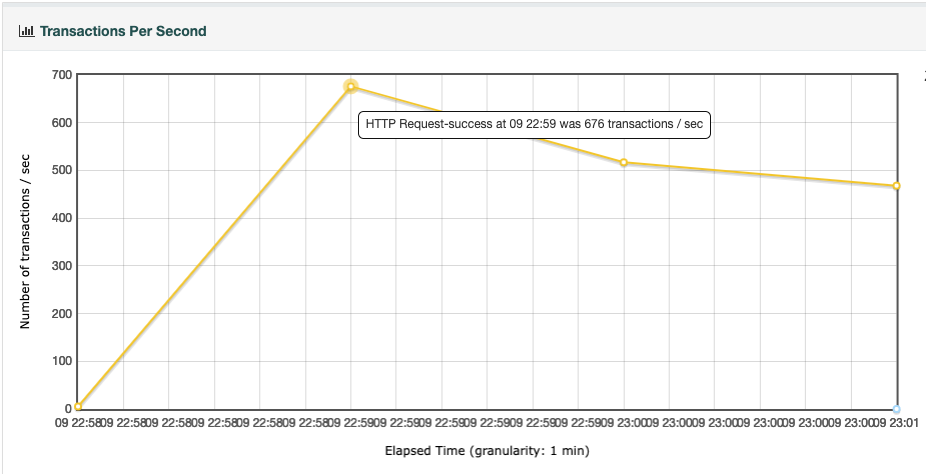

# 性能结果

## 测试方案

### 思路

本服务主要是两个接口，写入接口性能消耗较大，如果要测试系统性能瓶颈的话， 直接从写入接口入手就好，而且需要不命中缓存。

### 环境

> MacBook Air (13-inch, Early 2015) 
> 处理器 1.6 GHz 双核Intel Core i5 
> 内存 8 GB 1600 MHz DDR3

*服务启动使用1G内存参数* `-Xms1g -Xmx1g`

### 方案

使用jmeter工具，生成随机数拼接参数，20个线程，循环5000次，warmup时间设置为5s

测试请求，随机参数：

jmeter方案配置文件：[test/xurl_test.jmx](../test/xurl_test.jmx)

#### 单线程测试

server设置单线程工作线程

#### 多线程测试

由于本机仅为双核，故将服务参数设置为 2 工作线程

## 测试结果

### 单线程

测试结果如下：

**小结：** 
在上述环境下，单线程服务：

- 最高可达**615qps**
- 平均响应时间**33.93ms**
- 响应时间中位数在**16ms**左右

### 2 线程

测试结果如下：

**小结：** 
在上述环境下，双线程服务：

- 最高可达**676qps**
- 平均响应时间**34.27ms**(有两个2个超时请求拉低平均值)
- 响应时间中位数在**10ms**左右（排除最后）

## 总结

该服务为cpu任务型，且在核心部分—序列号分配加锁，所以双线程对于性能提升并不太明显

## 不足

- 性能边界未充分测试
- 未对内存瓶颈进行相关测试
