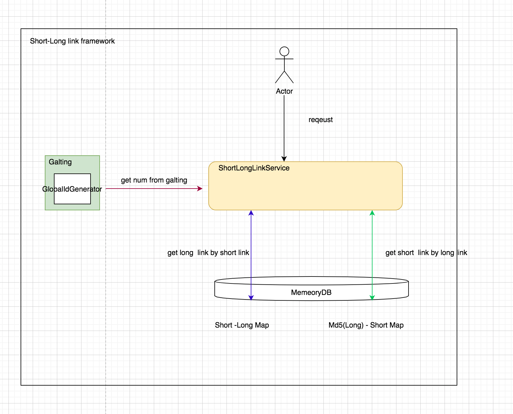
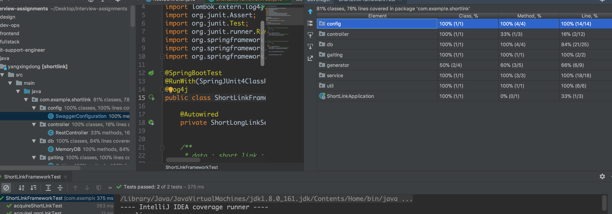
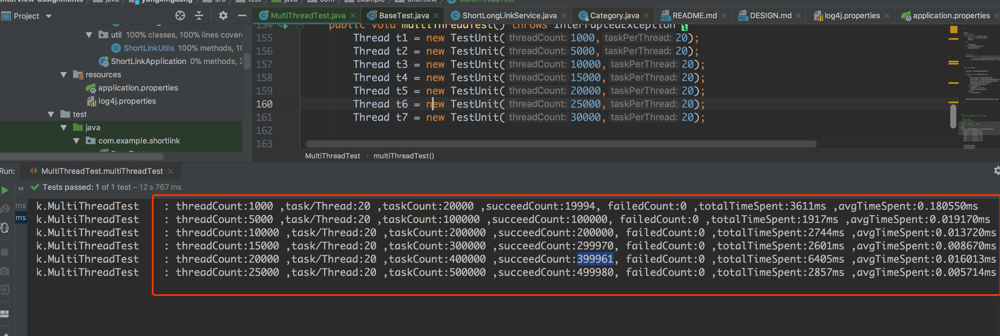

### 1.理论设计分析

几点假设：
   1。不借助任何中间件和DB，使用内存来模拟数据库
   2。本次是一个单体应用，但是同时也考虑到了分布式的情况
   
业务需求本身不复杂，只要提供长短连接转换即可，我们的实现基于ConcurrentHashMap，
分别，保存长-短，短-长 连接的映射。

需要解决问题的点在于：如何将长连接转化为短连接，我们采取的方式采用galting发号器的方式，
为每一个长连接分配一个序号，然后吧这个序号转成62进制的表示，然后保存短-长 连接的映射。

同时也保存MD5(长连接) - 短连接的映射。      

### 2.业务流程和程序架构
以下是架构图（简化），由时间关系，只画出了主要的实体：

1.通过长链接找短链接

首先在Md5(long link)-短链接Map里面找，有就直接返回。

如果没有则请求galting分配号码，然后将号码转成62进制的表示。存到两个映射
里面去。

2。通过短链接找长链接

直接从 短-长 Map里面拿就行了。

### 3.代码覆盖率

### 4.多线程测试结果

如图是多线程测试的结果，为此我写了一个类：com.example.shortlink.MultiThreadTest
用来测试这个框架的结果

### 5.框架优势
   * 面向抽象，方便扩展
   * 考虑到了分布式的情况，并且代码已经留白，相应的接口已经定义好了。
  
