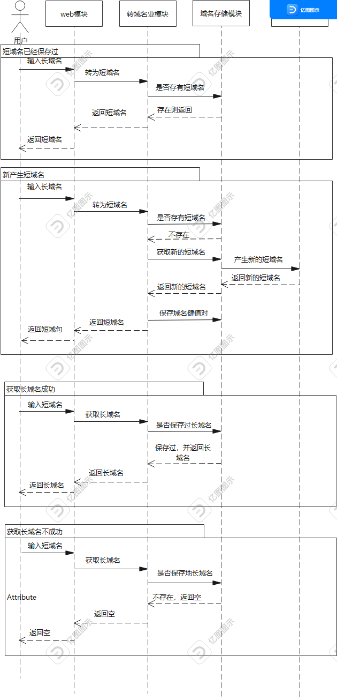
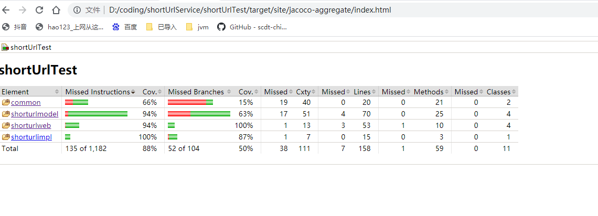
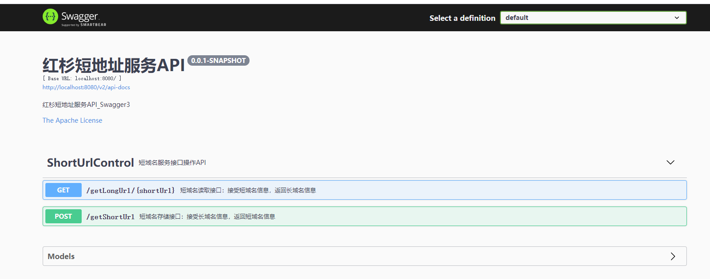

#　１.设计思路

##　１）短域名算法设计

&nbsp;&nbsp;&nbsp;&nbsp;&nbsp;&nbsp;&nbsp;&nbsp;使用雪花算法，产生一个18位的数字，
再将这个数字转为62进制的数，取62进制的低8位数，然后将这8位62进制的数做为下标到一个62位的字符 
数组中去取对应下标的字符，这8个字符就是产生的短域名。这个62位的字符数组是由
26位英文字母的大小写，以及10个数字组成。这样产生的短域名，重复率比较低，也没有
直观的规律，不内容被攻击！

##　2）存储设计

&nbsp;&nbsp;&nbsp;&nbsp;&nbsp;&nbsp;&nbsp;&nbsp;使用线程安全的ConcurrentHashMap
在内存中存储，这符合多线程的网络环境，同时也兼顾性能，所以选择ConcurrentHashMap。根据业务需要
一条长域名需要保存 "长域名-->短域名+日期"， "短域名-->长域名+日期" 两对key,value,以方便
快速存取。

##　3）防内存溢出设计

### 3.1 压缩字段长度

* 对用于key的长域名压缩为32位存储

> 
>对于长域名-->短域名+日期key-->value
>把做为key值的长域名 转换为md5字符32位

* 对日期的压缩，用一个short 2位字节存储

>
>对于日期，只取年月日8位组成的整形数字，然后估算我们的系统如果能使用100年，一年365年，可以存储36500
>个不同的日期，用一个short型，系统人为规定一个起始日期，比如20211121，其它日期就取与他的差值，
>用short存取，这样一个日期用2个字节（这个代码中还没有来得急实现，代码中用的Date,因为工作忙拖太久了）
>（这种设计可能保存要做转换日期的计算，得花时间，但是这个服务本就是很轻量的，这点时间应该不影响用户
>体验）

* 100m内存可以存储的数据量

>假设100m内存来做存储，来估算可以存储的数据量，长域名估算均250个字节，短地址8个字节，为了节省
>存储空间，把做为key值的长域名md5字符32位字节，这样平均一个 长域名的维护 需要 8+250+2+32+8+2=308
>个字节 100m = 100*1024*1024  个字节，可以存储（100 * 1024 * 1024）/308 = 340446.75,
>100m内存可处理340000个长地址。

### 3.2 根据假设每天最大存储长域名数理，估算域名保存有效期：

&nbsp;&nbsp;&nbsp;&nbsp;&nbsp;&nbsp;&nbsp;&nbsp;假设的每天最多的新增长域名为10000wh ,需要34天
所有的100m内存地址被用完,因域名有效期最长32天，但是为了应对不可预知的情况，域名有效期定为30天

### 3.3 防溢出实现方法：
&nbsp;&nbsp;&nbsp;&nbsp;&nbsp;&nbsp;&nbsp;&nbsp;启用定点任务，每天的凌晨2点，启动线程对超过
30天有效期的数据进行清理。启动线程进行清理，既能保证清理，也不影响用户对服务的正常使用。

## 4) 安全设计 

### 4.1 限制每天新增长域名数量：

&nbsp;&nbsp;&nbsp;&nbsp;&nbsp;&nbsp;&nbsp;&nbsp;为防止恶意的饱和攻击，采用限制每天
增长域名数量为正常情况 10000个，这样也能防止内存溢出。（这个程序中没有实现，因为工作太忙时间拖太
久）

### 4.2 相同的长域名不会存储多份：

&nbsp;&nbsp;&nbsp;&nbsp;&nbsp;&nbsp;&nbsp;&nbsp;为防止恶意的饱和攻击，采用的是
ConcurrentHashMap存储，相同的长域名不会存储多份。

## 5)可扩展设计

### 5.1 业务层采用门面模式：

&nbsp;&nbsp;&nbsp;&nbsp;&nbsp;&nbsp;&nbsp;&nbsp;Control控制层访问Service业务层
时，业务层采用接口模块与实现模块两个模块，以实现控制层与业务层的解耦，以方便业务层的扩展。

### 5.2 Model层采用门面模式：

&nbsp;&nbsp;&nbsp;&nbsp;&nbsp;&nbsp;&nbsp;&nbsp;Model层采用接口类与实现类，以实现
Model层与业务层的解耦，以方便Model层的扩展，将来可以扩展使用redis,db,mongDB等

### 5.3 短域名算法采用策略模式：

&nbsp;&nbsp;&nbsp;&nbsp;&nbsp;&nbsp;&nbsp;&nbsp;短域名算法设计采用的策略模式，在配置文档 中
配置算法bean的名称，运行中根据配置的算法bean名称在spring上下文 环境中动态获取bean的方式，来
灵活扩展。

# 2、 设计图

# 3、jacoco 测试报告截图

Jacoco报告地址：

file:///D:/hongshang2/interview-assignments/java/ygShortUrlService/shortUrlService/shortUrlTest/target/site/jacoco-aggregate/index.html

# 4、swagger3集成api服务

swagger服务访问地址：http://localhost:8080/swagger-ui/index.html#/

