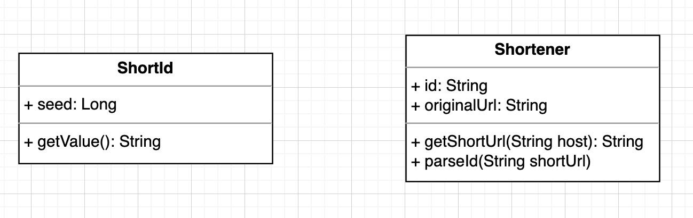

#短域名服务

##设计思路

短域名服务的实现原理就是给长域名生成并绑定一个唯一的短码，通过短码和长域名的映射关系实现双向查询。

### 算法设计

##### Assumption：短域名服务的读操作远远大于写操作，写操作的并发要求不高。

目前主流的短域名服务大致分为两种算法：

1. 自增ID
2. MD5哈希

比较两种算法：

* 自增ID可以保证永不重复，但是在写入的时候必然有单点性能瓶颈（所有节点都要等待去获取下一个ID）
* MD5不存在单点性能问题，但是会存在一定的重复几率

所以出于对唯一性的要求，选择**自增ID算法**。

算法详细设计：

实现一个 10 进制的自增ID，将 10 进制的ID转换成一个 62 进制的字符值，每一位是由 [a - z, A - Z, 0 - 9] 共 62 个字母组成的，需求中最长限制是8位，将会有 62^8 种组合，数量足够使用。

### 模型设计

业务需求：

1. 根据短域名获取长域名
2. 根据长域名获取短域名


转换为技术需求：

1. 生成自增ID
2. 存储长短域名映射关系

转换为模型：

1. ShortId: 负责自增ID和短码计算
2. Shortener: 负责长短域名映射关系



### 架构策略

##### Assumption：短域名服务的业务模式稳定不变，核心逻辑就是维护管理长短域名的映射关系，技术实现，如算法，存储方式等可能会出现变化。

软件架构类型有很多，这里就不一一做出对比了，基于上述假设，这种业务相对稳定，技术实现多样的需求与六边形架构十分契合。


如上图：

* 最内的 Model 层提供核心可复用的业务逻辑，单一且稳定。
* 最外的 Adapter 可以适配各种技术实现，如内存计算，数据库计算，文件、缓存或三方服务等。
* 中间的Application Service层负责组合和封装业务能力，对外部（如API，当然API也视为Adapter的一种）提供统一的服务。

所以最终选择使用 **六边形架构**，又名**端口适配器架构**。

## 架构设计
### 框架选择
##### Assumption：
1. 当前短域名服务在整体架构中属于中台层，只负责获取域名信息，不负责前端地址的重定向（重定向应向由BFF层或者应用服务层负责）。
2. 对性能有要求，支持高并发。


* 由于使用的是Java语言，虽然市面上有很多新的优秀的框架，但考虑到稳定性、可维护性以及社区活跃度等因素，还是选择Spring Boot作为基础开发框架。
* 考虑到系统对性能会有一定的要求，这里选择了[Spring WebFlux](https://docs.spring.io/spring-framework/docs/current/reference/html/web-reactive.html) 构建non-blocking的响应式Web应用。
* 使用 [Gradle](https://gradle.org/) 作为构建工具对代码进行构建。

### 组件设计
基于六边形架构的设计原则，核心组件设计如下图：


### API文档
可以使用 `./gradlew bootRun` 运行项目，访问[Swagger](http://localhost:8080/swagger-ui.html)的地址查看，如下图：


## 非功能性需求设计
### 幂等性
基于前文提到的假设，当前短域名服务作为中台服务，需要对接口进行幂等处理，当前服务的两个接口：

1. 根据长域名获取短域名：存在写操作，要考虑幂等性
2. 根据短域名获取长域名：读操作，没有幂等性问题

业务规则设计：当请求 **根据长域名获取短域名** 的接口时，如果长域名重复，不会生成新的短域名，返回之前已存在的短域名。

### 读写锁 + 锁池
基于对API的幂等处理，需要对写操作进行加锁，防止在并发请求下出现重复的长域名，需要对整个过程进行加锁。

然而重复判断只是读操作，在大部分情况下，读操作之间是不需要互斥的，所以这里采用读写锁进一步提高并发性能。

由于不同的URL之间的写操作也不需要互斥，可以根据长域名的hash值取余数作为Key，构建一个可配置大小的读写锁池（防止内存溢出），进一步提高写操作的并发性能。

配置如下：

```yaml
short-code:
  lock-config:
    timeout: 10 #尝试获取锁的时间
    timeunit: SECONDS #尝试获取锁的时间单位
    max-pool-size: 100 #锁池大小
```

### 内存回收
由于数据都保存在内存中，无限制就会造成内存溢出，这里使用`Queue`的结构来记录存储顺序，优先回收存在时间最长的数据。

并且简单实现了一些可配置化，配置如下:

```yaml
short-code:
  max-store-size: 2000 #最大存储个数，超过就会触发回收
  gc-rate: 0.2 #每次回收比率，0.2表示每次回收总数量的20%
```

## 测试覆盖率报告
工程中多采用单元测试的方式进行测试，对组件间的依赖使用mockito进行替身，由于是interview，这里小小强迫症的尝试了一下100%的coverage，真实项目中基本稳定保持在85%以上。

工程集成了[Jacoco Gradle](https://docs.gradle.org/current/userguide/jacoco_plugin.html) 插件。
运行`./gradlew clean test`，即可在`build/reports/jacoco`中查看报告结果，如下图：


## 性能测试报告
使用了[Gatling](https://gatling.io/docs/gatling/) 作为性能测试工具，集成了[Gatling Gradle](https://gatling.io/docs/gatling/reference/current/extensions/gradle_plugin/) 插件和 [Gatling charts](https://mvnrepository.com/artifact/io.gatling.highcharts/gatling-charts-highcharts) 组件库。

测试代码在`src/gatling/java`目录下，测试了两个Simulation：

1. get short url 根据长域名获取短域名
2. get url full step 先获取短域名，再根据短域名获取长域名

执行`./gradlew bootRun` 运行项目，再执行 `./gradlew gatlingRun` 即可运行测试，可以在`build/reports/gatling`目录下查看结果，如下图：

（由于Report较长，这里仅展示第二个Simulation的截图）


