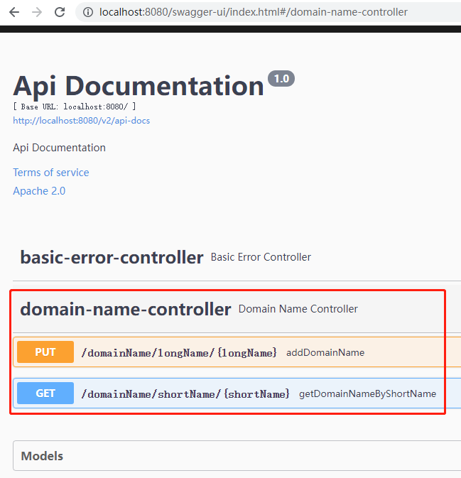
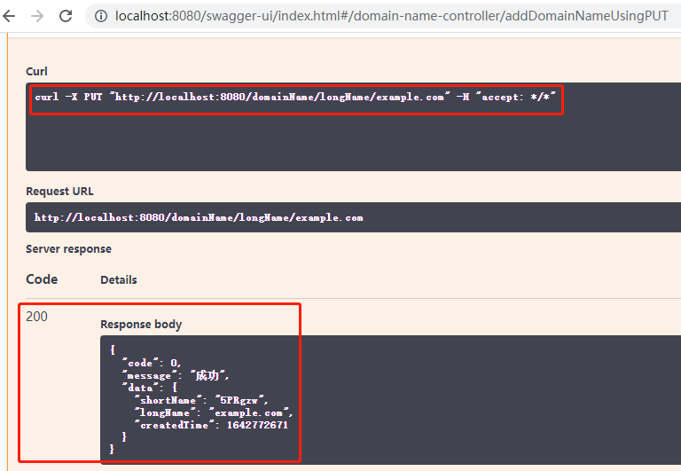
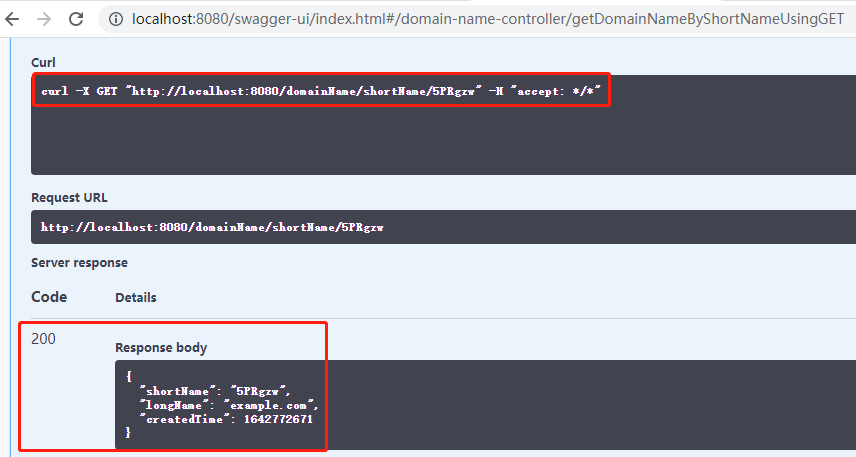
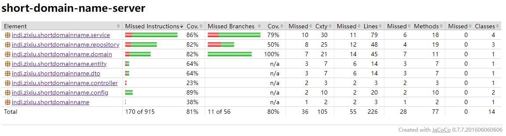

这是红杉中国 Java 工程师职位面试作业短域名服务器的解答（作业链接：https://github.com/scdt-china/interview-assignments/tree/master/java）

**1 设计文档**：[设计文档](docs/设计文档.md)

**2 集成 Swagger API 文档效果**

DomainNameController 的接口：

测试短域名存储接口：

测试短域名读取接口：

**3 JaCoCo 测试覆盖率**

