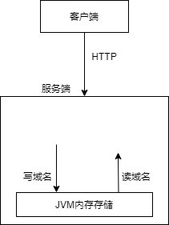
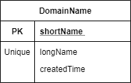
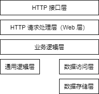

# 1 需求

## 1.1 用例

要求实现以下 HTTP 接口：

- 短域名存储接口：接受长域名信息，返回短域名信息

- 短域名读取接口：接受短域名信息，返回长域名信息


不考虑对接口请求进行认证、鉴权。

## 1.2  限制与假设

限制：

- 短域名长度最大为 8 个字符
- 采用 Spring Boot，集成 Swagger API文档
- 用 JUnit 编写单元测试, 使用 Jacoco 生成测试报告
- 域名数据库存储在 JVM 内存，必须防止内存溢出


假设：

- 最多会有多少个域名？根据 【Verisign ，Q3 2021 域名行业报告】，2021年 Q3 结束时，注册域名总数约为 3.6亿，2020年 Q3 结束时，注册域名总数约为 3.7亿。可见注册域名总数的年度变化不大，年度变化量在 2% 以内，所以可以假设未来 5 年注册域名总数约为 4亿。注册域名是主域名，在我们的短域名服务中存储的域名可能是子域名，假设每个主域名平均有 5 个子域名（包含该主域名自身），则未来 5 年子域名总数约为 20亿（4亿 * 5）。再假设我们的短域名服务只存储全体子域名的 1%，即 2000万子域名。

- 短域名存储接口请求频率平均为 10次/秒
- 短域名读取接口请求频率平均为 100次/秒
- 短域名读取接口请求频率 : 短域名存储接口请求频率 = 10  : 1
- 长域名平均长度不超过 20 个字符（参考【ZookNIC，域名长度】）

# 2 概要设计



- 客户端与服务端通过 HTTP 协议通信
- 域名数据库存储在 JVM 内存

# 3 详细设计

## 3.1 数据库设计

### 3.1.1 概念设计

数据库概念模型用实体联系模型表示。



实体 DomainName 代表域名，其属性如下：

- shortName: 短域名，是域名的唯一标识
- longName: 长域名，具有唯一约束
- createTime: 创建该域名的时间

### 3.1.2 逻辑设计

根据需求，域名数据库应存储在 JVM 内存中，所以数据库逻辑模型用 Java 类表示。


DomainName 实体的逻辑模型：

```java
class DomainNameEntity {
    private long shortName;
    private String longName;
    private int createdTime;  // 创建该域名的时间，Unix 时间戳，单位为秒
}
```

shortName, createdTime 属性的数据类型分别用 long, int，是为了节省内存。

### 3.1.3 物理设计

现在需要设计存储域名数据库的数据结构。考虑用例对域名数据库的数据结构的需求：

- 短域名存储接口：先判断数据库中是否已存在指定长域名，若存在则返回已存在的域名实体，否则添加一个新域名到数据库中。所以数据库需支持以下特性：
  - 根据长域名快速查找域名实体
  - 快速添加新域名
- 短域名读取接口：数据库需支持以下特性：
  - 根据短域名快速查找域名实体


使用以下 2 个索引可以支持以上需求：

- 短域名索引：用 Map<Long, DomainNameEntity>（java.util.Map，下同）存储短域名到域名实体的映射
- 长域名索引：用 Map<String, DomainNameEntity> 存储长域名到域名实体的映射


下面考虑使用 Map 接口的哪种实现，合适的候选实现有 HashMap 和 TreeMap。根据需要，我们主要关注 Map 实现 时间复杂度（添加、查询操作）和空间复杂度，HashMap 和 TreeMap 对比如下表：

| 指标                   | HashMap                                   | TreeMap                |
| ---------------------- | ----------------------------------------- | ---------------------- |
| 添加操作平均时间复杂度 | O(1)                                      | O(log(n)               |
| 查询操作平均时间复杂度 | O(1)                                      | O(log(n)               |
| 空间复杂度             | n * (HashMap 链表节点大小 + 引用类型大小) | n * TreeMap 树节点大小 |

在时间复杂度方面，HashMap 优于 TreeMap，不过由于操作都是内存读写，速度很快，O(log(n)) 复杂度也是可以接受的。在空间复杂度方面，HashMap 占用空间更小。所以选用 HashMap 存储短域名索引和长域名索引。


假设数据库中每个域名平均占用 256B，而 “1.2 限制与假设”中假设最多存储 2000万个域名，于是数据库最大大小为 256B * 2000万 = 5GB。


用 DomainNameRepository 类表示域名数据库，该类结构如下：

```java
class DomainNameRepository {
    private Map<Long, DomainNameEntity> shortNameToDomainName;
    private Map<String, DomainNameEntity> longNameToDomainName;
    
    public void insert(DomainNameEntity domainName) {}
    
    public DomainNameEntity findByShortName(long shortName) {}
    
    public DomainNameEntity findByLongName(String longName) {}
}
```


因为可能并发读写域名数据库，所以 DomainNameRepository 类需要有并发控制机制，候选方案有：

- synchronized：任一时刻，最多只允许一个线程读/写，并发度低。
- ReadWriteLock：任一时刻，可以有任意个线程读，或一个线程写，而我们假设读请求数量是写请求数量的 10 倍，所以总体上并发度是较高的。

所以选用 ReadWriteLock 做并发控制，现在 DomainNameRepository 类结构如下：

```java
class DomainNameRepository {
    private Map<Long, DomainNameEntity> shortNameToDomainName;
    private Map<String, DomainNameEntity> longNameToDomainName;
    
    private ReadWriteLock repositoryLock;  // 控制并发读写数据库的锁
    
    // 不会获取数据库的锁
    public void insert(DomainNameEntity domainName);
    
    // 会获取数据库的 lockMode类型锁
    public void insert(DomainNameEntity domainName, LockMode lockMode);
    
    public DomainNameEntity findByShortName(long shortName);
    
    public DomainNameEntity findByShortName(long shortName, LockMode lockMode);
    
    public DomainNameEntity findByLongName(String longName);
    
	public DomainNameEntity findByLongName(String longName, LockMode lockMode);
    
    // 获取数据库的读锁
    public void lockForRead();
    
    // 释放数据库的读锁
    public void unlockForRead();
    
    // 获取数据库的写锁
    public void lockForWrite();
    
    // 释放数据库的写锁
    public void unlockForWrite();
}
```

其中 LockMode 类为表示锁模式的枚举类，有 READ, WRITE, NONE 3 个值，分别代表读锁，写锁，无锁 3 种模式。

## 3.2 项目结构设计

### 3.2.1 应用分层


应用分层如上图，上层依赖下层，各层含义如下：

- HTTP 接口层：客户端与应用的 HTTP 通信接口，把客户端的请求转发给 HTTP 请求处理层，然后把 HTTP 请求处理层的响应转发给客户端。该层包含 Web 服务器（如 Tomcat）。
- HTTP 请求处理层：主要是对访问控制进行转发，各类基本参数校验，或者不复用的业务简单处理等。该层包含 Controller。
- 业务逻辑层：相对具体的业务逻辑服务层。该层包含 Service 类，DTO（Data Transfer Object） 类。
- 通用逻辑层：领域模型，业务逻辑层通用能力下沉。该层包含 Domain 类。
- 数据访问层：从（向）数据存储层读（写）数据。该层包含 DAO 类, Entity 类。在本项目中，因数据存储层在应用内，所以本项目暂时无需数据访问层，业务逻辑层可直接与数据存储层交互来读写数据。
- 数据存储层：MySQL, Redis, MongoDB 等数据存储系统。

### 3.2.2 Java 包结构

假设项目的 Java 包前缀为 ${projectPrefix}，则 ${projectPrefix} 包下主要包含以下子包：

- controller: 包含 Controller 类，Controller 类建立 HTTP 请求与处理器的映射关系，从（向） Spring MVC 接收（发送）HTTP 请求（响应）
- dto: 包含 DTO （Data Transfer Object）类，DTO 类用于在 2 个系统之间传递数据对象。Service 和 Controller 会输出 DTO，Controller 会向 Service 传递 DTO（根据客户端请求构造）。
- service: 包含 Service 类，Service 类负责业务逻辑。
- domain: 包含领域模型类，领域模型类是业务领域核心概念、业务的抽象。
- entity: 包含 Entity 类，Entity 对应数据存储系统中的数据记录。
- repository: 在应用内部实现的域名数据存储系统，包含 DomainNameRepository 类。

## 3.3 HTTP 接口设计

### 3.3.1 HTTP 接口规约

HTTP 响应的的 HTTP 状态码只可能是以下 3 种：

- 200：表示完成了业务处理，但不表示业务成功了。要想知道业务结束于何种情形，需检查响应体。
- 400：由于客户端的错误，导致无法完成业务处理。
- 500：由于服务端的错误，导致无法完成业务处理。


HTTP 请求体和响应体都是 json 格式，可能是任何 json 数据类型（Number, String, Boolean, Array, Object, null）。

### 3.3.2 短域名存储

短域名存储接口的请求格式为：

```
PUT /domainName/longName/${长域名}
```

比如，PUT /domainName/longName/foo.example.com。

因为拟将该接口设计成幂等接口（重复存储同一个长域名，得到的短域名是相同的），所以接口的 HTTP 方法采用 PUT，而不是 POST。


响应体格式：

```json
{
    "code": 0,  // 0 表示成功，创建的域名在 data 属性中。1 表示域名数据库达到容量上限，无法存储新域名
    "message": "成功",
    "data": {
        "shortName": "3NLLoe",
        "longName": "foo.example.com",
    	"createdTime": 1642743556
    }
}
```

### 3.3.3 短域名读取

短域名读取接口的请求格式为：

```
GET /domainName/shortName/${短域名}
```

比如，GET /domainName/shortName/3NLLoe


响应体格式：

```json
{
	"shortName": "3NLLoe",
    "longName": "foo.example.com",
    "createdTime": 1642332590
}
```

或：

```json
null
```

## 3.4 业务逻辑层设计

Service 类的接口方法遵循以下规约（参考【书牧，Java接口Result设计】）：

- 失败处理
  - 对于系统异常（网络超时、空指针异常、方法参数错误等），用抛异常处理，在方法签名中添加抛异常声明。
  - 对于业务失败（如因数据库中域名数量达到上限，不能新增域名），在方法返回值中返回失败状态
- 返回值
  - 对于不可能产生业务失败的方法，返回值就是原始的业务结果数据。比如，下面的 DomainNameService.getDomainNameByShortName 方法，不可能产生业务失败（找不到域名不认为是业务失败），所以其返回值就是 DomainName。
  - 对于可能产生业务失败的方法，返回值为 Result（见下文），Result 中有说明业务结束于何种情形的代码，以便调用方根据不同的业务结束情形做处理。


Result 类：

```java
// T 业务结果数据的类型
class Result<T> {
	private String code;  // 业务结束情形代码
	private String message;  // 业务结束情形简介
	private T data;  // 业务结果数据
	
	// getter/setter
	
	// 业务是否成功
	public boolean isSuccess();
}
```


本项目只有 短域名存储 和 短域名读取 2 个用例，所以业务逻辑层定义一个 DomainNameService 类即可：

```java
class DomainNameService {
    // 短域名存储
    public Result<DomainNameDto> addDomainName(String longName);
    
    // 短域名读取
    public DomainNameDto getDomainNameByShortName(String shortName);
}
```

### 3.4.1 短域名存储

功能：接受一个长域名，为其生成一条域名记录，该记录包含长域名，短域名，以及其他信息，然后将该记录保存到数据库，并返回该记录。


约束：

- 短域名最长 8 个字符，且数据库中的短域名是唯一的
- 接口要幂等， 即重复存储同一个长域名，得到的短域名是相同的
- 要限制域名数据库中的域名数量，以免内存溢出，根据 "1.2 限制与假设" 对域名数量的假设，我们限制域名数据库最大存储 2000万个域名
- 访问数据库时，可能有多个线程在并发读写数据库，所以对访问数据库要做并发控制


流程：

1. 检查长域名是否是合法域名，若不合法，则返回失败，流程结束，否则执行下一步。
2. 获取数据库的写锁。
3. 检查数据库中是否存在指定长域名，若存在，则释放数据库的写锁，返回已存在的域名，流程结束，否则执行下一步。
4. 检查数据库中的域名数是否已达到阈值（2000万），若已达到，则释放数据库的写锁，返回失败，流程结束，否则执行下一步。
5. 生成域名记录，将其写到数据库，然后释放数据库的写锁，返回该记录，流程结束。


以上流程中生成域名记录步骤需要生成短域名，下面设计短域名生成算法。


短域名生成算法约束：

- 短域名最长 8 个字符
- 能把短域名映射到对应域名所在的服务器。因为服务器集群场景下，负载均衡器收到短域名读取请求后，需要知道该把请求转发到哪台服务器。


Twitter Snowflake 算法可以生成分布式 ID，生成的 ID为 64 比特长（实际为 63 比特，因为最高位始终是 0）的整数，若将这个整数转换成以 62 进制数（用 [0-9A-Za-z] 62 个字符表示数字），最多需要的 62 进制位数为 log62(2 ^ 63 - 1) = 10.5808，即最多需要 11 位字符来表示 ID，这超出了短域名最长 8 个字符的限制。所以需要稍微修改 Snowflake 算法，使其生成的最大 ID 能用 8 位 62 进制数表示。Snowflake 算法生成的 ID 的 64 比特的结构如下：

- 最高位始终是 0
- 接下来 41 位为时间戳（相对某个参考时刻的毫秒数）
- 接下来 5 位为数据中心 ID
- 接下来 5 位为同一数据中心内的机器的 ID
- 最后 12 位为递增序列号


减少以上各部分的比特位数，可使 Snowflake 算法生成更小的 ID。假设短域名服务器最长运行 15 年，则时间戳部分需要的比特位数为 log2(15 * 365 * 24 * 3600 * 1000) = 38.7832 ，即 39 位。又根据 “1.2 限制与假设” 中假设短域名存储接口和短域名读取接口请求频率分别为 10次/秒，100次/秒，可以将数据中心 ID，机器 ID，和序列号的比特位数分别调整成 1, 3, 2。经过以上修改，Snowflake 生成的 ID的只需占用 39 + 1 + 3 + 2 = 45 比特，此时最多需要的 62 进制位数为 log62(2 ^ 45 - 1) = 7.5577，即 8 位，符号短域名最长 8 个字符的限制。

### 3.4.2 短域名读取

功能：根据短域名，返回对应的域名记录，若不存在对应的域名记录，返回 null。


流程：

1. 将 62 进制短域名转换成 long 类型
2. 获取数据库的读锁
3. 根据 long 类型短域名，从数据库中查找域名记录，释放数据库的读锁，返回该域名记录（可能为 null）。

## 3.5 通用逻辑层设计

本项目业务简单，只有一个领域模型 DomainName:

```java
class DomainName {
    private long shortName;
    private String longName;
    private int createdTime;
    
    public static boolean isValidDomainName(String longName);
    
    public static String convertShortNameInLongToInBase62(long shortNameInLong);
    
    public static long convertShortNameInBase62ToInLong(String shortNameInBase62);
}
```

# 4 参考资料

【Verisign ，Q3 2021 域名行业报告】https://www.verisign.com/en_US/domain-names/dnib/index.xhtml

【ZookNIC，域名长度】http://www.zooknic.com/Domains/dn_length.html

【书牧，Java接口Result设计】阿里巴巴，书牧，谈谈Java接口Result设计， https://mp.weixin.qq.com/s/D5dinmi-YwQeeJzjSYBqfA