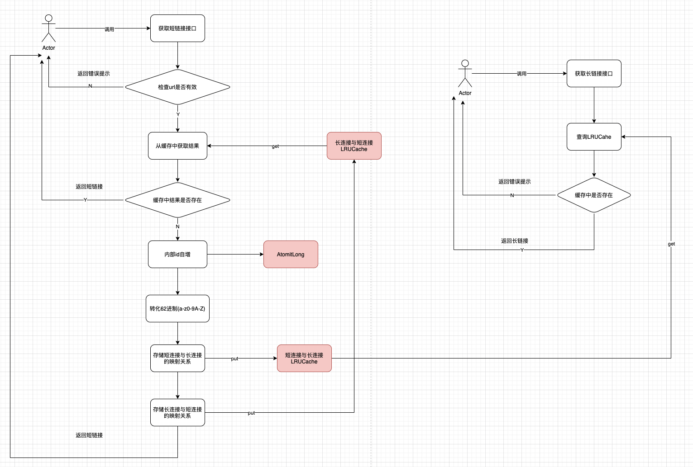
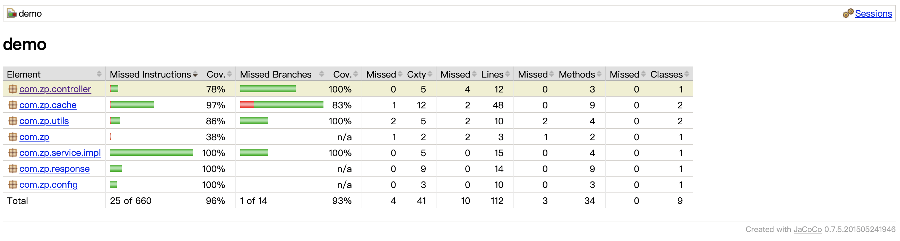
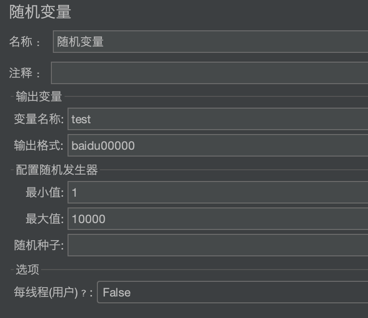
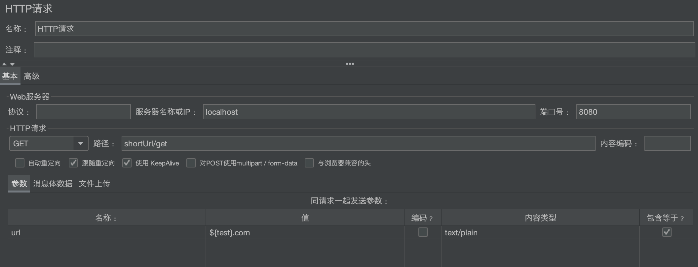
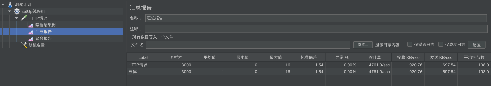
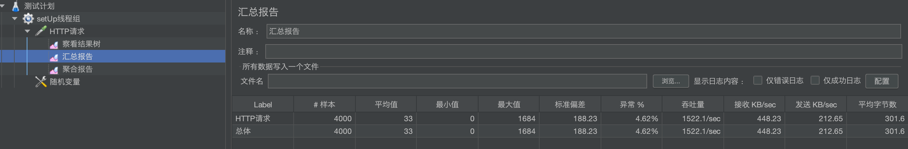

# 整体设计
* 短域名生成算法采用自增id转为自定义62进制(a-z0-9A-Z)
* 即每次调用接口时，id自增(采用AtomicLong)，再把此id转为62进制
* 短域名和长域名的映射关系采用了并发安全的双LRU缓存存储，避免内存溢出
* 双LRU缓存的设计: cache1:短域名作为key，长域名作为value; cache2:长域名作为key,短域名作为value
* 这样设计的好处是获取长域名接口可以直接从cache1中获取结果，获取短域名时可以先从cache2中获取结果，避免相同长域名重复生成短域名
* LRU缓存的最大大小在配置文件中配置
* 当LRU缓存达到最大值后，再往里面put会淘汰掉最早的数据，此时如果访问此数据会返回【短域名不存在或已失效】

# 流程图

# 测试覆盖率

# jmeter测试结果
使用jmeter的随机参数构造不重复的长域名

3000并发时没有问题

4000并发时有一定的connection refused
