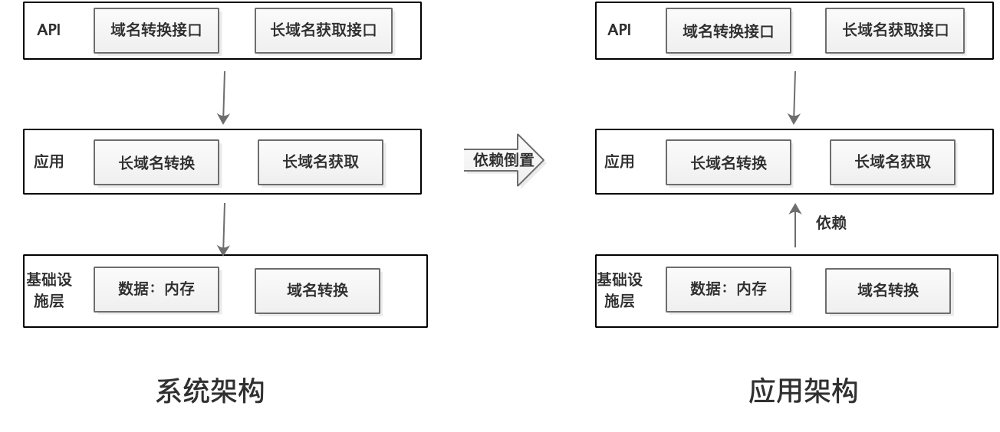

[toc]

### 1、总体设计
#### 1.1、系统架构

系统架构：总体分为三层，API层，应用层，基础设置层 
应用架构：落地时，考虑封装变化及未来可扩展性和易维护性，通过依赖倒置原则将应用层和基础设施层进行解耦；具体实现如下：
* 数据存储接口（UrlDao），长域名转换接口(UrlTransferService)定义在应用层
* 接口具体实现放在基础设施层，通过依赖抽象，而不依赖具体来达到接口的目的

方案优势：便于扩展，长域名装换方案便于切换，数据存储方案也便于切换

### 2、关键点设计

#### 2.1、长连接转换为短连接方案
方案1：自增序列算法 也叫永不重复算法  
    * 优点：实现简单且易理解  
    * 缺点： 
        *  1、短码长度不固定  
        *  2、基于java代码实现是为保证安全性需要消耗资源(加锁 or CAS)，对性能有影响 
        *  3、存在恶意请求，穷举短连接地址风险  
方案2：摘要算法  
    * 优点： 
        1、短码位数较固定  
        2、微博使用这种算法，经过实践证明  
    * 缺点：存在重复可能性，但概率及其低  

结论：选择方案2，理由：用户体验较好，且经过微博验证过可行性  
算法过程： 
1、将长网址 md5 生成 32 位签名串,分为 4 段, 每段 8 个字节  
2、对这四段循环处理, 取 8 个字节, 将他看成 16 进制串与 0x3fffffff(30位1) 与操作, 即超过 30 位的忽略处理  
3、这 30 位分成 6 段, 每 5 位的数字作为字母表的索引取得特定字符, 依次进行获得 6 位字符串  
4、总的 md5 串可以获得 4 个 6 位串,取里面的任意一个就可作为这个长 url 的短 url 地址  

#### 2.2、存储方案-基于内存

方案1：使用HashMap  
方案2：使用ConcurrentHashMap  

结论：选择方案2，这里存储属于共享资源，需要保证线程安全。估使用线程安全的并发容器；而HashMap是线程不安全的，可以使用Collections.synchronizedMap
封装为线程安全容器，但是封装的加锁粒度太粗，影响性能
 
 

