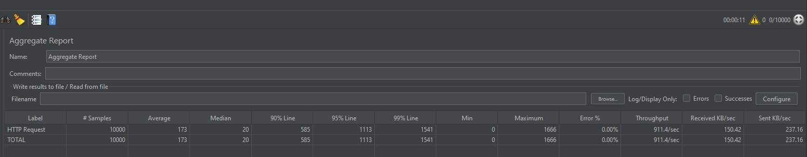

# 设计思路

## 总体设计
1. 应用场景设定为大型集团内部，部分情况（例如发放记名的投票链接）需要适当加密，但是无需为加密而过多牺牲其他性能
2. 避免碰撞，使用全局自增长的ID转换为62进制来生成短域名
3. 单点服务，保留扩展为分布式部署的空间
4. 存储 <长，短> , <短，长> 2对键值对，提高服务效率
5. 使用LinkedHashMap进行缓存，添加或移除元素时加锁保证一致性，采用LRU机制进行淘汰
6. 定时监控内存使用情况，超过阈值时暂停生成新的短域名，避免内存溢出

## 长短域名转换算法
为长域名分配自增ID，并转换为62进制字符串，为避免生成的短域名过于具有规律，采取以下改进措施
1. 62个字符打乱顺序
2. ID不从0或1开始自增
3. 引入最大ID值***MAX***和自增幅度***INC***，同时令***MAX=pow(62,8)-1***，当ID增加到超过***MAX***后取模
4. ***INC***设为质数且与***MAX***互质，可以保证小于***MAX***的所有ID都得到利用

## 生成短域名流程设计（时间关系省略流程图）
1. 输入完整域名，正则检查是否为规范URL，若是，进入下一步，若不是，返回错误信息
2. 检查该完整域名是否曾请求过，若是，读取相应短域名并返回，若否，进入下一步
3. 检查是否由于内存不足暂停生成新域名，若是，返回错误信息，若否，进入下一步
3. 获取新ID，转换为62进制并返回，将长短域名映射关系存入Map中，若已达最大容量，则以LRU机制更新

## 优化设想

### 分布式扩展
如果需要分布式部署，进行如下设置
1. 各台机器独立提供服务,前置负载均衡
2. ID的自增幅度***INC***设为机器台数，最大ID值***MAX***设为小于pow(62,8)-1的***INC***的倍数  
举例 : 4台机器，***MAX***设为400，则第一台机器的ID取值为0,4,8,...396,400.第二台机器的ID取值为1,5,9,...393,397.

## 缓存池设置
- 考虑到不同链接的时效性不同，例如规章制度类的通知需要长久保存，实时资讯则在很短时间内不会再有点击，因此可以设置多个缓存池，永久缓存池不做淘汰处理，普通缓存池则仍然采取LRU机制  
- 当缓存池LRU更新较为频繁时，说明需要适当扩大缓存池  
- 当缓存池更新频率很低时，说明可以缩减缓存池降低内存使用

# 压测说明
便于阅读，文档都写在一个md里  
- 5秒内发送10000个请求，11秒完成

- 请求内容随机生成，存在21个重复的长域名  
