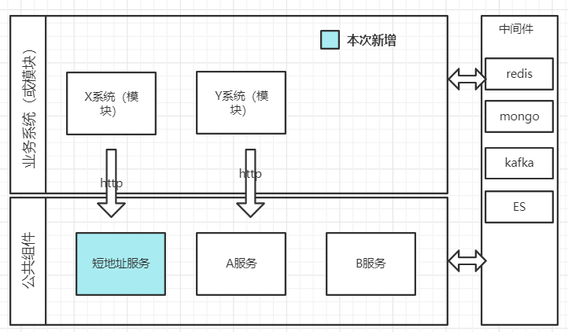

技术实现方案
==

需求描述
--
本次需求主要是开发一个工具提供两个接口的实现为其他模块使用，接口遵循restfull规范，具体要求如下：

撰写两个 API 接口:
短域名存储接口：接受长域名信息，返回短域名信息
短域名读取接口：接受短域名信息，返回长域名信息。

限制：
短域名长度最大为 8 个字符
采用SpringBoot，集成Swagger API文档；
JUnit编写单元测试, 使用Jacoco生成测试报告(测试报告提交截图即刻)；
映射数据存储在JVM内存即可，防止内存溢出；

系统架构
--

实现方案
--
核心逻辑实现：
生成的短地址由 0-9，a -z ，A-Z 共62个字符组成。长度为8的短地址相当于一个8位长的62进制的数。
维护一个自减的发号器。从62的8次方-1开始发号。将这个数转为62进制表示即可。
生成后维护一个map，来存储短地址和长地址的映射关系，用来通过短地址获取长地址信息。
优点：计算速度快、复杂度低。
缺点：没有随机性、62的8次方用完之后要重新开始，。
可优化点：短地址失效时间、生成满了之后的淘汰策略（LRU），存储可从jvm内存换成redis等nosql数据库。
