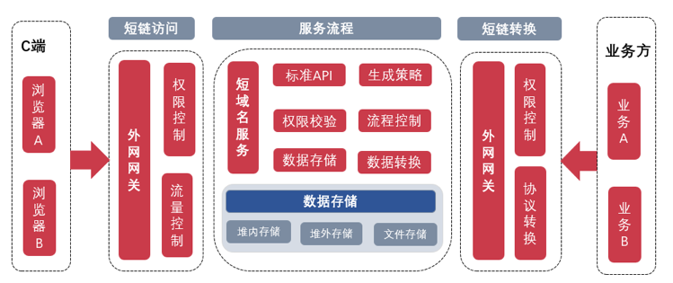

#短域名服务设计文档
## 1.需求
### 1.1 功能需求
- 输入长域名信息，返回短域名信息
- 输入短域名信息，返回长域名信息
- 短域名长度最大为 8 个字符
### 1.2 非功能需求
- 域名映射数据存储在JVM内存
- 防止内存溢出

## 2.整体设计思路

1. 使用哈希算法或ID生成器，获取长域名对应的十进制哈希值或自增数值；
2. 在网址URL中，常用的合法字符有 0～9、a～z、A～Z 62个字符，将生成的10进制的哈希值，转化成更高的62进制值，使别名更短，同时最大支持62^8=218,340,105,584,896个短域名；
3. 建立短网址与长网址的映射关系，存入到本地缓存中；
4. 为防止不存在的短链接对系统造成压力，将生成的短链接存入布隆过滤器后，返回短域名信息；
5. 输入短域名信息，通过查询布隆过滤器是否存在，若存在，则查询本地缓存，返回长域名信息；

**接口执行流程图**

**系统架构图**

## 3.短域名生成方案
### 3.1 哈希算法
哈希算法可以将一个不管多长的字符串，转化成一个长度固定的哈希值，因此可以利用哈希算法，来生成短域名，比如常见的MD5、SHA等。
但当前场景，不需要考虑反向解密的难度，主要关心哈希算法的计算速度和冲突概率，并不需要这些复杂的哈希算法。

> **MurmurHash算法**是一种比较著名且应用广泛的算法，已应用到 Redis、MemCache、Cassandra、HBase、Lucene 等众多著名的软件中。
> MurmurHash算法提供了两种长度的哈希值，一种是32bits，一种是128bits，为了让最终生成的短域名尽可能短，可以选择32bits的哈希值，但是哈希算法会存在哈希冲突，尽管 MurmurHash算法冲突的概率非常低，也还是会发生。

解决办法可以采取拼接固定字符串的方式，重新进行哈希，当用户访问短域名的时候，短域名服务先通过短域名，在映射中查找到对应的原始网址，如果原始网址有拼接特殊字符，就先将特殊字符去掉，再将不包含特殊字符的原始网址返回。

### 3.2 ID生成器
也可以维护一个ID生成器，作为发号器，当短域名服务接收到一个原始网址转化成短域名的请求之后，它先从发号器中取一个号码，然后将其转化成62进制表示法，拼接到自定义域名后面，就形成了最终的短域名。

此方案不足之处在于相同的长域名可能会对应不同的短域名，但是这个并不影响用户使用，是可以接受的。

**常见的分布式ID生成器选型**
- UUID
- 数据库自增
- 雪花算法
- redis
- zookeeper
- 其他开源组件如：美团leaf、百度uid等

以上ID生成策略各有优劣，其中雪花snowflake算法生成的id为17或18位数，转化成62进制表示法后，会超出8位数限制，当前不满足当前需求，暂不进行改造。

**鉴于本服务为单机jvm存储，采用AtomicLong主键生成方案，自增原子操作，保证线程安全。**

## 4.存储方案

### 4.1 缓存选型
- JDK CourrentHahMap，可作为缓存的一种实现方式, 但不能算作缓存的范畴，一是其存储的数据不能主动过期；二是无任何缓存淘汰策略
- GuavaCache，相对于ConcurrentHashMap，在其上封装了一些好用的逐出策略和并发优化，在线程安全，容量溢出，垃圾回收等方面更具优势
- Caffeine，作为一个进程内部缓存框架，使用了Java 8最新的[StampedLock]乐观锁技术，极大提高缓存并发吞吐量，一个高性能的 Java 缓存库，被称为最快缓存

通过资料查阅、性能参数对比，选型Caffeine作为本服务的缓存框架

### 4.2 过期策略
> GuavaCache是基于LRU的，而Caffeine是基于LRU和LFU的，结合了两者的优点，Caffeine使用Window TinyLfu回收策略，提供了一个近乎最佳的命中率。可以提供三种过期策略，分别是基于大小(size-based)、基于时间(time-based)、基于引用(reference-based)

**为避免内存溢出，设计本服务提供自定义配置参数，设置缓存容量(initialCapacity)、缓存的最大条数(maximumSize)、最后一次写入或访问过期时间(expireAfterWrite)，根据部署服务器内存情况以及吞吐量进行灵活配置。**

## 5.接口设计
### 5.1 接受长域名信息，返回短域名信息

接口地址：`/api/getShortLink`

请求方式：`POST`

请求体：

|    参数名    |   参数类型   |   必填   | 说明    |
|:---------:|:--------:|:------:|-------|
| longLink  |   text   |   是    | 长域名地址 |

响应体：

~~~json
{
    "code": "",// 业务状态码
    "msg": "",// 业务信息
    "data": ""// 短域名信息
}
~~~

响应示例：
~~~json
{
  "code": 200,
  "msg": "获取短域名成功",
  "data": "https://t.cn/00Hog"
}
~~~

### 5.2 接受短域名信息，返回长域名信息

接口地址：`/api/getLongLink`

请求方式：`GET`

请求体：

|    参数名    |   参数类型   |   必填   | 说明    |
|:---------:|:--------:|:------:|-------|
| shortLink  |   text   |   是    | 短域名地址 |

响应体：

~~~json
{
  "code": "",// 业务状态码
  "msg": "",// 业务信息
  "data": ""// 长域名信息
}
~~~

响应示例：

~~~json
{
  "code": 200,
  "msg": "获取长域名成功",
  "data": "https://github.com/scdt-china/interview-assignments/tree/master/java"
}
~~~

## 6.测试

### 5.1 单元覆盖率测试
Jacoco单元测试覆盖率截图如下：

### 5.2 性能测试

**基础信息：**

1. 测试范围：测试短域名存储接口的响应时间和支持的qps 
2. 测试工具：使用Jmeter测试工具 
3. 测试环境：Jmeter客户端和restful服务同在本地部署
4. 硬件环境: CPU 4核 2.90GHz, 内存 8G 2133Mhz
5. 软件环境：windows10 64位，Jdk1.8.0_311,jvm -Xms4096m -Xmx4096m
   
**测试方案：**

对/api/getShortLink接口进行3论压力测试，入参通过随机数拼接长域名；设置5线程，分别持续30s、60s、180s,测试qps及响应结果

线程数设置：

接口入参设置：

**测试结果：**

持续30s：

持续60s:

持续180s:

**测试结论：**

获取短域名接口qps在14000 ~ 19000 之间