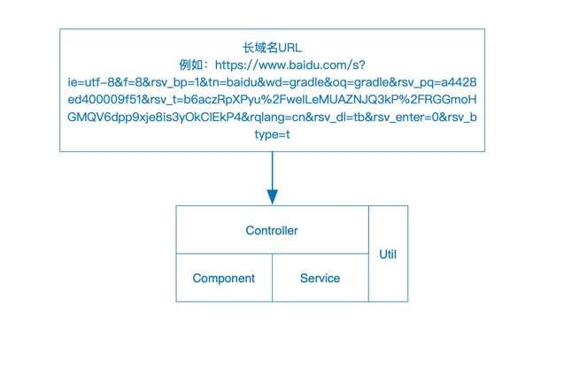
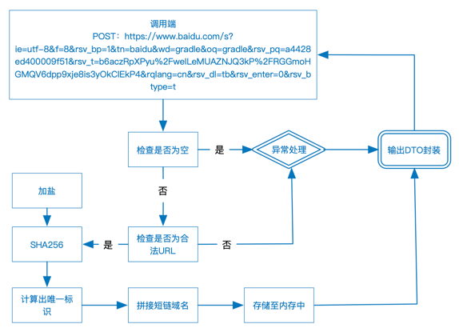
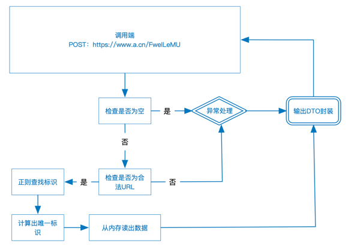
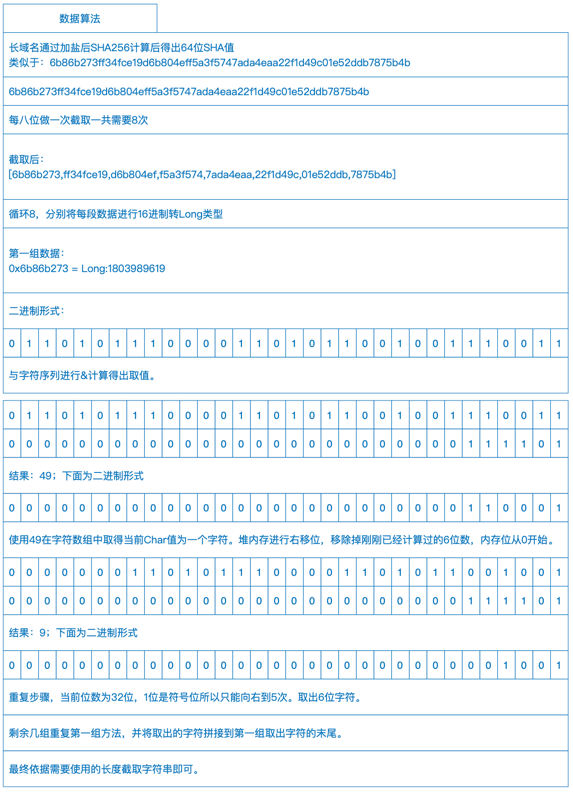
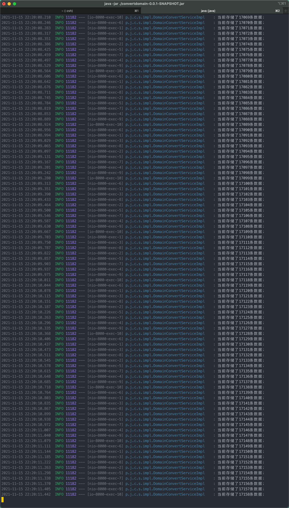
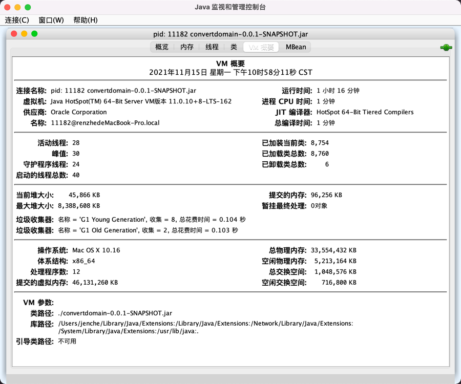

##### **程序开发：任喆  **

##### **手机：18611225551**

##### **email：jenchecn@outlook.com**

## 功能需求

1. 短域名存储接口：接受长域名信息，返回短域名信息
2. 短域名读取接口：接受短域名信息，返回长域名信息。

## 软件需求

- 短域名长度最大为 8 个字符
- 采用SpringBoot，集成Swagger API文档；
- JUnit编写单元测试, 使用Jacoco生成测试报告(测试报告提交截图即刻)；
- 映射数据存储在JVM内存即可，防止内存溢出；

## 系统准备工作

1. 构建工具使用[Gradle](https://gradle.org/)
2. spring boot 使用版本为2.5.6
3. 开发工具为 IDEA
4. swagger入口地址为：http://locahost:8000/doc.html

## 功能需求分析

### 已知问题

​	长域名所指的长域名是否包含超长的URL。
​			现有系统中是带有URL。

​	短域名是否支持用户自定义设置。

​			现有系统预留了用户自定URL功能扩展。

## 解决方案（图）

## 原始域名链接转短域名

## 短域名转原始域名

## 数据算法

## 测试

源码内Jacoco文件夹为代码覆盖测试数据

### 逐量测试查看压力相关，100 -> 1000 --> 10000

### 测试时VM概要

### 进程内存数据

## 总结

系统中未完善短链重复问题，经过测试并未发现重复标识，但并不代表数据量大时不会出现使用SHA256的第一组、第二组16进制数据重复的问题。

解决方法：在保存数据时进行判断是否重复，如果重复向后再截取，可根据运行条件，假设最大短域名标识为8位是否可以使用10位；方法二越过前8位向后再取8位字符进行比对
