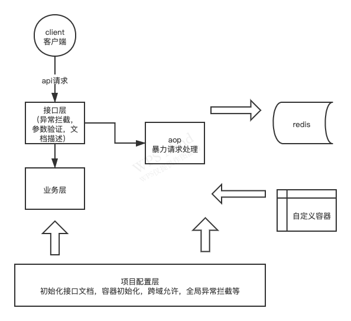

## 需求
需求：实现长短域名转换

限制：短链接长度不超过8字符，存储在jvm防止内存溢出，使用springboot，需要接口文档

## 分析
功能分析：首先要存储在jvm中，所以项目启动就要初始化两个容器，分别以长链接为key和短链接为key。
这样做牺牲了内存空间，但是提高了查询速度。不能内存溢出，那在长链接转换为短链接并存储的时候要提前判断可用内存是否到达上限
这里可用内存上限程序设置为了2m，因为程序简单，留2M能保证后续短链接查询。

## 接口业务实现流程
长转短->url解码->在以长链接为key的容器中查询是否包含该链接，包含就直接返回value，不包含继续往下
->开始循环，循环内调用算法把长链接转换为短链接，每得到一个短链接就去以短链接为key的容器中判断是否包含，如果包含，这个短链接就说明重复了，直接下一次循环
，直到获取到未使用过的短链接->把长短链接put进入两个容器中->返回短链接

短转长->url解码->去以短链接为key的容器中查找->根据查找结果返回数据

## 框架选型
项目搭建：首先使用springboot做管理框架，替换tomcat为undertow，增加apache.commons的工具依赖，使用knife4j来做swagger的接口文档，增加forest作为网络请求框架测试api

## 可能出现的情况

1 接口必传参数不传，在参数验证的时候增加处理，全局异常捕获

2 请求过多，项目启动的时候设置堆栈过小，内存溢出，在put之前做当前实例可用内存的判断，到达峰值直接抛出异常

3 传入参数不是url，做参数校验拦截

4 短转长传入的不是系统转换过的短链接，查询不到结果直接返回信息

5 同一个长链接多次传入，不影响，在转换之前先查询该长链接是不是已经转换过了

6 传入的url有中文和其他符号，先把url解码再做处理

7 长转短接口遭受攻击，增加拦截，目前从入参处理，同样的入参500ms内只允许一次请求，还可以根据请求的ip，时间内大量请求的ip拉入黑名单(因不清楚需求是否需要，暂未实现黑名单)

8 转换算法不稳定，做大量测试

9 请求跨域，设置允许跨域

## 简单架构图

