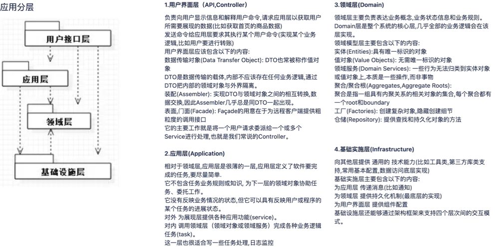

# **百亿级短链系统设计**

## 需求背景
在社交媒体上，人们经常需要分享一些URL，但是有些URL可能会很长，比如：https://github.com/scdt-china/interview-assignments/tree/master/java这样长的URL显然体验并不友好。期望分享的是一些更短、更易于阅读的短 URL，比如像 http://h.cn/ScW4dt 这样的。当用户点击这个短 URL 的时候，可以重定向访问到原始的链接地址。为此我们将设计开发一个短 URL 生成器。

## 设计目标
需要管理的短 URL 规模在百亿级别，并发吞吐量达到数万级别

## 概要设计

### 用户访问时序图

### 用例图

### 短链生成算法

#### 单项散列函数生成短 URL

将长 URL 利用 MD5 或者 SHA256 等单项散列算法，进行 Hash 计算，得到 128bit 或者 256bit 的 Hash 值。然后对该 Hash 值进行 Base64 编码，得到 22 个或者 43 个 Base64 字符，再截取前面的 6 个字符，就可以得到短 URL。
但是这样得到的短 URL，可能会发生 Hash 冲突，即不同的长 URL，计算得到的短 URL 是相同的（MD5 或者 SHA256 计算得到的 Hash 值几乎不会冲突，但是 Base64 编码后再截断的 6 个字符有可能会冲突）。所以在生成的时候，需要先校验该短 URL 是否已经映射为其他的长 URL，如果是，那么需要重新计算（换单向散列算法，或者换 Base64 编码截断位置）。重新计算得到的短 URL 依然可能冲突，需要再重新计算。但是这样的冲突处理需要多次到存储中查找 URL，无法保证的性能要求。

#### 自增长短 URL
一种免冲突的算法是用自增长自然数来实现，即维持一个自增长的二进制自然数，然后将该自然数进行 Base64 编码即可得到一系列的短 URL。这样生成的的短 URL 必然唯一，而且还可以生成小于 6 个字符的短 URL，比如自然数 0 的 Base64 编码是字符“A”，就可以用 http://h.cn/A 作为短URL。

#### 预生成短 URL

即预先生成一批没有冲突的短 URL 字符串，当外部请求输入长 URL 需要生成短 URL 的时候，直接从预先生成好的短 URL 字符串池中获取一个即可。没有性能问题
因此本项目才能此算法。

## 详细设计

### 重定向响应码（后续实际项目可以扩展）

满足短 URL 重定向要求的 HTTP 重定向响应码有 301 和 302 两种，其中 301 表示永久重定向，即浏览器一旦访问过该短 URL，就将重定向的原始长 URL 缓存在本地，此后不再请求短 URL 生成器，直接根据缓存在浏览器（HTTP 客户端）的长 URL 路径进行访问。

302 表示临时重定向，每次访问短 URL 都需要访问短 URL 生成器。

一般说来，使用 301 状态码可以降低服务器的负载压力，但无法统计短 URL 的使用情况，而短链架构设计完全可以承受这些负载压力，因此可以使用 302 状态码构造重定向响应。

### 短 URL 预生成文件及预加载

目前是本地自动生成和存储，默认6个长度，预计可以生成680亿左右（可以满足大多数公司未来2-3的容量），后续不够可以扩展为7个长度，大约4万亿，可以合理的设置短链生命周期，可以实现回收复用

实际项目可以用存储：
 1.预生成的短链可以存储在：HDFS， 短链服务器可以预热加载
 2.长url和短url映射关系可以存储在mysql/Hbase + redis
 
 
生成规则(默认6个字符，采用base64编码表)

预生成短 URL 的算法可以采用随机数来实现，6 个字符，每个字符都用随机数产生（用 0~63 的随机数产生一个 Base64 编码字符）。为了避免随机数产生的短 URL 冲突，需要在预生成的时候检查该 URL 是否已经存在（用布隆过滤器检查）。因为预生成短 URL 是离线的，所以这时不会有性能方面的问题。事实上，在上线之前就可以生成全部需要的80%短 URL 并存储在文件系统中。

### 技术架构

### 请求调用

### 性能预估

预计每月新生成短 URL 5 亿条，短 URL 有效期 1 年，那么总 URL 数量 120 亿。5亿×12月×1年=120亿

**存储空间**
每条短 URL 数据库记录大约 1KB，那么需要总存储空间 12TB（不含数据冗余备份）。120亿×1KB=12TB

**吞吐量**
每条短 URL 平均读取次数 100 次，那么平均访问吞吐量（每秒访问次数）2 万。（5亿×100）÷（30×24×60×60）≈20000

一般系统高峰期访问量是平均访问量的 2 倍，因此系统架构需要支持的吞吐能力应为 4 万。

**网络带宽**
短 URL 的重定向响应包含长 URL 地址内容，长 URL 地址大约 500B，HTTP 响应头其他内容大约 500B，所以每个响应 1KB，高峰期需要的响应网络带宽 320Mb。
4万（每秒）次请求×1KB=40MB×8bit=320Mb

**短 URL 长度估算**
短 URL 采用 Base64 编码，如果短 URL 长度是 7 个字符的话，大约可以编码 4 万亿个短 URL。647≈4万亿

如果短 URL 长度是 6 个字符的话，大约可以编码 680 亿个短 URL。646≈680亿

## 项目工程

本项目采用DDD（领域驱动设计）模式设计，工程搭建用包的形式体现, 实际项目采用父子工程设计，具体工程说明：

