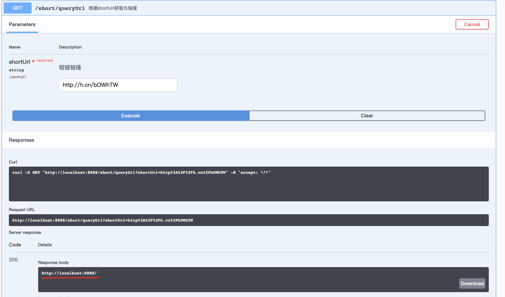

# 测试报告

## API测试报告

**短链接测试**

**长链接测试**

## 单元测试报告

## 性能测试报告
测试机器配置: mac i9 8核16线程16G

### 100w并发测试

### 500w并发测试

**测试结果：**
QPS > 之前设定目标2w，500w并发单机达到4w左右，最长响应不超过2ms， jvm堆内存维持1-1.5G左右，最大不超过2G

注：1000w并发测试结果 qps下降到2w左右，最大响应延迟6ms，jvm堆内存维持2g左右，
后期可以针对实际项目做全链路压测，如：线上数据过滤->压测平台->性能报告、监控->压测报告分析->性能优化

实际项目按照当前公司业务量进行评估