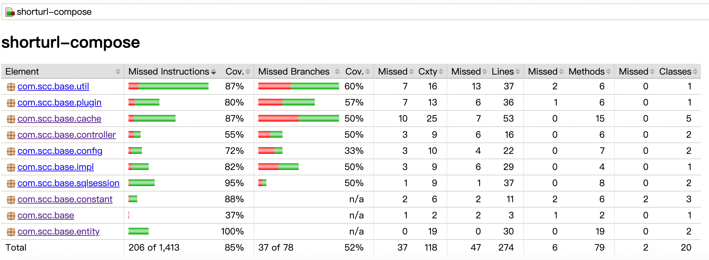

# 系统性能测试方案
## 压力测试工具
- 选用流行的压力测试工具jmeter进行压力测试

## 说明
- 因资源有限，仅在单台开发机器上测试

## 机器资源
- CPU Intel i7 2.6GHZ
- Memory 8G

## 压力测试结果
- 因担心开发机压力过大，故在中途停止了压力测试。如下，是对其中一个接口的请求100W+次压力测试结果: 
  

# Jacoco代码覆盖率测试
- 覆盖率测试结果
  

