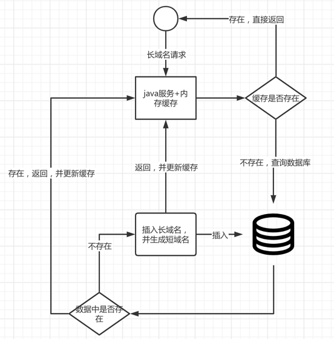
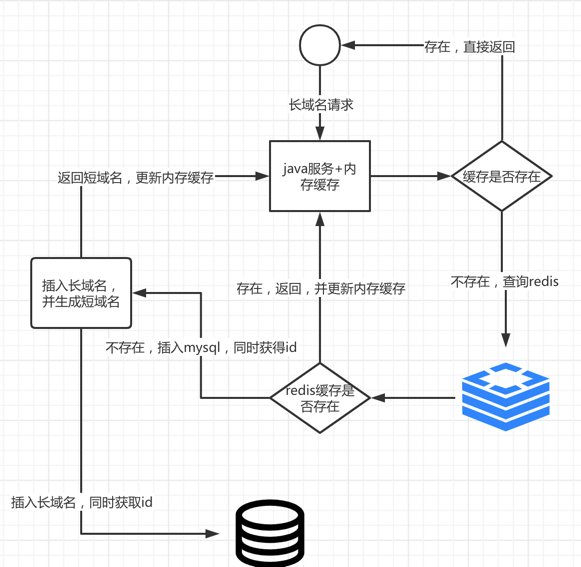

# 设计假设
## 一.对于业务数据量的假设
    1. 假设我们的短域名服务仅需应对少量的(小于100万)长域名
    2. 假设我们的短域名服务要面对互联网所有的(不会超过3万亿)长域名

## 二. 长短域名转换的算法假设
 - 现有2种常见的转换算法：hash算法 + 数据库自增id算法
    ### hash算法
    1. 优点是可以直接在内存计算将长域名转化为短域名，
    2. 缺点是当域名过多的情况下会产生冲突，即不同的长域名可能产生相同的短域名，且冲突程度取决于数据量大小和散列表的大小
   
    ### 数据库自增id算法
    1. 优点是产生的短域名无冲突
    2. 缺点是比较依赖数据库
    3. 算法的操作是，存储常域名，生成数据自增id，将id转化为62进制数，此62进制数既是短域名，计算得知 pow(62, 7) > 3万亿,因此最终生成的短域名不会超过8位长度  

    ### 生成短域名算法选取
    1. 使用hash算法，可能产生冲突，且开发无法预知产生冲突的数据量。当产生冲突的属于用户量多且常用的域名，则会对用户和请求造成较大的负面影响
    2. 使用数据库自增id算法，则不会产生冲突，可以完全正常的处理每一个转换请求
    3. 因此最终选择数据库自增id算法实现长短域名转换

## 三.缓存设计
- 为用户提供LUR和LFU两种选择，基于配置来选择使用哪种缓存


## 四.假设1的设计方案
### 设计说明
- 在此业务量下，一般的单数据库存储和查询效率完全可以满足性能要求，并且绝大部分的数据也可以被缓存至内存中，所以整体设计可以比较简单，具体设计如下

### 设计图

  
### 具体流程说明
 - 接口1:通过长域名获取短域名
   1. 查询缓存本地，看看长域名是否有对应的短域名
   2. 如果有，直接返回
   3. 如果没有, 则去查询数据库
   4. 如果数据库也没有，则将长链接插入数据库，并返回id
   5. 获取id之后，生成短域名 
   6. 返回短域名，同时更新缓存
 - 接口2: 通过短域名获取长域名
   1. 查询缓存本地，看看长域名是否有对应的短域名
   2. 如果有，直接返回
   3. 如果没有, 则去查询数据库 
   4. 如果数据库存在，则查询到长链接的，返回，并更新本地缓存   
   5. 如果数据库也没用，直接返回null

### 方案特色
- 逻辑简单，一个mysql搞定


## 五.假设2的设计方案
- 在此业务量下，但数据库就无法满足性能要求，因此，应该尽量少查或不查数据库，即使要查数据库，也应该以主键作为条件来查询，并且还需要外部可持久化缓存来加快查询转换

### 设计图


### 具体操作流程
- 接口1:通过长域名获取短域名
   1. 查询缓存本地，看看长域名是否有对应的短域名
   2. 如果有，直接返回
   3. 如果没有, 则去查询外部缓存Redis (这种做法的原因，相当于在大数据量情况下，把查询mysql，改为查redis，性能会更好)
   4. 如果redis中存在，则返回，并更新内存缓存
   5. 如果redis中不存在，则直接往mysql中插入，并获取id(这种做法的原因是，mysql的插入是在队尾插入，所以很快速)
   6. 获取到id之后，更新redis，并更新内存缓存，然后返回 
- 接口2: 通过短域名获取长域名
    1. 查询缓存本地，看看长域名是否有对应的短域名
    2. 如果有，直接返回
    3. 如果没有, 则去查询redis
    4. 如果redis存在，则查询到长链接的，返回，并更新本地缓存
    5. 如果redis也没用，直接返回null

### 方案特色
- mysql不承担查询,仅承担插入并生成id的操作
- 查询使用二级缓存，内存缓存和外部redis缓存

## 六. mysql表设计
```sql

-- 数据库名称bi
 CREATE TABLE `url` (
  `id` int NOT NULL AUTO_INCREMENT COMMENT "自增id, 可转化为短url",
  `long_url` varchar(512) NOT NULL COMMENT "长url",
  `ext` varchar(64) DEFAULT NULL COMMENT "扩展字段",
  PRIMARY KEY (`id`),
  UNIQUE KEY `long_url` (`long_url`)
) ENGINE=InnoDB AUTO_INCREMENT 5000; -- 从一个相对大一点的数字开始自增，让短URL不至于太短
```

