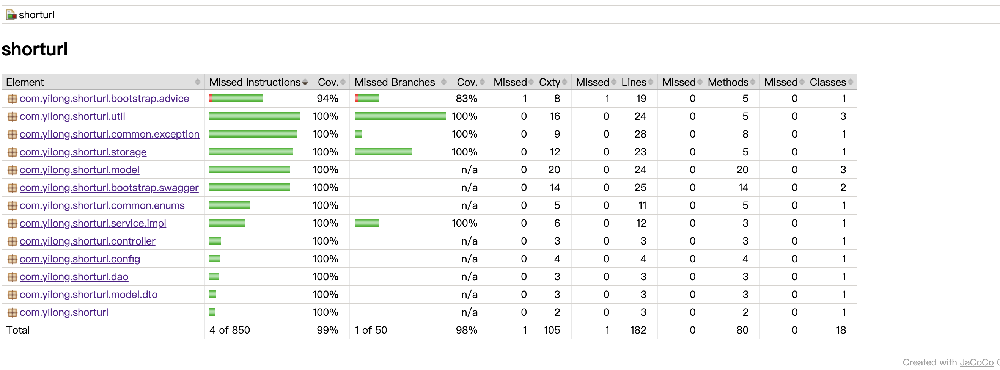

# 短链接服务设计文档
## 需求分析
+ 短链接存储接口：接受长链接，返回短链接
+ 短域链接取接口：接受短链接，返回长链接
+ 短链接码长度最大为8个字符
+ 映射数据存储在JVM内存，防止内存溢出

## 算法
+ 短链接服务的核心就是构建短链接和长链接的唯一映射关系，依赖映射标识生成算法
### 映射方式
+ 基于长链接生成一个短编码与自有的短域名组合生成短链接，存储短编码与长链接的映射关系
#### 自增序列算法
+ 维护一个全局的自增发号器，每次生成短链接请求生成一个唯一的序列号与之对应
+ 优点：实现方式比较多，映射简单
+ 缺点：难以做到长链接与短编码一一对应，代价略大，写性能受限于发号器的性能
#### hash算法
+ 通过hash算法将原来的长链hash成一个序列数
+ 优点: 不依赖全局发号器, 可反向查找
+ 缺点: 需要解决hash冲突
#### 本方案采用hash算法
+ hash算法选择: MurmurHash,非加密型哈希函数，性能是MD5等加密算法的十倍以上
+ MurmurHash提供了两种长度的哈希值，32bit，128bit，为了让网址尽可通地短，选择32bit的哈希值，32bit能表示的最大值近43亿
+ 解决hash冲突: 给长链接增加固定padding的方式重新hash解决hash冲突
### 编码方式
+ 短编码长度(最大8位)
+ 32bit能表示的最大值近43亿
+ 将十进制的hash值转化为只包含数字和大小写英文的62进制数[0-9A-Za-z]
+ 62 ^ 6 = 56800235584，6位62进制数能表示568亿左右链接
+ 6位62进制数字能表示的数字远大于十进制43亿,所以6位短编码就足够来，满足小于最大长度8位
    
## 存储
+ 映射数据存储在JVM内存，防止内存溢出
+ 抽象UrlStorage存储短链接码与长链接映射关系
+ 封装concurrentHashMap应对并发读写

## API
+ 提供两个核心Api
    + 编码长链接
    + 解码短链接
    
## 假设
- 短链不失效
- 部署机器为macOS0.14,CPU:Intel Core i5,Memory:8GB
- jdk8
- JVM堆内存为6G

## 测试
### 单元测试
+ Jacoco单元测试覆盖率截图如下：
